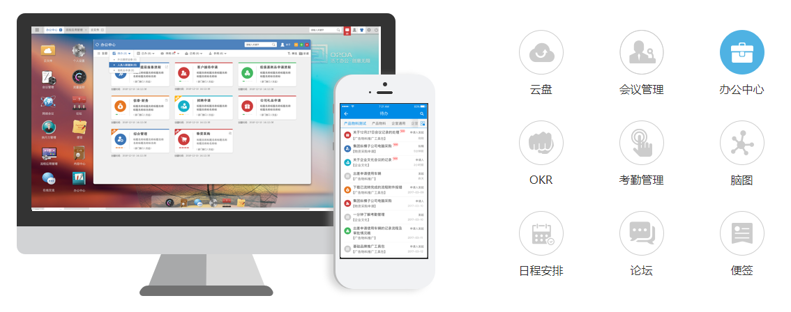

# 概述

## **简介**

开源主页 : [https://www.oschina.net/p/o2oa](https://www.oschina.net/p/o2oa)

官方网站 : [http://www.o2oa.net](http://www.o2oa.net/)

Gitee : [https://gitee.com/liyihz2008/O2OA](https://gitee.com/liyihz2008/O2OA)

Github : [https://github.com/o2oa/o2oa](https://github.com/o2oa/o2oa)

GitBook : [https://o2oa.gitbook.io/course/](https://o2oa.gitbook.io/course/)

脚本API：[http://www.o2oa.net/x\_desktop/portal.html?id=dcd8e168-2da0-4496-83ee-137dc976c7f6](http://www.o2oa.net/x_desktop/portal.html?id=dcd8e168-2da0-4496-83ee-137dc976c7f6)

## **云盘分享地址:**

百度云盘：[https://pan.baidu.com/s/1oBQ1atXGyXdLaYE5uAqF1w](https://pan.baidu.com/s/1oBQ1atXGyXdLaYE5uAqF1w) 提取码: pnk9

腾讯微云：[https://share.weiyun.com/5krUMjj](https://share.weiyun.com/5krUMjj)

## 平台简要介绍

O2OA是基于J2EE架构，集成移动办公、智能办公，支持私有化部署，自适应负载能力的，能够很大程度上节约企业软件开发成本的基于AGPL协议开放源代码的企业信息化系统需求定制开发解决方案，对外提供专业的开发运维等技术服务。

其主要能力如下：

### **流程管理**

全功能流程引擎。基于任务驱动，开放式服务驱动，高灵活性、扩展性，事件定义丰富。包含人工、自动、拆分、合并、并行、定时、服务调用、子流程等功能。应用场景丰富，可轻松实现公文、合同、项目管理等复杂工作流应用。

### **信息管理**

具有权限控制能力的内容管理平台。支持自定义栏目、分类，表格，表单，多级权限系统，能轻松实现知识管理、通知公司、规章制度、文件管理等内容发布系统。

### **门户管理**

具体可视化表单编辑的，支持HTML直接导入的，支持各类数据源，外部应用集成能力的，所见即所得的门户管理平台。适用于实现企业信息化门户系统，可以轻松结合O2OA提供的认证设置与其他系统进行单点认证集成。

### **服务管理**

可以在前端脚本的形式，开发和自定义web服务，实现与后端服务数据交互的能力。

### **数据中心**

可以通过配置轻松实现数据透视图展示，数据统计、数据可视化图表开发等等功能。

### **智能办公**

拥有语音办公、人脸识别、指纹认证、智能文档纠错、智能填表推荐等智能办公特色

### **移动办公**

支持安卓\IOS手机APP办公，支持与企业微信和钉钉集成，支持企业私有化微信部署

### **开箱即用**

O2OA还提供如考勤管理、日程管理、会议管理、脑图管理、便签、云文件、企业社区、执行力管理等开箱即用的应用供企业选择











