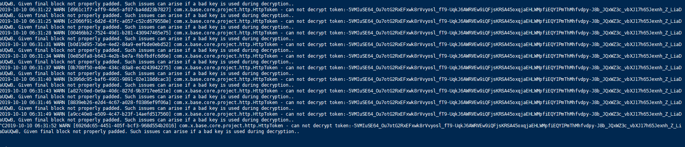
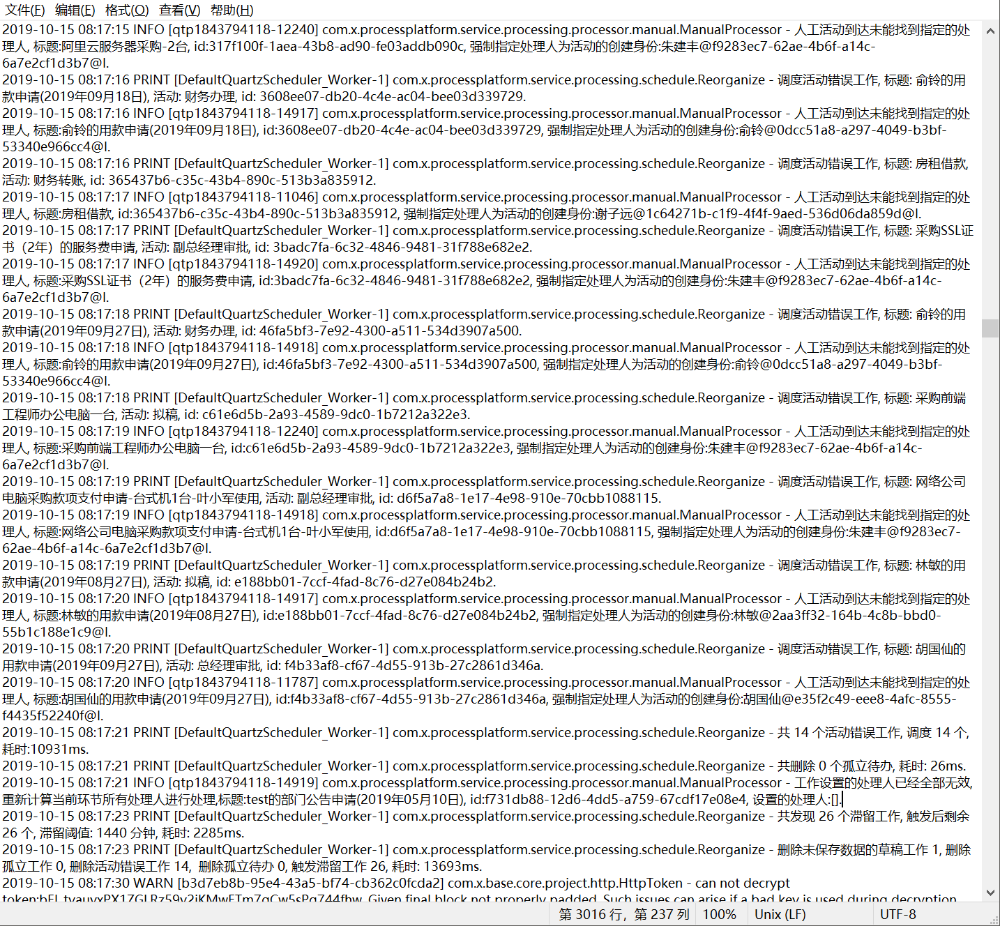

# 服务器错误

## can not decrypt token



服务端无法解开token,可能的原因是,xadmin的密码刚刚修改过而前台没有刷新页面.重新刷新前台页面即可,app端需要重新登录.

## 多个流程工单突然自动回到了拟稿人处理（自检）

现象：多个工单自动被系统调度到了拟稿人处理

日志：




```javascript
2019-10-15 08:17:10 PRINT [DefaultQuartzScheduler_Worker-1] com.x.processplatform.service.processing.schedule.Reorganize - 删除未保存数据的草稿工作, 标题: 外出办事测试流程,  流程: 外出申请, 应用: 考勤管理, id: 66e2cded-1bae-45bb-bc73-6bd93eac0222.
2019-10-15 08:17:10 PRINT [DefaultQuartzScheduler_Worker-1] com.x.processplatform.service.processing.schedule.Reorganize - 共删除 1 个未保存数据的草稿工作, 耗时: 404ms.
2019-10-15 08:17:10 PRINT [DefaultQuartzScheduler_Worker-1] com.x.processplatform.service.processing.schedule.Reorganize - 共删除 0 个孤立工作, 耗时: 45ms.
2019-10-15 08:17:10 PRINT [DefaultQuartzScheduler_Worker-1] com.x.processplatform.service.processing.schedule.Reorganize - 调度活动错误工作, 标题: 林敏的用款申请(2019年09月17日), 活动: 拟稿, id: 0805e307-fbc3-4ce9-b540-940b2bb9e62c.
2019-10-15 08:17:11 INFO [qtp1843794118-11046] com.x.processplatform.service.processing.processor.manual.ManualProcessor - 人工活动到达未能找到指定的处理人, 标题:林敏的用款申请(2019年09月17日), id:0805e307-fbc3-4ce9-b540-940b2bb9e62c, 强制指定处理人为活动的创建身份:林敏@2aa3ff32-164b-4c8b-bbd0-55b1c188e1c9@I.
2019-10-15 08:17:11 PRINT [DefaultQuartzScheduler_Worker-1] com.x.processplatform.service.processing.schedule.Reorganize - 调度活动错误工作, 标题: 胡国仙的用款申请(2019年09月29日), 活动: 总经理审批, id: 14462817-5795-4d2e-a5bd-a13442c6c7f0.
```



```javascript
2019-10-15 08:17:21 PRINT [DefaultQuartzScheduler_Worker-1] com.x.processplatform.service.processing.schedule.Reorganize - 共 14 个活动错误工作, 调度 14 个, 耗时:10931ms.
2019-10-15 08:17:21 PRINT [DefaultQuartzScheduler_Worker-1] com.x.processplatform.service.processing.schedule.Reorganize - 共删除 0 个孤立待办, 耗时: 26ms.
2019-10-15 08:17:21 INFO [qtp1843794118-14919] com.x.processplatform.service.processing.processor.manual.ManualProcessor - 工作设置的处理人已经全部无效,重新计算当前环节所有处理人进行处理,标题:test的部门公告申请(2019年05月10日), id:f731db88-12d6-4dd5-a759-67cdf17e08e4, 设置的处理人:[].
2019-10-15 08:17:23 PRINT [DefaultQuartzScheduler_Worker-1] com.x.processplatform.service.processing.schedule.Reorganize - 共发现 26 个滞留工作, 触发后剩余 26 个, 滞留阈值: 1440 分钟, 耗时: 2285ms.
2019-10-15 08:17:23 PRINT [DefaultQuartzScheduler_Worker-1] com.x.processplatform.service.processing.schedule.Reorganize - 删除未保存数据的草稿工作 1, 删除孤立工作 0, 删除活动错误工作 14,  删除孤立待办 0, 触发滞留工作 26, 耗时: 13693ms.
```


从上述日志内容可以看出，多个流程几乎同时进行了调度处理。

系统也打印了多个活动错误工作处理的日志，以及孤立待办、滞留工作的处理日志。

O2OA有流程自检的能力，当系统内多个流程由于人员离职 ，人员调动或者环节设计错误，处理路由错误等情况导致流程将无法继续进行流转时。

为了避免流程长期在系统中处于“濒死”状态，系统将会使用流程自检的能力将有问题的流程实例（工单）调度到拟稿人，由拟稿人决定如何继续处理该流程。以保证系统中所有的流程都可以继续进行流转。


