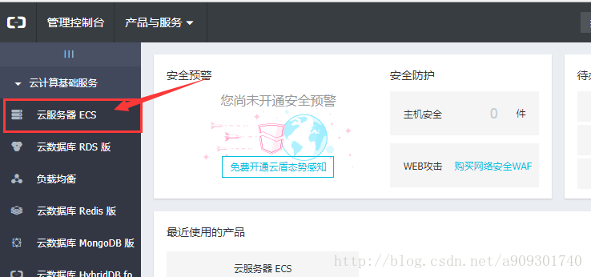
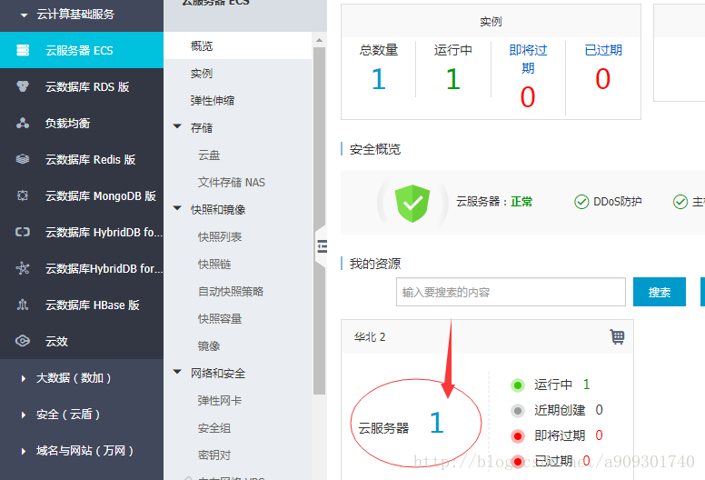
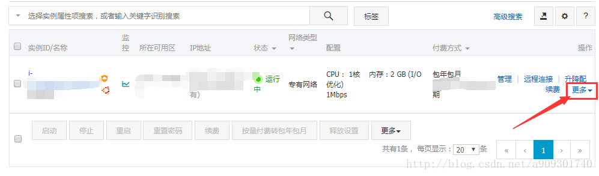
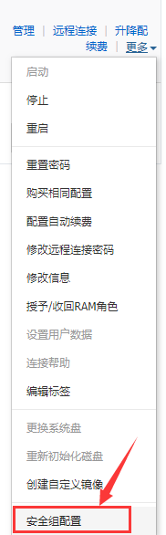
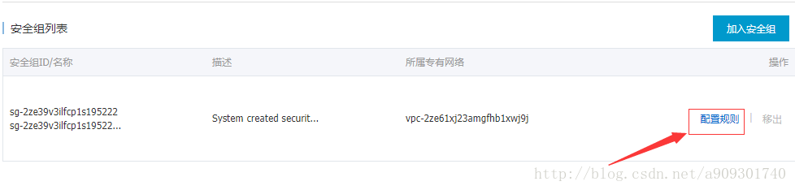
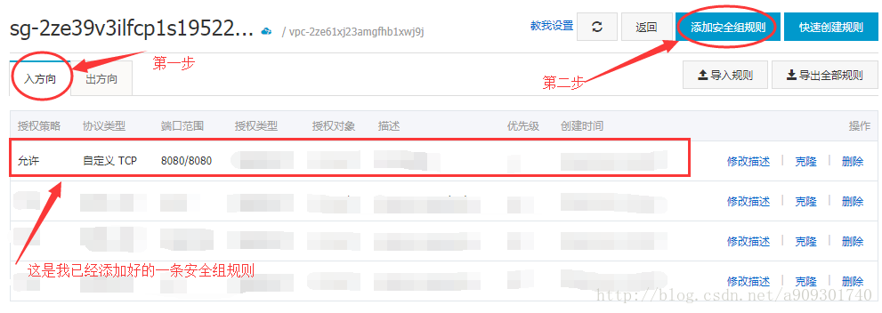
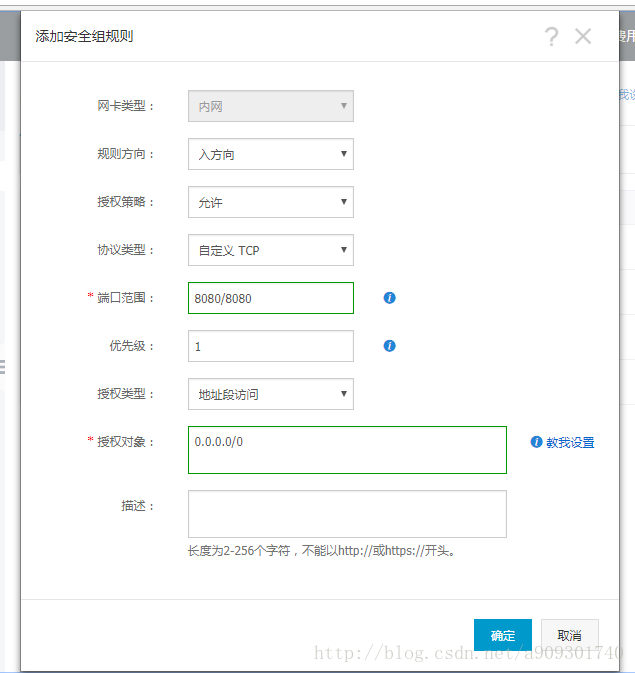

# 阿里云ECS服务器的端口启用

在阿里云上完成O2OA平台部署，并且启动完成后，有可能因为ECS服务未设置安全策略，未开通入方向上的指定端口导致平台无法正常访问。

```text
netstat -ano | grep 20020
netstat -ano | grep 20030
```

#### 1、进入控制台，单击云服务器ECS



#### 2. 单击云服务器



#### 3. 出现您服务器的有关信息，单击更多 <a id="3-&#x51FA;&#x73B0;&#x60A8;&#x670D;&#x52A1;&#x5668;&#x7684;&#x6709;&#x5173;&#x4FE1;&#x606F;&#x5355;&#x51FB;&#x66F4;&#x591A;"></a>



#### 4. 单击安全组配置 <a id="4-&#x5355;&#x51FB;&#x5B89;&#x5168;&#x7EC4;&#x914D;&#x7F6E;"></a>



#### 5. 单击配置规则 <a id="5-&#x5355;&#x51FB;&#x914D;&#x7F6E;&#x89C4;&#x5219;"></a>



#### 6. 在入方向添加安全组规则 <a id="6-&#x5728;&#x5165;&#x65B9;&#x5411;&#x6DFB;&#x52A0;&#x5B89;&#x5168;&#x7EC4;&#x89C4;&#x5219;"></a>




需要开放Web服务器、应用服务器和中心服务器相关的端口，默认为80、20020、20030


#### 7. 配置详细信息 <a id="7-&#x914D;&#x7F6E;&#x8BE6;&#x7EC6;&#x4FE1;&#x606F;"></a>




