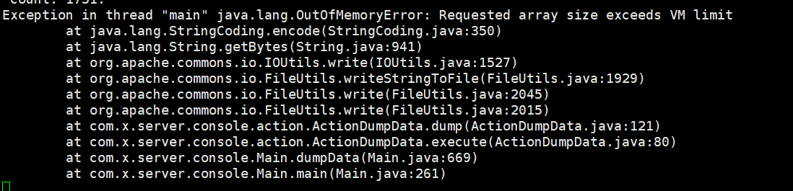
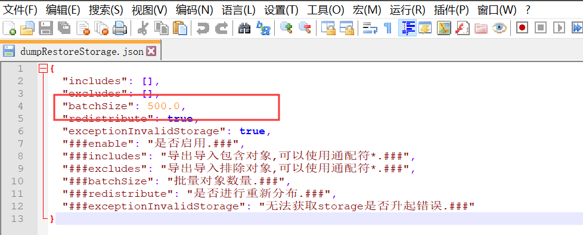

# 数据导出或者导入时发生OOM异常

## 现象描述：



```text
Exception in thread "main" java.lang.OutOfMemoryError: Requested array size exceeds VM limit 
    at java.lang.StringCoding.encode(StringCoding.java.350)
    at java.lang.String.getBytes(String.java.941)
    at org.apache.commons.io.IOUtils.write(IOUtils.java:1527)
```

## 解决方法：

1、在o2server/configSample目录中COPY文件到o2server/config目录中：

     1\) dumpRestoreData.json 

     2\) dumpRestoreStorage.json

2、将两个文件配置中的batchSize值 全部改为500（默认为2000） 



3、重启服务器，再尝试导出或者导入操作。

