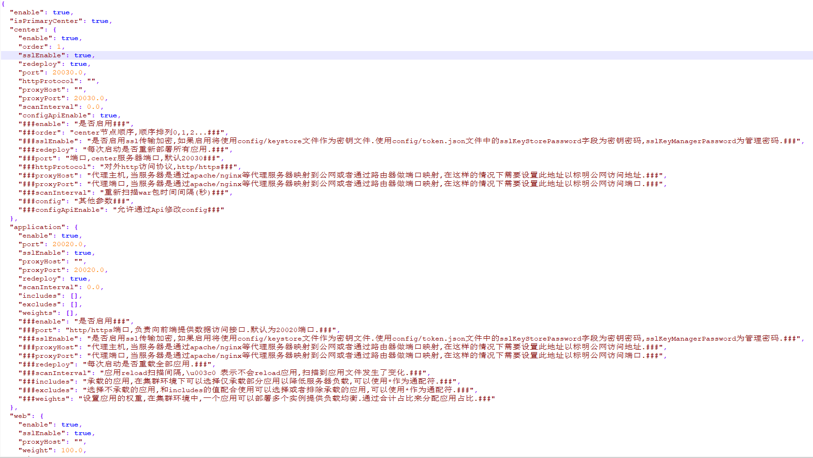

# 自签名SSL证书验证HTTPS功能

## 使用openssl创建自签名证书

1.创建根证书私钥以及请求文件:

openssl genrsa -out rootkey.key 1024 openssl req -new -out rootreq.csr -key rootkey.key

2.自签名根证书:

openssl x509 -req -in rootreq.csr -out rootcert.cer -signkey rootkey.key -CAcreateserial -days 3650

3.生成key:

openssl genrsa -out clientkey.key 1024

4.生成请求文件:

openssl req -new -out clientreq.csr -key clientkey.key

5.生成证书:

openssl x509 -req -in clientreq.csr -out clientcert.cer -signkey clientkey.key -CA rootcert.cer -CAkey rootkey.key -CAcreateserial -days 3650

6.生成p12证书:

openssl pkcs12 -export -clcerts -in clientcert.cer -inkey clientkey.key -out keystore

这里我们得到了进行ssl加密所需要的证书文件**keystore**

## 配置服务器使用ssl

1.将最终生成的**keystore**文件拷贝至o2server/config目录

2.编辑o2server/config/token.json文件中的

sslKeyStorePassword: "您设置的密码"

"sslKeyManagerPassword": "您设置的密码"

3.在node配置文件中的application,center,web设置sslEnable:true

4.重启服务器完成配置,使用https进行访问.

