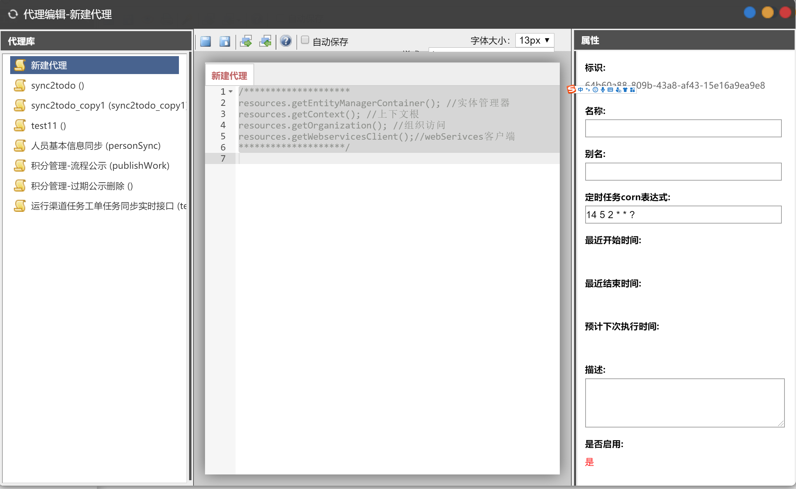
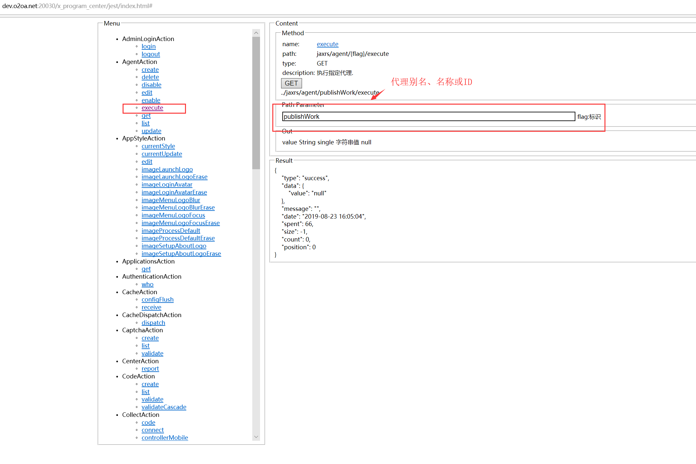

# 代理

代理是运行在服务器端的定时任务，使用Javascript编写，可以直接调用Java类。

## 入口

点系统的左上角导航-&gt;设计中心-&gt;服务管理-&gt;代理打开。

## 触发时间

点击“定时任务cron表达式”可选择cron表达式进行触发时间的配置。cron表达式详解[点击这里](http://www.o2oa.net/x_component_Template/widget/$CronPicker/cron_express_description.html)。

## 代理调试 

‌

打开URL： [http://centerServer:20030/x\_program\_center/jest/index.html](http://dev.o2oa.net:20030/x_program_center/jest/index.html#)​

在 上图的服务中填写代理的标识，然后点击GET，可以忽略触发时间设置，马上执行代理。

可以在代理中使用`print( text )`在服务器控制台输出调试信息。

## 完整样例

| 样例名称 | 链接 |
| :--- | :--- |
| 统一待办 | ​[链接](http://www.o2oa.net/x_component_service_AgentDesigner/sample/sync2todo_UnifiedWorkbench.js) |
| EXCEL操作 | [链接](http://www.o2oa.net/x_component_service_AgentDesigner/sample/ImportPersonFormExcel.js) |

更多样例可以查看 webServer/x\_component\_service\_AgentDesigner/sample/目录

