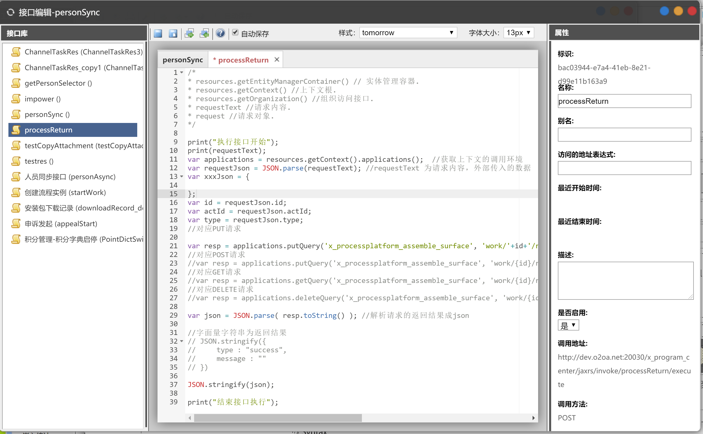
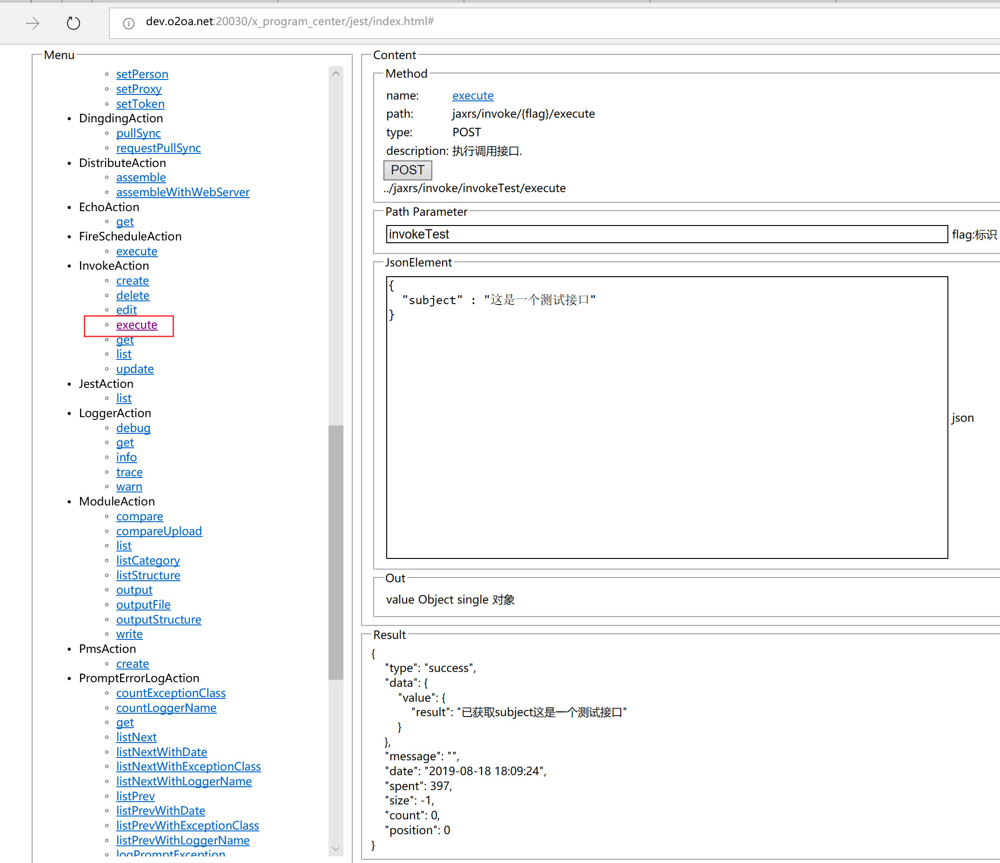

# 接口

接口可以提供Http服务让外部程序调用，使用Javascript编写，可以直接调用Java类。

## 入口 <a id="ru-kou"></a>

点系统的左上角导航-&gt;设计中心-&gt;服务管理-&gt;接口打开。



## 访问限制

如果“访问的地址表达式”不为空，那么只有匹配的地址可以访问，允许使用通配符。

## 接口调用

<table>
  <thead>
    <tr>
      <th style="text-align:left"></th>
      <th style="text-align:left"></th>
    </tr>
  </thead>
  <tbody>
    <tr>
      <td style="text-align:left">&#x63A5;&#x53E3;&#x8BF7;&#x6C42;&#x65B9;&#x5F0F;</td>
      <td style="text-align:left">http</td>
    </tr>
    <tr>
      <td style="text-align:left">&#x8BF7;&#x6C42;&#x5730;&#x5740;</td>
      <td style="text-align:left">
        <p><a href="http://dev.o2oa.net:20030/x_program_center/jaxrs/invoke/processReturn/execute">http://centerServer:20030/x_program_center/jaxrs/invoke/{flag}/execute</a> 
        </p>
        <p>flag&#x7684;&#x503C;&#x4F18;&#x5148;&#x7EA7;&#x4E3A;</p>
        <p>1&#x3001;&#x522B;&#x540D;&#x4E0D;&#x4E3A;&#x7A7A;&#xFF0C;&#x4F7F;&#x7528;&#x522B;&#x540D;;</p>
        <p>2&#x3001;&#x540D;&#x79F0;&#x4E0D;&#x4E3A;&#x7A7A;&#xFF0C;&#x4F7F;&#x7528;&#x540D;&#x79F0;;</p>
        <p>3&#x3001;&#x4E5F;&#x53EF;&#x4EE5;&#x4F7F;&#x7528;id&#x4F5C;&#x4E3A;flag&#x3002;</p>
      </td>
    </tr>
    <tr>
      <td style="text-align:left">&#x8BF7;&#x6C42;&#x65B9;&#x6CD5;</td>
      <td style="text-align:left">POST</td>
    </tr>
    <tr>
      <td style="text-align:left">&#x8BF7;&#x6C42;&#x6807;&#x5934;</td>
      <td style="text-align:left">Content-Type: application/json</td>
    </tr>
    <tr>
      <td style="text-align:left">&#x54CD;&#x5E94;&#x6807;&#x5934;</td>
      <td style="text-align:left">Content-Type: application/json; charset=utf-8</td>
    </tr>
  </tbody>
</table>## 接口调试

打开URL： [http://centerServer:20030/x\_program\_center/jest/index.html](http://dev.o2oa.net:20030/x_program_center/jest/index.html#)



在 上图的服务中填写接口的标识（接口别名、名称或者ID），在JsonElement区域输入接口接收数据，然后点击POST进行调试，接口会在Result区域输出返回数据。

可以在接口中使用`print( text )`在服务器控制台输出调试信息。

## 输入和输出

在接口脚本中可以使用 requestText 来获取请求的内容。

在接口脚本的末尾使用直接量作为接口的输出。

样例: 在调用接口的时候提交的报文为 { "subject" : "接口测试样例" }，那么脚本中的获取为：

```text
var requestJson = JSON.parse(requestText);
if( typeof(requestJson) === "string" ){ //某些情况下可能需要转换两次
    requestJson = JSON.parse(requestJson);
}
var subject = requestJson.subject; //subject值为"接口测试样例"

var result = { "result" : "已获取subject"+subject };
result; //接口的输出

```

最终接口的http request正文如下

```text
{
    "type": "success",
    "data": {
        "value": { //接口脚本的输出内容
            "result": "已获取subject这是一个测试接口"
        }
    },
    "message": "",
    "date": "2019-08-18 18:09:24",
    "spent": 397,
    "size": -1,
    "count": 0,
    "position": 0
}
```

## 当前用户

使用 effectivePerson 来获取当前用户。

如果未登录系统，返回如下：

```text
 {
 "tokenType": "anonymous",
 "token": "",
 "name": "anonymous",
 "unique": "anonymous",
 "distinguishedName": "anonymous",
 "debugger": true,
 "remoteAddress": "115.216.34.235",
 "uri": "/x_program_center/jaxrs/invoke/invokeTest/execute",
 "userAgent": "Mozilla/5.0 (Windows NT 10.0; Win64; x64; rv:68.0) Gecko/20100101 Firefox/68.0"
}
```

如果已登录系统，返回如下：

```text
{
"tokenType": "user", //如果是管理员为manager
"token": "jlMh2guoFibWcTwR3NHdVTbw_ylqeq-uFLrLL9stmcruJSx7mPOjiX-euWIQv-ovp8orv1dTAwkavfdfdfdfdf",
"name": "张三",
"unique": "zhangsan",
"distinguishedName": "张三@zhangsan@P",
"debugger": true,
"remoteAddress": "115.216.34.235",
"uri": "/x_program_center/jaxrs/invoke/invokeTest/execute",
"userAgent": "Mozilla/5.0 (Windows NT 10.0; Win64; x64) AppleWebKit/537.36 (KHTML, like Gecko) Chrome/64.0.3282.140 Safari/537.36 Edge/17.17134"
}
```

## 完整样例

| 样例名称 | 链接 |
| :--- | :--- |
| 用户同步接口 | ​[链接](http://www.o2oa.net/x_component_service_InvokeDesigner/sample/personSync.js) |
| 组织同步接口 | [链接](http://www.o2oa.net/x_component_service_AgentDesigner/sample/ImportPersonFormExcel.js) |

更多样例可以查看 webServer/x\_component\_service\_InvokeDesigner/sample/ 目录

