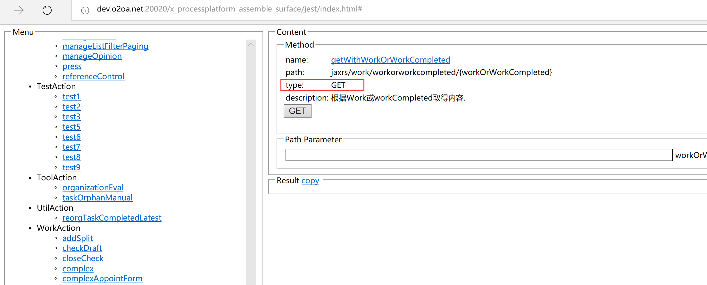
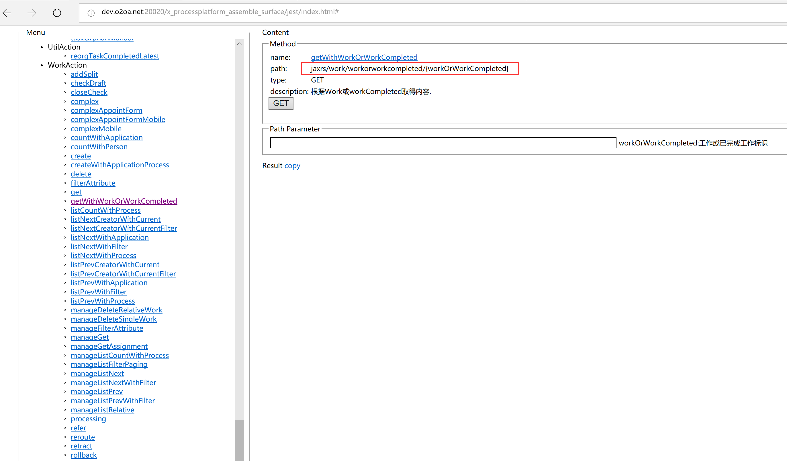

# 代理和接口的脚本编写

## 输出调试信息

```text
var text = "在服务器控制台输出的消息"
print( text );
```

## 调用JAVA类

```text
//classString 为类名字符串，比如 "java.util.Calendar"
var Class = Java.type( classString );
var object = new Class();
//object.method()
```

或者

```text
var object = new Class();
//比如 var simpleDateFormat = new java.text.SimpleDateFormat("yyyy-MM-dd hh:mm:ss");
```

样例:

获取当前日期后的第5天

```text
function setDate(){
    var Date = java.util.Date();
    var Calendar = Java.type("java.util.Calendar");
    var GregorianCalendar = Java.type("java.util.GregorianCalendar");
    var now = new Date();
    var calendar = new GregorianCalendar();
    calendar.setTime(now);
    calendar.set(Calendar.DATE, calendar.get(Calendar.DATE) - Config.waitDay);
    return calendar.getTime();
}

```

## 调用服务

### 调用O2OA后台服务

服务查看和调试

打开 [http://centerserver:20030/x\_program\_center/jest/list.html](http://centerserver:20030/x_program_center/jest/list.html)

**本小节中的“服务根\(**serviceRoot**\)”如下**：

| x\_processplatform\_assemble\_surface | 流程平台相关服务 |
| :--- | :--- |
| x\_portal\_assemble\_surface | 门户平台相关服务 |
| x\_cms\_assemble\_control | 内容管理平台相关服务 |
| x\_query\_assemble\_surface | 数据平台相关服务 |
| x\_organization\_assemble\_express | 组织架构相关服务 |
| x\_file\_assemble\_control | 云文件相关服务 |
| x\_meeting\_assemble\_control | 会议管理相关服务 |
| x\_bbs\_assemble\_control | 论坛相关服务 |
| x\_calendar\_assemble\_control | 日程管理相关服务 |
| x\_hotpic\_assemble\_control | 热点信息相关服务 |
| x\_mind\_assemble\_control | 脑图模块相关服务 |
| x\_organization\_assemble\_personal | 个人设置相关服务 |
| x\_attendance\_assemble\_control | 考勤模块相关服务 |

**查找method**，后台服务有GET\POST\PUT\DELET几种方法，可以在服务详情中找到，如下图：



**本小节中的“路径\(path\)”**，可以在服务详情中找到，如下图：



以上图的服务为例，最后拼接成下列两种路径均可使用

/jaxrs/work/workorworkcompleted/dcd8e168-2da0-4496-83ee-137dc976c7f6

或

work/workorworkcompleted/dcd8e168-2da0-4496-83ee-137dc976c7f6

#### GET方法

```text
var applications = resources.getContext().applications();
//serviceRoot 服务根
//path 路径
applications.getQuery( serviceRoot, path );
```

样例：

已知work id为dcd8e168-2da0-4496-83ee-137dc976c7f6，获取work内容，并解析成JSON。

```text
var applications = resources.getContext().applications();
var serviceRoot = "x_processplatform_assemble_surface";
var path = "work/workorworkcompleted/dcd8e168-2da0-4496-83ee-137dc976c7f6"
var resp = applications.getQuery( serviceRoot, path );
var json = JSON.parse( resp.toString() );
```


#### POST方法

```text
var applications = resources.getContext().applications();
//serviceRoot 服务根
//path 路径
//string 数据字符串，json转字符串可以用 JSON.stringify( json )
applications.postQuery( serviceRoot, path, string );
```

样例：

已知发文流程的ID为“0b7c5c43-caa8-4789-a263-308508d44016”，发起人的dn是“张三@zhangsan@I”。需要发起一个流程。

查到发起流程的路径是“jaxrs/work/process/{processFlag}”。

```text
var applications = resources.getContext().applications();
var serviceRoot = "x_processplatform_assemble_surface";
var path = "work/process/0b7c5c43-caa8-4789-a263-308508d44016";
var string = JSON.stringify({
    "latest" : false,
    "title" : "测试发文流程",
    "identity" : "张三@zhangsan@I",
    "data" : {  //业务数据
         "fileNoPrefix" : "xxx"  //文号冠字
    }
});
var resp = applications.postQuery( serviceRoot, path, string );
var json = JSON.parse( resp.toString() );
```


#### PUT方法

```text
var applications = resources.getContext().applications();
//serviceRoot 服务根
//path 路径
//string 数据字符串，json转字符串可以用 JSON.stringify( json )
applications.putQuery( serviceRoot, path, string );
```

样例：

已知发文流程实例的work id为“0b7c5c43-caa8-4789-a263-308508d44016”，需要更新数据。

查到修改流程数据的路径是“jaxrs/data/work/{id}”。

```text
var applications = resources.getContext().applications();
var serviceRoot = "x_processplatform_assemble_surface";
var path = "data/work/0b7c5c43-caa8-4789-a263-308508d44016";
var string = JSON.stringify({
    "subject" : "测试流程11",
    "fileNoPrefix" : "xxx1"
});
var resp = applications.putQuery( serviceRoot, path, string );
var json = JSON.parse( resp.toString() );
```

#### 

#### DELETE方法

```text
var applications = resources.getContext().applications();
//serviceRoot 服务根
//path 路径
applications.deleteQuery( serviceRoot, path );
```

样例：

已知发文流程实例的work id为“0b7c5c43-caa8-4789-a263-308508d44016”，需要删除改流程实例。

查到删除流程实例的路径是“jaxrs/work/{id}”。

```text
var applications = resources.getContext().applications();
var serviceRoot = "x_processplatform_assemble_surface";
var path = "work/0b7c5c43-caa8-4789-a263-308508d44016";
var resp = applications.deleteQuery( serviceRoot, path );
var json = JSON.parse( resp.toString() );
```

### 调用本系统服务管理中的接口

样例：现有一个名称为“sendSMS”的接口，接收的requestText为 "{ mobile : mobile, content : content }"

```text
var CipherConnectionAction = Java.type('com.x.base.core.project.connection.CipherConnectionAction');
var Config = Java.type('com.x.base.core.project.config.Config');
var path = "invoke/sendSMS/execute";
var dataString = JSON.stringify({
    "mobile" : "13500000000",
    "content" : "测试短信内容"
});
var resp = CipherConnectionAction.post(false, Config.url_x_program_center_jaxrs() + path, dataString );
//var resp = CipherConnectionAction.post(false, Config.x_program_centerUrlRoot() + path, dataString );
var json = JSON.parse( resp.toString() );
```


### 调用外系统的服务

样例：现有一个外系统的服务，url为 '[http://hostname/UnifiedWorkbench/ProcessTaskService](http://10.11.198.209:9083/UnifiedWorkbench/ProcessTaskService)'，接收的Content-type 为 'text/xml; charset=utf-8'

```text
function sendRequest( xml ){
    try{
        print("发起请求:"+xml);
        var url =  'http://hostname/UnifiedWorkbench/ProcessTaskService'
        var ArrayList = Java.type('java.util.ArrayList');
        var heads = new ArrayList();
        var NameValuePair = Java.type('com.x.base.core.project.bean.NameValuePair');
        var p1 = new NameValuePair('Content-Type', 'text/xml; charset=utf-8');
        heads.add(p1);
        var HttpConnectionClass = Java.type('com.x.base.core.project.connection.HttpConnection');
        var resp = HttpConnectionClass.postAsString(url, heads, xml);
        print( "统一待办返回:"+ resp.toString());
    }catch(e){
        print("发送请求出错：");
        print(  e.printStackTrace() );
    }
}
```

## 人员组织操作

组织管理中包括人员、人员属性、组织、组织属性、身份、群组和角色。有两种方法可以进行组织管理的操作：

1、通过调用后台组织查询服务“x\_organization\_assemble\_express”进行组织管理的操作。具体服务请查看

“http://applicationServer:20020/x\_organization\_assemble\_express/jest/index.html”

2、你可以通过 this.org 获取组织中的人员、人员属性、组织、组织属性、身份、群组和角色。 

具体请查看API的[org](http://www.o2oa.net/x_desktop/portal.html?id=dcd8e168-2da0-4496-83ee-137dc976c7f6&page=d26f71a1-0488-4171-8bc8-e7bffda81561)章节


