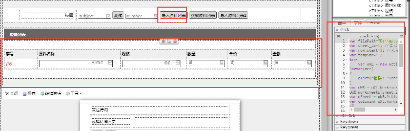

# Excel数据导入数据网格（仅支持IE）

示例：表单数据网格设计，原料名称、规格、数量、单价、金额的标题列分别对应标识ylmcList、ggList、slList、djList、jeList



Excel样式如下：


示例代码：

```text
var filePath="D:\\mytest.xls"; //要读取的xls
var sheet_id=1; //读取第1个表
var row_start=2; //从第1行开始读取
var tempStr='';
try{
    var oXL = new ActiveXObject("Excel.application"); //创建Excel.Application对象
}catch(err)
{
    alert("错误："+err);
}
var oWB = oXL.Workbooks.open(filePath);
oWB.worksheets(sheet_id).select();
var oSheet = oWB.ActiveSheet;
var colcount=oXL.Worksheets(sheet_id).UsedRange.Cells.Rows.Count ;//总共多少条数据

this.form.get("yllb").setData({});//先把原料列表清空
var data=new Array();

//拼装数据网格的data数据

for(var i=row_start;i<=colcount;i++){
    op = {
        "ylmcList":{"ylmc":oSheet.Cells(i,1).value},
        "ggList":{"gg":oSheet.Cells(i,2).value},
        "slList":{"sl":oSheet.Cells(i,3).value},
        "djList":{"dj":oSheet.Cells(i,4).value},
        "jeList":{"je":oSheet.Cells(i,5).value}
    };
    data[i-2]=op;
}
op2 = {
    "data":data,
    "total":{}
};
this.form.get("yllb").setData(op2);//给数据网格赋值
alert("导入完成！");
```

