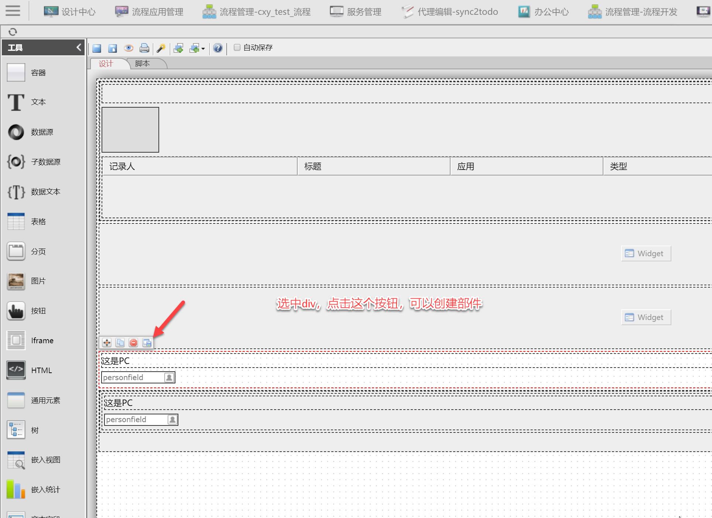
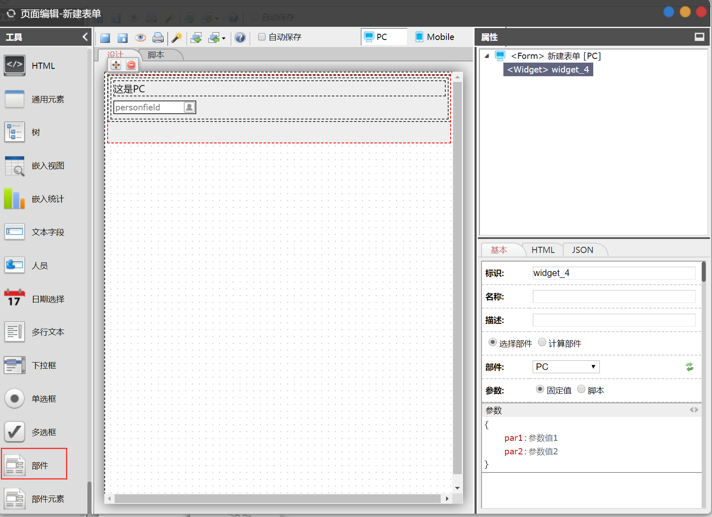
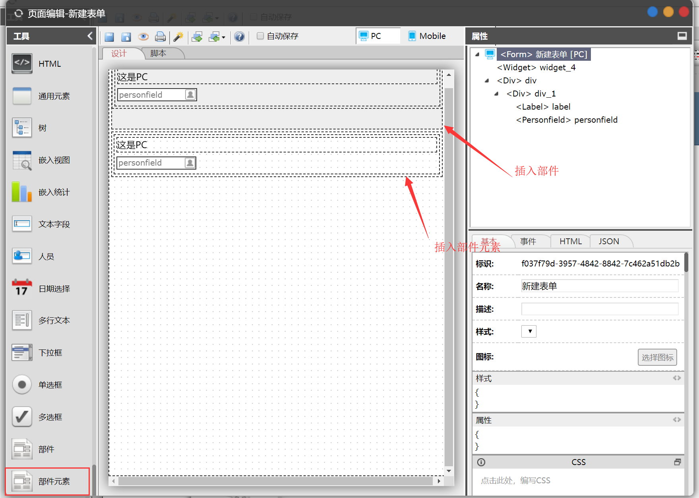

# 部件设计

部件相当于一个子页面，部件中元素的和页面中元素用法一致。您可以在门户有页面中插入部件或者部件内的元素。

## 创建部件

### 新建部件


### 选择容器元素创建

从页面/部件中，选择容器元素（Div），创建部件，容器内的元素是作为新部件的元素保存。



## 部件的使用

### 插入部件

可以在页面中插入部件，如果当前页面在设计PC端，那么插入的是部件的PC模式内容；如果当前页面在设计Mobile端，那么插入的是部件的Mobile模式内容。



1、计算部件

如果使用计算部件，可以通过条件计算来插入部件。如：

```text
if( this.page.get("type").getData() == "yes" ){    return "部件1"; //需返回部件名称或部件ID}else{    return "部件2";}
```

2、参数

 可以在页面的部件属性中传参数给部件。可以通过固定值或者是脚本传参。

参数脚本

```text
return {  //如果使用脚本，需要返回参数对象    "par1" : "参数值1",    "par2" : "参数值2"}
```

在 部件中可以通过· this.page.getWidgetPrameters\(\); 来获取页面传入的参数

比如上面的参数脚本

```text
var par = this.page.getWidgetPrameters();//获取的par是//{//    "par1" : "参数值1",//    "par2" : "参数值2"//}
```

### 插入部件元素

可以在页面中插入部件的元素。如果当前页面在设计PC端，那么插入的是部件的PC模式内容；如果当前页面在设计Mobile端，那么插入的是部件的Mobile模式内容。



## 获取部件内的元素

可以在页面中重复插入同一个部件，可以通过 `this.page.getWidgetModule( widget, moduleName );`可以来获取制定部件的元素。

比如：

1、设计了一个部件，包含一个设计元素subject。 

2、在主页面里两次嵌入1步骤创建的部件，一个标识是widget\_1, widget\_2。 

`var module = this.page.getWidgetModule( "widget_1", "subject"); //部件widget_1的subject组件 var data2 = this.page.getWidgetModule( "widget_2", "subject").getData(); //部件widget_2的subject组件的值`

