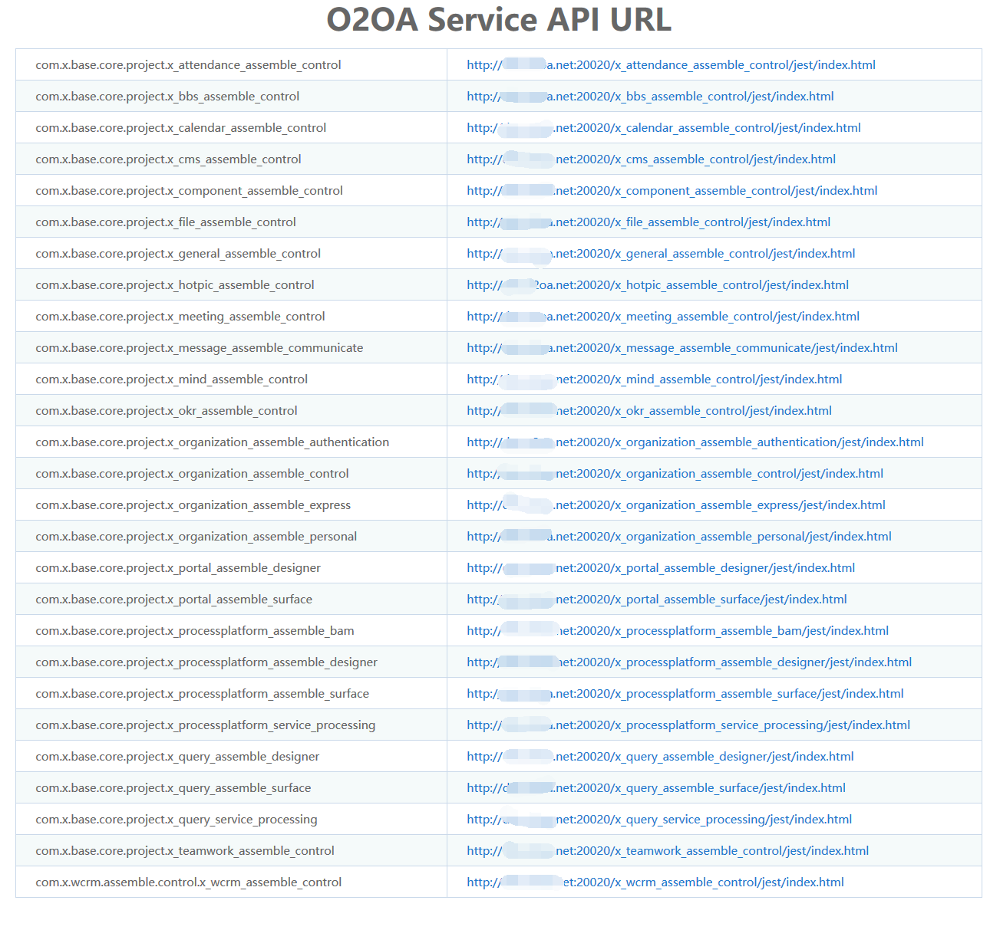
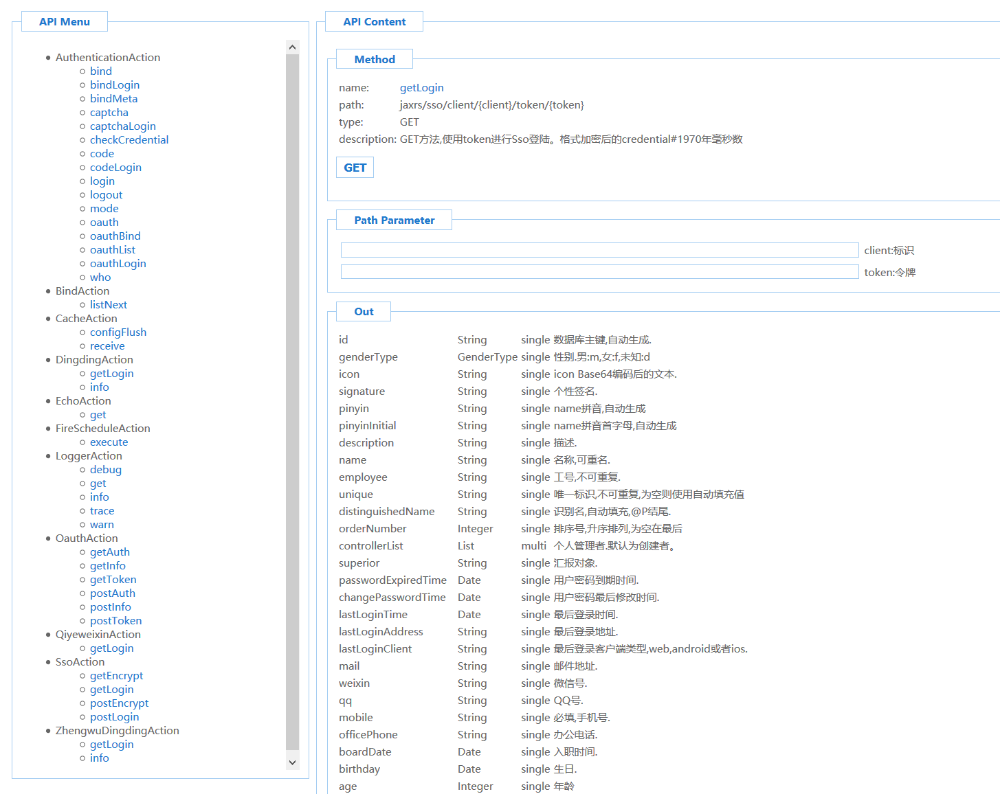

# API接口服务

## 一、服务地址列表访问

### 1、使用xadmin或者拥有管理员权限\(manager角色\)的用户登录O2OA

### 2、访问中心服务器的服务列表

服务列表地址：http://o2server\_center\_host:20030/x\_program\_center/jest/list.html

## 二、各个应用服务API列表

点击中心服务器服务API列表中的具体应用服务列表，可以访问具体应用服务的API，如：

[http://appserver\_host:20020/x\_organization\_assemble\_authentication/jest/index.html](http://dev.o2oa.net:20020/x_organization_assemble_authentication/jest/index.html#)

