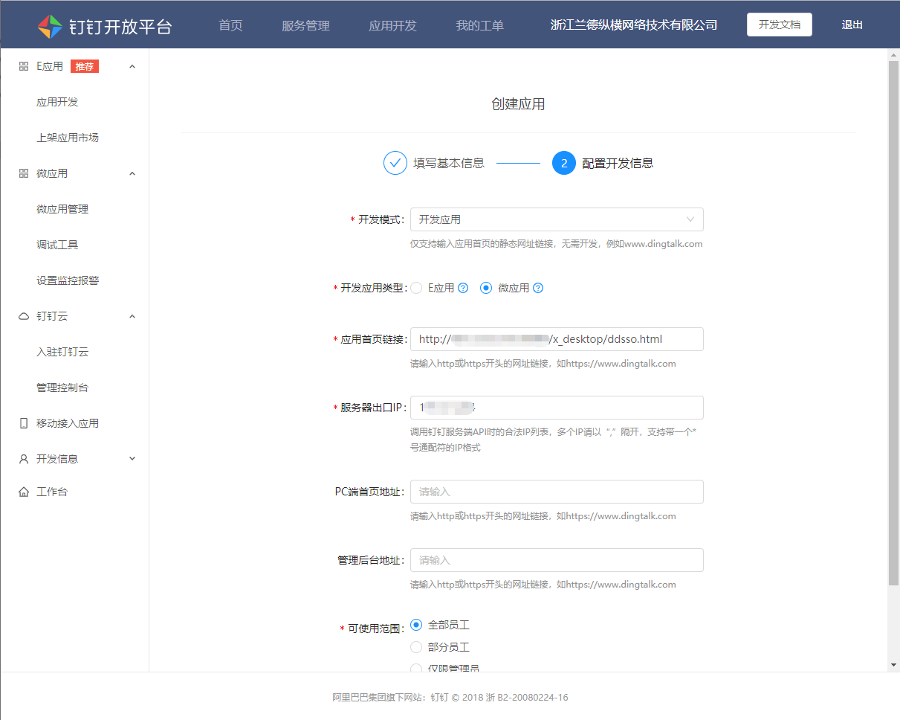

# 集成到阿里钉钉\(DingTalk\)


**如果O2OA成功接入钉钉，O2OA将会自动从钉钉拉取所有的人员和组织进行同步，O2OA的所有人员和组织以企业钉钉中创建的组织架构为准（ 本地已经创建的人员和组织将保留不会被删除，可能会造成人员和组织重复 ）。**

**对企业通讯录授权时，所对应的组织请设置为顶层组织，后续将会细化相应的权限设置。**


> **O2OA接入钉钉建议先配置好钉钉应用，待组织和人员从钉钉同步完成后，再进行组织和人员的信息编辑，避免人员和组织信息的重复创建。**

## 一、前提条件

1、完成O2OA部署，平台可以正常访问

2、确保O2OA平台可以正常通过公网进行访问（不是内网）

## **二、**注册企业钉钉

注册地址：https://oa.dingtalk.com/\#/login，此步骤需要企业自行准备。


需要提供使用钉钉的企业相关信息。


## 三、添加钉钉微应用

钉钉注册成功后，使用企业管理员账号登录企业钉钉，在\[工作台\] 页面中，点击**自建应用**链接，新建一个企业应用，如下图所示：


填写应用基本信息，如下图所示：


参数说明：

```text
应用Logo：您可以上传您需要显示在钉钉里的O2OA办公应用图标。
应用名称：填写您指定的钉钉里O2OA办公应用的应用名称，如移动办公，企业办公，O2OA办公等等。
功能介绍：填写应用的功能介绍
开发方式：企业内部自主开发
```

填写完成后点击下一步，填写配置开发信息，如下图所示：



参数说明：

```text
开发模式       ：开发应用
开发应用类型    ：微应用
应用首页链接    ：http://[serverIp]:[port]/x_desktop/ddsso.html
(其中[serverIp]为您部署的O2OA公网IP或者域名，[port]是开放的web端口，默认为80不用填写)
开服务器出口IP  ：填写服务器公网出口IP地址
首页地址       ：http://[serverIp]:[port]/x_desktop/ddsso.html
可使用范围      ：根据要求填写
```

填写完成后点击提交即可完成应用创建，填写好的界面如下图所示：


## 四、查询应用的AgentId、appKey、appSecret和CorpId信息 <a id="h1_8"></a>

### 1、查询应用的AgentId、appKey、appSecret信息

点击自建应用设置，查看应用的详细设置信息


查询已经创建好的应用设置信息，如下图所示：



 请记录应用的**AgentId、AppKey以及AppSecret**信息，后续需要配置到服务器设置里


### 2、查询企业CropId信息

进入钉钉开放平台，点击左侧导航：开发信息 -&gt; 开发账号信息：



 请记录企业的**CorpId**信息，后续需要配置到服务器设置里。


## 五、设置钉钉微应用的通讯录权限 <a id="h1_9"></a>

在已经创建好的微应用的权限设置栏可以对应用的操作权限进行设置，如下图所示：



企业通讯录权限：请开启通讯录只读权限、手机号码信息以及邮箱等个人信息，并且将选择授权范围**设置为最顶层组织。**


至此，钉钉应用创建以及设置工作已经完成。

## 六、O2OA接入配置 <a id="h1_10"></a>

1、进入o2oa安装目录，从o2server/configSample 目录下拷贝 dingding.json 到 o2server/config 目录（如果已经复制过了，请跳过此步骤）；

2、使用文本编辑器打开dingding.json进行编辑：

```text
{
  "enable": true,
  "corpId": "",
  "agentId": "",
  "appKey": "",
  "appSecret": "",
  "syncCron": "10 0/10 * * * ?",
  "forceSyncCron": "10 45 8,12 * * ?",
  "oapiAddress": "https://oapi.dingtalk.com",
  "messageEnable": true,
  "###enable": "是否启用###",
  "###corpId": "钉钉corpId###",
  "###agentId": "agentId###",
  "###appKey": "应用的key,唯一标识###",
  "###appSecret": "应用的密钥###",
  "###syncCron": "组织同步cron,默认每10分钟同步一次.###",
  "###forceSyncCron": "强制拉入同步cron,默认在每天的8点和12点强制进行同步.###",
  "###oapiAddress": "oapi服务器地址###",
  "###messageEnable": "是否启用消息推送###"
}
```

参数说明：

```text
"enable": "是否启用企业钉钉接入: true | false",  
"agentId": "企业钉钉应用信息AgentId（从企业钉钉信息中获取 'AgentId'）",
"appKey": "企业钉钉参数SSOsecret（从企业钉钉开放平台信息中获取 'AppKey'）",
"appSecret": "企业钉钉参数SSOsecret（从企业钉钉开放平台信息中获取 'AppSecret'）",
"syncCron": "拉入同步时间表达式, 默认每10分钟同步一次(10 0/10 * * * ?).",
"forceSyncCron": "强制拉入同步cron, 默认在每天的8点和12点强制进行同步(10 45 8,12 * * ?)",
"oapiAddress": "企业钉钉api服务器地址, 固定填写：https://oapi.dingtalk.com",
"messageEnable": "是否允许推送消息到企业钉钉: true | false"
```


完成以上配置后重启O2OA，即可完成O2OA在企业钉钉中的接入，可以在企业钉钉中看到自己配置的企业应用。

## 七、手工从钉钉拉取组织人员数据 <a id="h1_11"></a>

服务地址：http://**localhost**:20030/x\_program\_center/jest/index.html

服务名称：**DingdingAction**.pullSync

如下图所示界面，点击GET之后，观察服务器控制台或者日志文件信息（o2server/logs），可以查看到同步日志。


**请注意，不要多次点击GET，**点击一次后，控制台会有正在拉取组织人员信息相关的日志。



