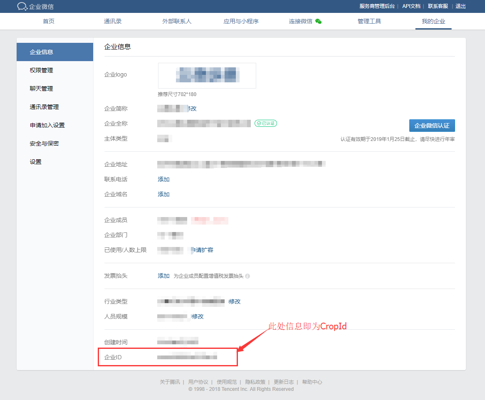
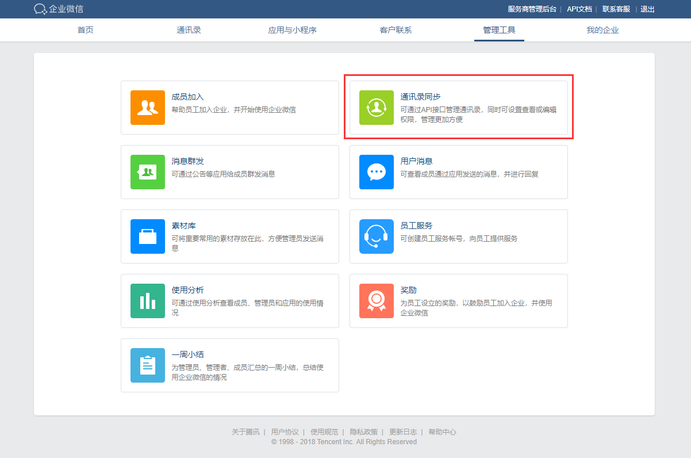
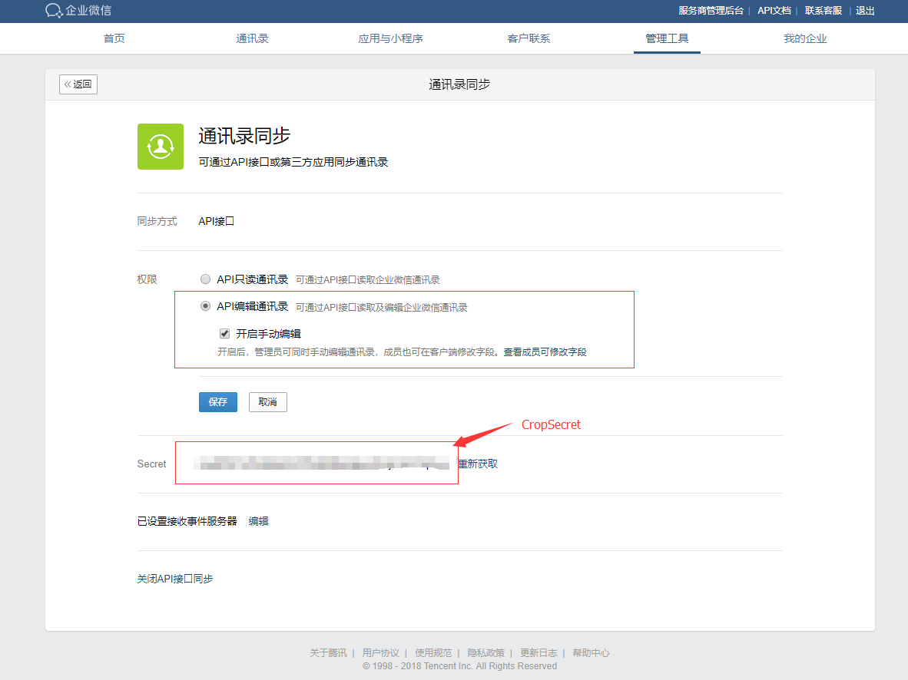
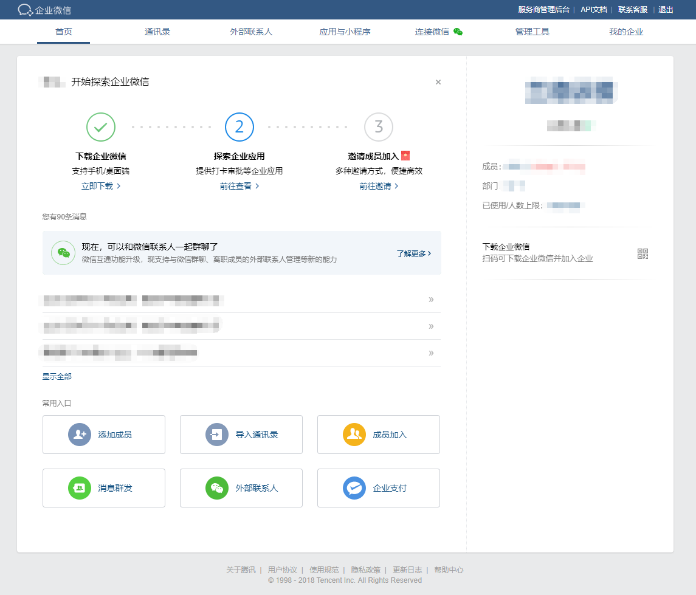
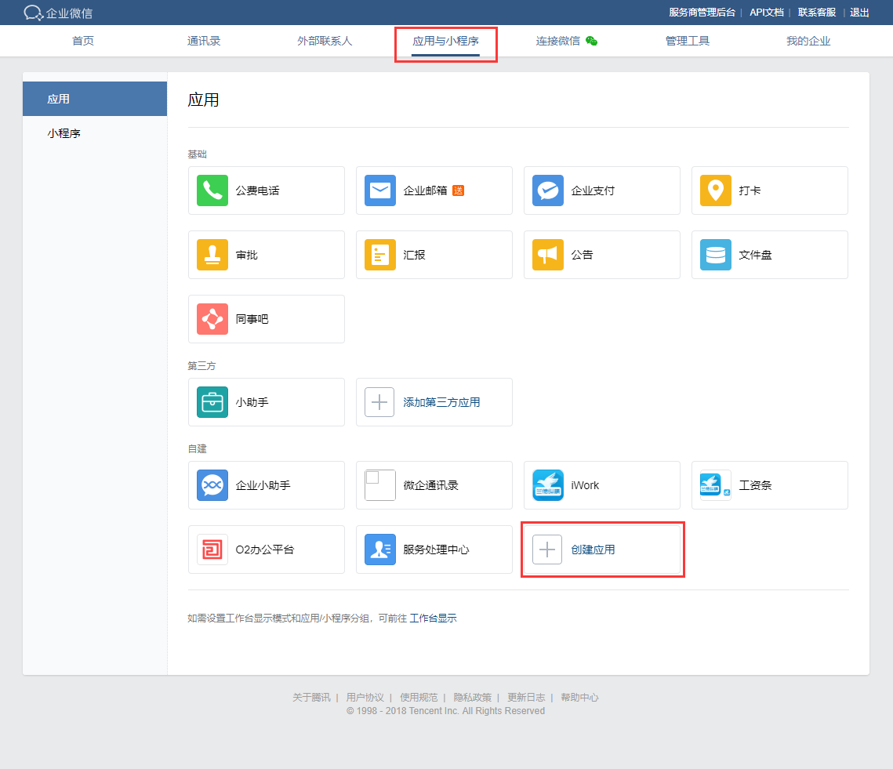
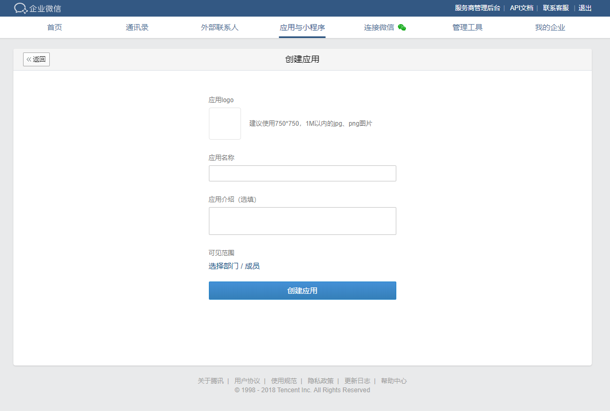
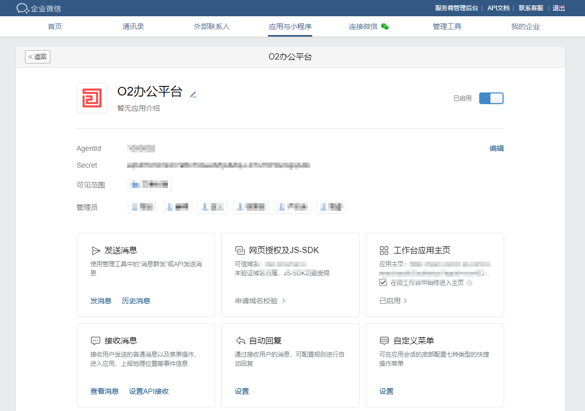
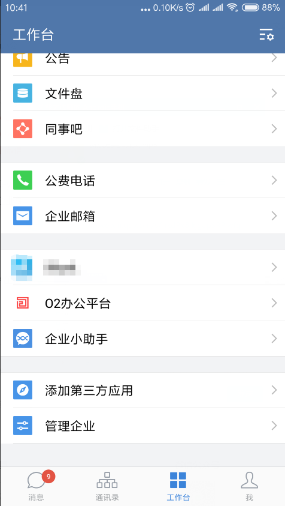

# 集成到企业微信


### 如果O2OA成功接入企业微信，O2OA将会自动从企业微信拉取所有的人员和组织进行同步，O2OA的所有人员和组织以企业微信中创建的组织架构为准（ 本地已经创建的人员和组织将保留不会被删除，可能会造成人员和组织重复 ）。 <a id="h2_1"></a>


> ### O2OA接入企业微信建议先配置好企业微信应用，待组织和人员从企业微信同步完成后，再进行组织和人员的信息编辑，避免人员和组织信息的重复创建。 <a id="h2_2"></a>

## 一、注册企业微信号（自行准备） <a id="h1_3"></a>

注册地址：https://work.weixin.qq.com/，此过程需要提供使用微信的企业相关信息。

## 二、获取企业CropId信息 <a id="h1_4"></a>

注册成功后，使用管理员账号登录企业微信，在\[我的企业\]信息最后一行可以获取企业的CropId，如下图所示：



## 三、获取CropSecret信息 <a id="h1_4"></a>

在管理工具 - 通讯录同步配置里进行API信息查询和配置



 配置同步方式、权限，并且获取Secret，该Secret就是后续需要配置到O2OA里的**CropSecret**信息:



## 四、添加O2OA为企业微信自建应用 <a id="h1_5"></a>

注册成功后，使用管理员账号登录企业微信，如下图所示：



点击\[应用与小程序\]，如下图所示界面：



如上图所示，点击\[创建应用\]，继续在自建程序区域创建应用：



填写好应用相关信息后进行应用创建：填写好应用相关信息后进行应用创建：

```text
应用LOGO：可以自行制作合适大小的LOGO，此LOGO将在企业微信中展示。
应用名称：此应用的具体名称，可以随意命名，如O2OA，企业办公，XXOA都可以。
应用介绍：此应用的具体用途介绍。
可见范围：可使用此应用的人员范围设定，可以选择组织和个人成员。
```

应用创建完成后，如下图所示界面：



您可以在界面中获取**AgentId**信息，这两个信息以及之前获取的CropId将配置到O2OA相关的接入配置中，请牢记此信息。

###  **网页授权及JS-SDK**

授权文件放置路径：o2server/servers/webServer/

###  **工作台应用主页**

> [https://open.weixin.qq.com/connect/oauth2/authorize?appid=CORPID&redirect\_uri=https%3A%2F%2F\[host\]\[port\]%2Fx\_desktop%2Fqiyeweixinsso.html&response\_type=code&scope=snsapi\_base&agentid=1000004&\#wechat\_redirect](https://open.weixin.qq.com/connect/oauth2/authorize?appid=CORPID&redirect_uri=https%3A%2F%2F[host][port]%2Fx_desktop%2Fqiyeweixinsso.html&response_type=code&scope=snsapi_base&agentid=1000004&#wechat_redirect)

其中：

```text
appid : 企业的corpId
host : O2OA服务器提供服务的域名
port : O2OA服务器提供服务的端口
AgentId : 应用的agentId
```


 **redirect\_uri参数需要使用urlencode进行编码，不然会遇到50001错误，redirect\_uri不是可信域名。**


## 五、O2OA接入配置 <a id="h1_6"></a>

1、进入o2oa安装目录，从o2server/configSample 目录下拷贝 qiyeweixin.json 到 o2server/config 目录（如果已经复制过了，请跳过此步骤）；

2、使用文本编辑器打开qiyeweixin.json进行编辑：

```text
{
  "enable": false,
  "syncCron": "10 0/10 * * * ?",
  "forceSyncCron": "10 45 8,12 * * ?",
  "apiAddress": "https://qyapi.weixin.qq.com",
  "corpId": "",
  "corpSecret": "",
  "agentId": "",
  "token": "",
  "encodingAesKey": "",
  "messageEnable": true
}
```

参数说明：

```text
"enable": "是否启用企业微信接入: true | false",
"syncCron": "拉入同步时间表达式, 默认每10分钟同步一次(10 0/10 * * * ?).",
"forceSyncCron": "强制拉入同步cron, 默认在每天的8点和12点强制进行同步(10 45 8,12 * * ?)",
"apiAddress": "企业微信api服务器地址, https://qyapi.weixin.qq.com",
"corpId": "企业微信参数corpId（从企业微信后台管理信息中获取 '企业ID'）",
"corpSecret": "企业微信参数corpSecret（从企业微信后台管理信息中获取 'Secret'）",
"agentId": "企业微信参数agentId（从企业微信后台管理信息中获取 'AgentId'）",
"messageEnable": "是否允许推送消息到企业微信: true | false"
```


 **token**和**encodingAesKey**可以先填1，不然无法进行保存，对微信集成不会产生影响。


完成以上配置后重启O2OA，即可完成O2OA在企业微信中的接入，可以在企业微信 - 工作台中看到自己配置的企业应用。




