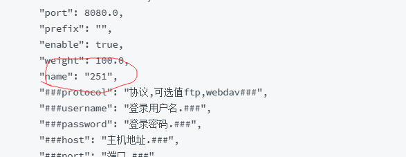

# 平台存储库配置

附件文件\(二进制文件\)存放在storage服务器上,

在默认情况下服务器在启动时自动启动了一个ftp服务作为storage服务器.

在生产环境中推荐使用商用服务器来存储附件文件\(二进制文件\).

支持以下协议作为附件存储服务器:

ftp,ftps,webdav,cifs\(samba\)

## 配置外部存储服务配置文件

配置文件样例configSample/externalStorageSources.json

如果在o2server/config目录下没有externalStorageSources.json配置文件.可以将externalStorageSources.json配置文件从o2server/configSample目录下拷贝至o2server/config目录.

```text
{
  "file": [
    {
      "protocol": "webdav",
      "username": "admin",
      "password": "admin",
      "host": "127.0.0.1",
      "port": 8080.0,
      "prefix": "",
      "enable": true,
      "weight": 100.0,
      "name": "251",
      "###protocol": "协议,可选值ftp,webdav###",
      "###username": "登录用户名.###",
      "###password": "登录密码.###",
      "###host": "主机地址.###",
      "###port": "端口.###",
      "###prefix": "前缀路径.###",
      "###enable": "是否启用###",
      "###weight": "设置权重.###",
      "###name": "存储节点名,对应存储名称,谨慎修改.###"
    }
  ],
  "processPlatform": [
    {
      "protocol": "webdav",
      "username": "admin",
      "password": "admin",
      "host": "127.0.0.1",
      "port": 8080.0,
      "prefix": "",
      "enable": true,
      "weight": 100.0,
      "name": "251",
      "###protocol": "协议,可选值ftp,webdav###",
      "###username": "登录用户名.###",
      "###password": "登录密码.###",
      "###host": "主机地址.###",
      "###port": "端口.###",
      "###prefix": "前缀路径.###",
      "###enable": "是否启用###",
      "###weight": "设置权重.###",
      "###name": "存储节点名,对应存储名称,谨慎修改.###"
    }
  ],
  "mind": [
    {
      "protocol": "webdav",
      "username": "admin",
      "password": "admin",
      "host": "127.0.0.1",
      "port": 8080.0,
      "prefix": "",
      "enable": true,
      "weight": 100.0,
      "name": "251",
      "###protocol": "协议,可选值ftp,webdav###",
      "###username": "登录用户名.###",
      "###password": "登录密码.###",
      "###host": "主机地址.###",
      "###port": "端口.###",
      "###prefix": "前缀路径.###",
      "###enable": "是否启用###",
      "###weight": "设置权重.###",
      "###name": "存储节点名,对应存储名称,谨慎修改.###"
    }
  ],
  "meeting": [
    {
      "protocol": "webdav",
      "username": "admin",
      "password": "admin",
      "host": "127.0.0.1",
      "port": 8080.0,
      "prefix": "",
      "enable": true,
      "weight": 100.0,
      "name": "251",
      "###protocol": "协议,可选值ftp,webdav###",
      "###username": "登录用户名.###",
      "###password": "登录密码.###",
      "###host": "主机地址.###",
      "###port": "端口.###",
      "###prefix": "前缀路径.###",
      "###enable": "是否启用###",
      "###weight": "设置权重.###",
      "###name": "存储节点名,对应存储名称,谨慎修改.###"
    }
  ],
  "calendar": [
    {
      "protocol": "webdav",
      "username": "admin",
      "password": "admin",
      "host": "127.0.0.1",
      "port": 8080.0,
      "prefix": "",
      "enable": true,
      "weight": 100.0,
      "name": "251",
      "###protocol": "协议,可选值ftp,webdav###",
      "###username": "登录用户名.###",
      "###password": "登录密码.###",
      "###host": "主机地址.###",
      "###port": "端口.###",
      "###prefix": "前缀路径.###",
      "###enable": "是否启用###",
      "###weight": "设置权重.###",
      "###name": "存储节点名,对应存储名称,谨慎修改.###"
    }
  ],
  "okr": [
    {
      "protocol": "webdav",
      "username": "admin",
      "password": "admin",
      "host": "127.0.0.1",
      "port": 8080.0,
      "prefix": "",
      "enable": true,
      "weight": 100.0,
      "name": "251",
      "###protocol": "协议,可选值ftp,webdav###",
      "###username": "登录用户名.###",
      "###password": "登录密码.###",
      "###host": "主机地址.###",
      "###port": "端口.###",
      "###prefix": "前缀路径.###",
      "###enable": "是否启用###",
      "###weight": "设置权重.###",
      "###name": "存储节点名,对应存储名称,谨慎修改.###"
    }
  ],
  "cms": [
    {
      "protocol": "webdav",
      "username": "admin",
      "password": "admin",
      "host": "127.0.0.1",
      "port": 8080.0,
      "prefix": "",
      "enable": true,
      "weight": 100.0,
      "name": "251",
      "###protocol": "协议,可选值ftp,webdav###",
      "###username": "登录用户名.###",
      "###password": "登录密码.###",
      "###host": "主机地址.###",
      "###port": "端口.###",
      "###prefix": "前缀路径.###",
      "###enable": "是否启用###",
      "###weight": "设置权重.###",
      "###name": "存储节点名,对应存储名称,谨慎修改.###"
    }
  ],
  "bbs": [
    {
      "protocol": "webdav",
      "username": "admin",
      "password": "admin",
      "host": "127.0.0.1",
      "port": 8080.0,
      "prefix": "",
      "enable": true,
      "weight": 100.0,
      "name": "251",
      "###protocol": "协议,可选值ftp,webdav###",
      "###username": "登录用户名.###",
      "###password": "登录密码.###",
      "###host": "主机地址.###",
      "###port": "端口.###",
      "###prefix": "前缀路径.###",
      "###enable": "是否启用###",
      "###weight": "设置权重.###",
      "###name": "存储节点名,对应存储名称,谨慎修改.###"
    }
  ],
  "report": [
    {
      "protocol": "webdav",
      "username": "admin",
      "password": "admin",
      "host": "127.0.0.1",
      "port": 8080.0,
      "prefix": "",
      "enable": true,
      "weight": 100.0,
      "name": "251",
      "###protocol": "协议,可选值ftp,webdav###",
      "###username": "登录用户名.###",
      "###password": "登录密码.###",
      "###host": "主机地址.###",
      "###port": "端口.###",
      "###prefix": "前缀路径.###",
      "###enable": "是否启用###",
      "###weight": "设置权重.###",
      "###name": "存储节点名,对应存储名称,谨慎修改.###"
    }
  ],
  "strategyDeploy": [
    {
      "protocol": "webdav",
      "username": "admin",
      "password": "admin",
      "host": "127.0.0.1",
      "port": 8080.0,
      "prefix": "",
      "enable": true,
      "weight": 100.0,
      "name": "251",
      "###protocol": "协议,可选值ftp,webdav###",
      "###username": "登录用户名.###",
      "###password": "登录密码.###",
      "###host": "主机地址.###",
      "###port": "端口.###",
      "###prefix": "前缀路径.###",
      "###enable": "是否启用###",
      "###weight": "设置权重.###",
      "###name": "存储节点名,对应存储名称,谨慎修改.###"
    }
  ],
  "teamwork": [
    {
      "protocol": "webdav",
      "username": "admin",
      "password": "admin",
      "host": "127.0.0.1",
      "port": 8080.0,
      "prefix": "",
      "enable": true,
      "weight": 100.0,
      "name": "251",
      "###protocol": "协议,可选值ftp,webdav###",
      "###username": "登录用户名.###",
      "###password": "登录密码.###",
      "###host": "主机地址.###",
      "###port": "端口.###",
      "###prefix": "前缀路径.###",
      "###enable": "是否启用###",
      "###weight": "设置权重.###",
      "###name": "存储节点名,对应存储名称,谨慎修改.###"
    }
  ]
}
```

针对每一类文件可以设置一个或者多个存储点进行文件存储,在同一类文件的存储点中的name必须唯一,且不能进行修改\(会导致无法找到附件文件\),



## FTP协议

File Transfer Protocol

## FTPS协议

TLS File Transfer Protocol

## WEBDAV协议

Web-based Distributed Authoring and Versioning

## CIFS协议

Common Internet File System


