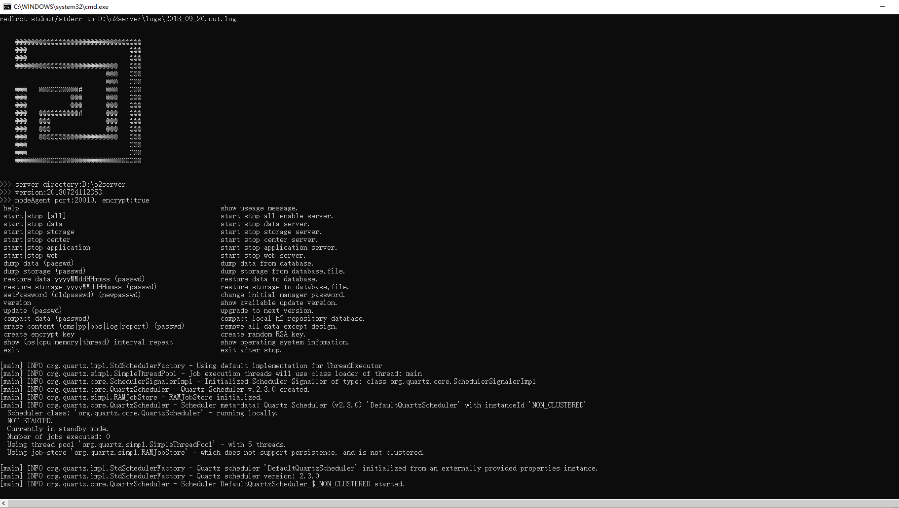

# 服务器下载和安装

 访问 [www.o2oa.net/download.html](www.o2oa.net/download.html)

下载与系统对应的版本.

O2OA支持windows/linux/macos/aix/中标麒麟操作系统，下载相应的安装包版本，安装包大小大概400M左右。这里以Windows系统为例：

1\) 下载o2server\_yyyyMMddHHmmss\_windows.zip程序包.

2\) 解压下载后的压缩包到任意目录（注意：为了避免JVM异常，**请不要使用有中文目录和空格的目录名**）

3\) 为了服务器能正常启动，请确认服务器的80、20020、20030端口未被占用，如果是云服务器的话，请确认以上端口可以被访问（已经加入到安全控制策略，或者防火墙允许以上端口被访问）

4\) 打开o2server文件夹，选择start\_windows.bat双击打开（如有必要，请使用管理员身份打开start\_windows.bat），命令提示窗口如下图所示:

5\) 在命令行中输入"start" 回车，O2OA各服务器开始启动启动服务，等待相关服务启动完成即可。

 _**启动顺序依次为：**_

 a.数据库服务器 （默认占用20050端口）

 b.文件存储服务器（默认占用20040端口）

 c.中心调度服务器（默认占用20030端口）

 d.应用服务器 （默认占用20020端口）

 e.静态资源服务器（WEB服务器，默认占用80端口）

启动界面如下图所示：

当出现如下图红圈内信息

\[main\] com.x.server.console.server.web.WebServerTools - web server start completed on port: 80.

时，表示安装完毕，可通过当前主机[http://127.0.0.1:80](http://127.0.0.1:80) 登陆O2OA平台。

 6\) 输入用户名xadmin密码o2登陆系统即可。

----------------------------------------------- 我是一条美丽的分割线 ------------------------------------------------------

**启动命令说明：**

**help**

显示启动命令列表。

**start\|stop \[all\]**

启动或者停止服务器，启动全部或者停止全部服务器时，all可以省略.

**start\|stop data**

启动或者停止数据库服务器。

**start\|stop**

启动或者停止文件存储服务器。

**start\|stop center**

启动或者停止中心调度服务器。

**start\|stop**

启动或者停止应用服务器。

**start\|stop web**

启动或者停止WEB服务器。

**dump data \(passwd\)**

导出全部数据命令，如 **dump data o2**，其中o2是管理员密码，导出的数据在目录o2server/local/dump目录下，导出文件名如：o2server/local/dump/dumpData\_20180926060000。其中20180926060000是日期时间后缀，在导入（恢复）数据时使用。

**dump storage \(passwd\)**

导出附件或者文件内容，命令使用方法如dump data，不再详述。

**restore data yyyyMMddHHmmss \(passwd\)**

导入（恢复）数据，命令如：**restore data 20180926060000 o2，**其中20180926060000是导出文件的时间后缀，o2是管理员密码。

**restore storage yyyyMMddHHmmss \(passwd\)**

导入（恢复）文件或者附件数据，导入方式同restore data，不再详述。

**setPassword \(oldpasswd\) \(newpasswd\)**

设置管理员密码，如：**setPassword o2 12345678**, 其中o2是旧密码，12345678是新密码。

**version**

查看当前服务器的版本。查询后，命令提示窗口会列出所有可以更新的版本，系统每次只能更新到最近的一个新版本，如果有多个版本需要升级，请多次执行更新命令update \(passwd\)至最新版本升级完成。

**update \(passwd\)**

更新服务器至下一个新版本。如：**update o2**， 其中o2是旧密码。

**compact data \(passwod\)**

压缩系统自带的H2数据库，如果使用了其他数据库，此功能不需要使用。命令如：**compact data o2**， 其中o2是旧密码。

**erase content \(cms\|pp\|bbs\|log\|report\) \(passwd\)**

清除业务数据。此命令将在保留系统设计的前提下，清除所有已经发起的流程，以及发布的信息，论坛的贴子等用户使用过程中产生的数据。

如：**erase content cms o2**， 其中cms指信息内容管理系统，o2是旧密码。

**create encrypt key**

创建用于远程连接服务器的私钥和公钥.

**show \(os\|cpu\|memory\|thread\) interval repeat**

显示服务器运行状态,例如显示cpu繁忙程度,间隔两秒显示一次,共重复100次.:show cpu 2 100

**exit**

在停止所有服务器之后，退出控制进程。

