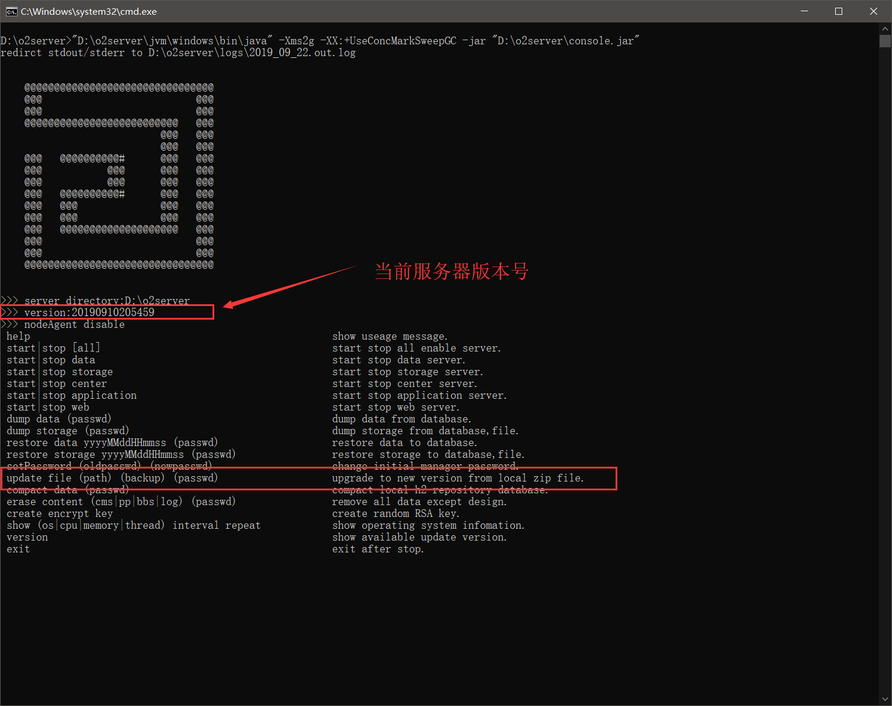
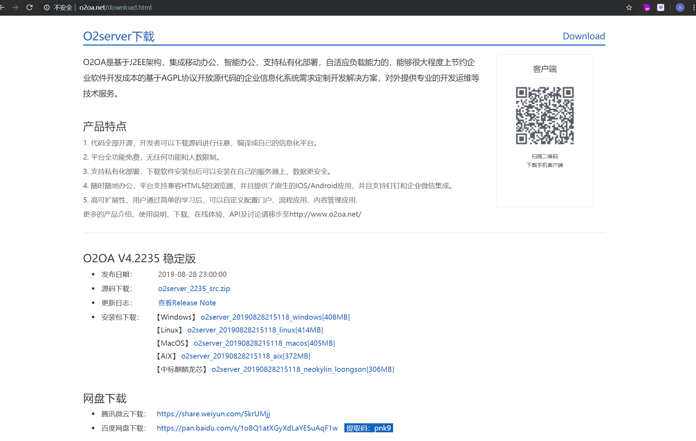
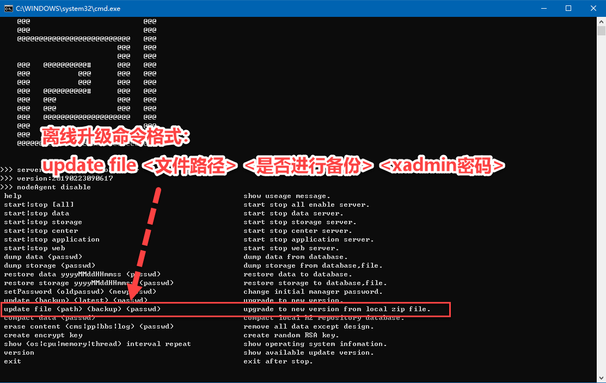
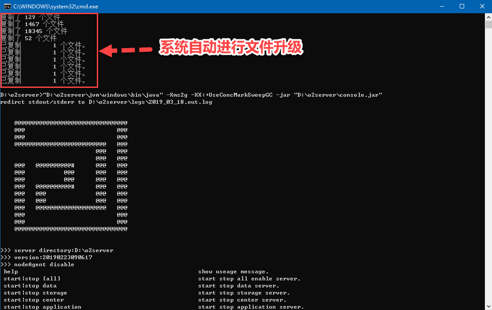

# 平台升级操作说明


#### **因为安装包比较大，部分用户直接在线升级因为网络原因会导致更新不成功，所以我们停用在线直接升级，启用离线包进行服务器升级的方式。**


##  一、**查看当前系统版本号**

服务器下载完成后，执行启动命令（start\_windows.bat或者start\_linux.sh等），命令提示窗口将会展示服务器信息及可执行的服务器命令说明，如下图所示：



##  二、**下载离线安装包**


#### O2OA v4.1369\[o2server_20190223090617_\*.zip\]之后的版本均支持离线升级操作。




在O2OA v4.1369之后，O2OA支持系统下载离线包进行离线升级来支持内网升级并且提高升级过程成功率。



执行命令：

```text
update file d:/versions/o2server_20190318092737_windows.zip false o2
```

此命令将根据下载到本地磁盘D盘version目录下的O2OA服务器安装文件：o2server\_20190318092737\_windows.zip 进行升级，不对原系统进行备份，如果是其他操作系统，请根据操作系统自行选择正确的安装文件。


#### 根据不同的服务器主机配置，升级过程可能需要一定的时间。


更新命令执行完成后，请点击任意键关闭控制台窗口（linux可以exit或者kill进程来退出），然后重新执行start\_windows命令，系统会自动开始服务器文件升级过程，如下图所示界面：



升级完成后即可启动服务器。


