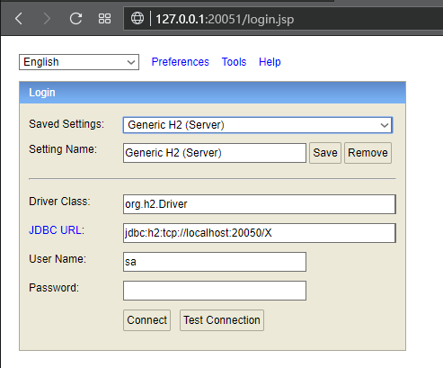
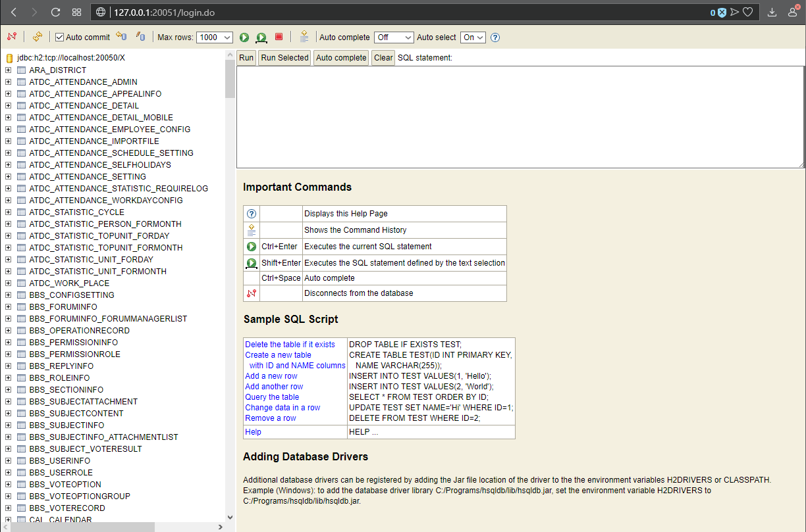
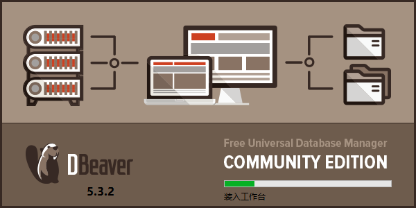
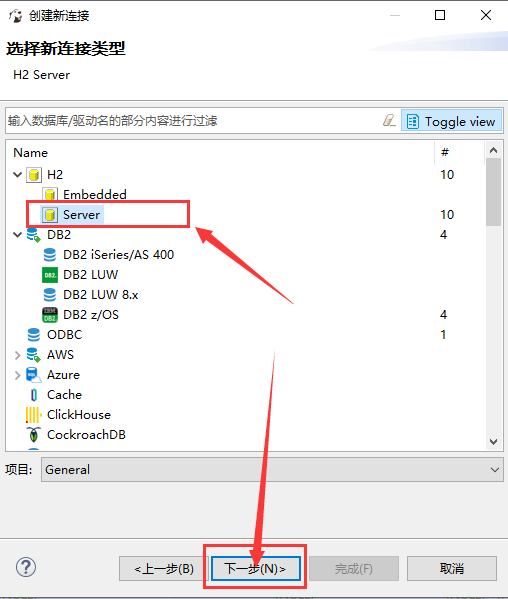
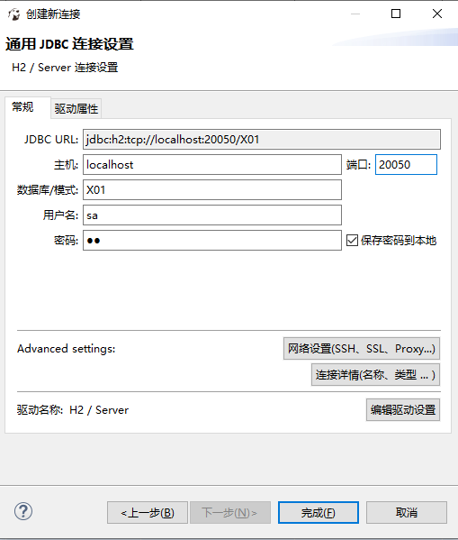
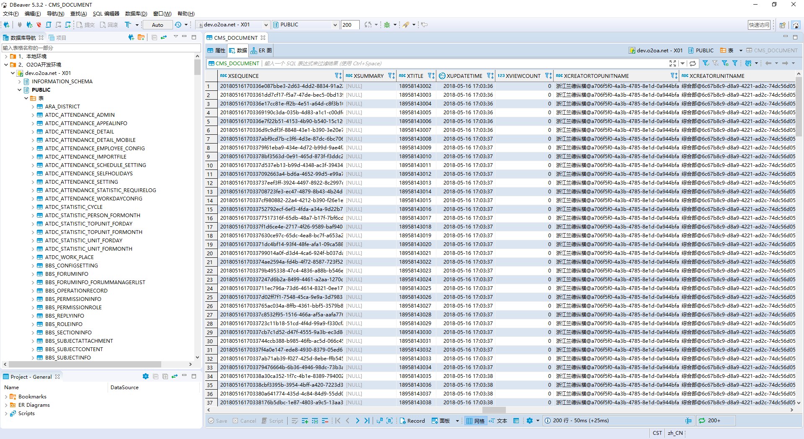
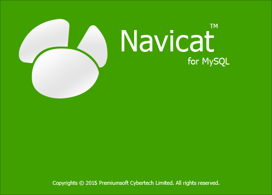
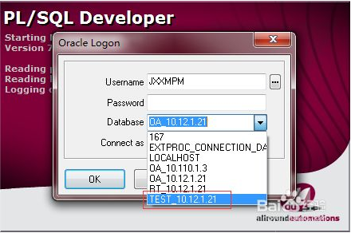
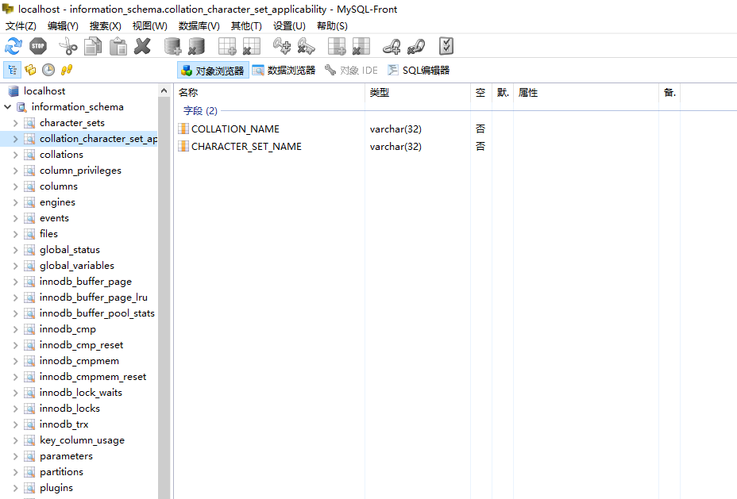

# 访问和操作H2数据库

O2OA默认内嵌了H2数据库，H2数据库支持两种访问方式：

**一、以WEB方式访问数据库**

**二、以客户端形式访问数据库（JDBC）**

\*\*\*\*

## **Web访问** <a id="h1_1"></a>

默认访问地址：[http://hostip:20051/](http://hostip:20051/)


**20051为系统默认的H2数据库访问端口，管理员可以在node\_127.0.0.1.json里对端口进行配置**




**参数说明**

```text
Saved Settings: Generic H2 （Server）Setting Name: Generic H2 （Server）Driver Class: org.h2.DriverJDBC URL: jdbc:h2:tcp://localhost:20050/XUser Name：saPassword: o2
```


**20050是平台默认的H2数据库JDBC访问端口，管理员可以在node\_127.0.0.1.json文件中修改该端口配置，passowrd:o2为xadmin密码。**


说明：

Password同xadmin密码，平台默认管理员密码为 o2

初次登录管理端，会快较慢，请耐心等待30秒左右。



## **客户端访问** <a id="h1_2"></a>

推荐客户端软件：开源数据库客户端DBeaver

DBeaver官网：https://dbeaver.io  或者 从其他网站下载均可，安装过程此处不做描述。

安装与使用手册：https://blog.csdn.net/volitationLong/article/details/80583977



**相关配置说明**

1、新建数据连接



2、填写连接信息



**参数说明**

```text
JDBC URL: 自动生成主机：服务器所在的主机IP，如127.0.0.1端口：默认为20050数据库/模式：X01用户名：sa密码：o2
```


**20050是平台默认的H2数据库JDBC访问端口，管理员可以在node\_127.0.0.1.json文件中修改该端口配置，passowrd:o2为xadmin密码。**




## **其他数据库访问** <a id="h1_3"></a>

其他数据库如Oralce，Mysql，SQLServer等，请自行使用相对应的数据库客户端，此处不做过多赘述。





MySQL-Front：

下载地址：http://www.mysqlfront.de/

安装与使用教程：https://www.w3cschool.cn/mysql/mysql-mox12owr.html




\*\*\*\*

\*\*\*\*

\*\*\*\*

\*\*\*\*

