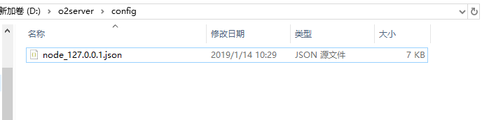

# 启用HTTPS（SSL）

##  **一、修改WEB服务器和应用服务器配置**

1、文件位置：o2server/config/node\_127.0.0.1.json, 如果目录里没有该文件，可以从o2server/configSample目录里COPY一个到config目录下。


**直接修改o2server/configSample下的node\_127.0.0.1.json配置将不会生效。**


如下图所示：



2、修改node\_127.0.0.1.json内容：

```text
{
  "enable": true,
  "isPrimaryCenter": true,
  "application": {
    "enable": true,
    "port": 20020.0,
    "sslEnable": true,
    "proxyHost": "",
    "proxyPort": 20020.0,
    "redeploy": true,
    "scanInterval": 0.0,
    "includes": [],
    "excludes": [],
    "weights": []
  },
  "web": {
    "enable": true,
    "sslEnable": true,
    "port": 443,
    "weight": 100.0
  },
  "data": {
    "enable": true,
    "tcpPort": 20050.0,
    "webPort": 20051.0,
    "includes": [],
    "excludes": [],
    "jmxEnable": false,
    "cacheSize": 512.0
  },
  "storage": {
    "enable": true,
    "port": 20040.0,
    "sslEnable": false,
    "name": "251",
    "accounts": []
  },
  "logLevel": "warn",
  "dumpData": {
    "cron": "",
    "size": 14.0,
    "###cron": "定时任务cron表达式###",
    "###size": "最大保留分数,超过将自动删除最久的数据.###"
  },
  "dumpStorage": {
    "cron": "",
    "size": 14.0,
    "###cron": "定时任务cron表达式###",
    "###size": "最大保留分数,超过将自动删除最久的数据.###"
  },
  "restoreData": {
    "cron": "",
    "date": "",
    "###cron": "定时任务cron表达式###",
    "###date": "导入数据时间戳,需要在local/dump下有此时间戳的文件.###"
  },
  "restoreStorage": {
    "cron": "",
    "date": "",
    "###cron": "定时任务cron表达式###",
    "###date": "导入数据时间戳,需要在local/dump下有此时间戳的文件.###"
  },
 ......
}
```

\*\*\*\*

\*\*\*\*

\*\*\*\*

## **二、修改中心服务器配置**

\*\*\*\*

\*\*\*\*

