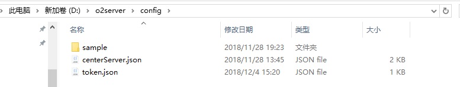
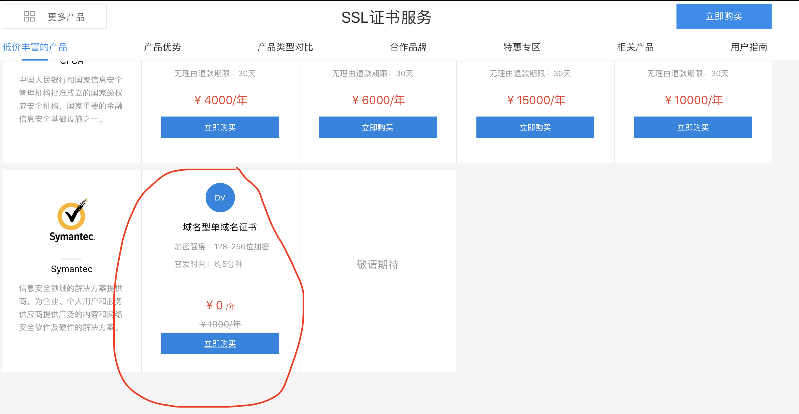

# 启用HTTPS（SSL）

##  **一、修改WEB服务器和应用服务器配置**

1、文件位置：o2server/config/node\_127.0.0.1.json, 如果目录里没有该文件，可以从o2server/configSample目录里COPY一个到config目录下。


**直接修改o2server/configSample下的node\_127.0.0.1.json配置将不会生效。**


如下图所示：


2、修改node\_127.0.0.1.json内容：

```text
{
  "enable": true,
  "isPrimaryCenter": true,
  "application": {
    "enable": true,
    "port": 20020.0,
    "sslEnable": true,         #启用SSL
    "proxyHost": "",
    "proxyPort": 20020.0,
    "redeploy": true,
    "scanInterval": 0.0,
    "includes": [],
    "excludes": [],
    "weights": []
  },
  "web": {
    "enable": true,
    "sslEnable": true,         #启用SSL
    "port": 443,               #修改端口为443
    "weight": 100.0
  },
  "data": {
    "enable": true,
    "tcpPort": 20050.0,
    "webPort": 20051.0,
    "includes": [],
    "excludes": [],
    "jmxEnable": false,
    "cacheSize": 512.0
  },
  "storage": {
    "enable": true,
    "port": 20040.0,
    "sslEnable": false,
    "name": "251",
    "accounts": []
  },
  "logLevel": "warn",
  "dumpData": {
    "cron": "",
    "size": 14.0,
    "###cron": "定时任务cron表达式###",
    "###size": "最大保留分数,超过将自动删除最久的数据.###"
  },
  "dumpStorage": {
    "cron": "",
    "size": 14.0,
    "###cron": "定时任务cron表达式###",
    "###size": "最大保留分数,超过将自动删除最久的数据.###"
  },
  "restoreData": {
    "cron": "",
    "date": "",
    "###cron": "定时任务cron表达式###",
    "###date": "导入数据时间戳,需要在local/dump下有此时间戳的文件.###"
  },
  "restoreStorage": {
    "cron": "",
    "date": "",
    "###cron": "定时任务cron表达式###",
    "###date": "导入数据时间戳,需要在local/dump下有此时间戳的文件.###"
  },
 ......
}
```

将配置文件中的web和application对象中的sslEnable设置为true, web服务器的端口设定为443。

## **二、修改中心服务器配置**

1、文件位置：o2server/config/centerServer.json, 如果目录里没有该文件，可以从o2server/configSample目录里COPY一个到config目录下。

如下图所示：



2、修改centerServer.json内容：

```text
{
  "sslEnable": true,       #启动SSL
  "redeploy": true,
  "port": 20030.0,
  "httpProtocol": "",
  "proxyHost": "",
  "proxyPort": 20030.0,
  "scanInterval": 0.0,
  "###enable": "是否启用###",
  "###sslEnable": "是否启用ssl传输加密,如果启用将使用config/keystore文件作为密钥文件.使用config/token.json文件中的sslKeyStorePassword字段为密钥密码,sslKeyManagerPassword为管理密码.###",
  "###redeploy": "每次启动是否重新部署所有应用.###",
  "###port": "端口,center服务器端口,默认20030###",
  "###httpProtocol": "对外http访问协议,http/https###",
  "###proxyHost": "代理主机,当服务器是通过apache/eginx等代理服务器映射到公网或者通过路由器做端口映射,在这样的情况下需要设置此地址以标明公网访问地址.###",
  "###proxyPort": "代理端口,当服务器是通过apache/eginx等代理服务器映射到公网或者通过路由器做端口映射,在这样的情况下需要设置此地址以标明公网访问端口.###",
  "###scanInterval": "重新扫描war包时间间隔(秒)###",
  "###config": "其他参数###"
}
```

将配置文件中的sslEnable设置为true。

## **三、证书申请：**

百度云目前有免费的SSL域名证书申请：https://cloud.baidu.com/product/ssl.html



 点击**立即购买**，进入购买页面，点击\`**下一步**\`完成购买。


