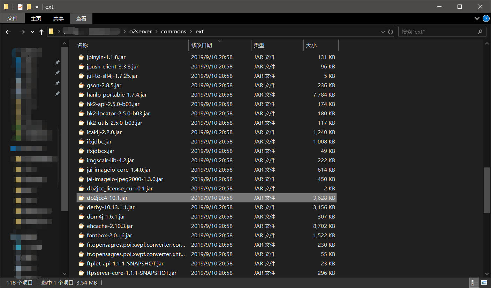
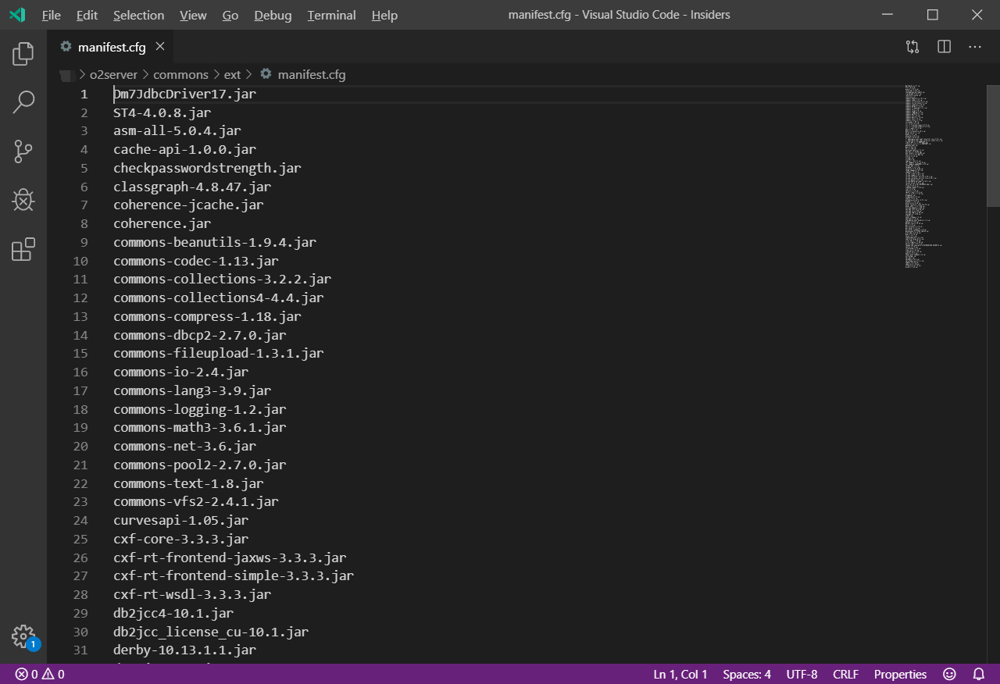

# 数据库驱动JAR包的更新或新增

## 一、下载新的驱动包文件

此节内容需要自行准备，您可以在数据库官方网站上下载最新的驱动 或者合适数据库版本的驱动包。

## 二、替换旧的驱动包（新增驱动包）

### 1、将驱动包COPY到指定的目录

驱动包位置：o2server/commons/ext

### 2、修改O2OA扩展包注册文件

新增JAR包（驱动包）后，需要修改扩展包注册文件，否则，新加入的JAR包会在服务器重新启动时进行删除。

扩展包注册文件位置：o2server/commons/ext/manifest.cfg

请在mainfest.cfg里增加新加入的jar包名称，让服务器在启动后加载到指定的驱动文件。

## 三、修改外部数据库驱动，并且重新启动

添加或者更新好驱动包后，需要修改外部数据库连接配置以使服务器正确加载驱动并且连接数据库。

此节内容请参考《外部数据库配置》

#### 

