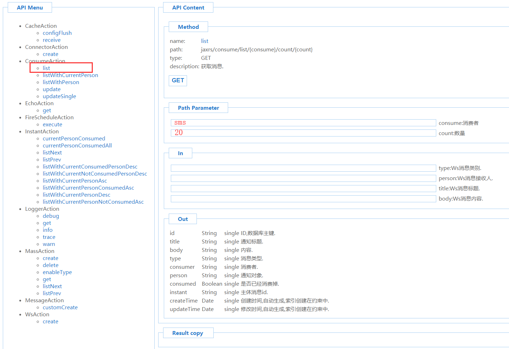
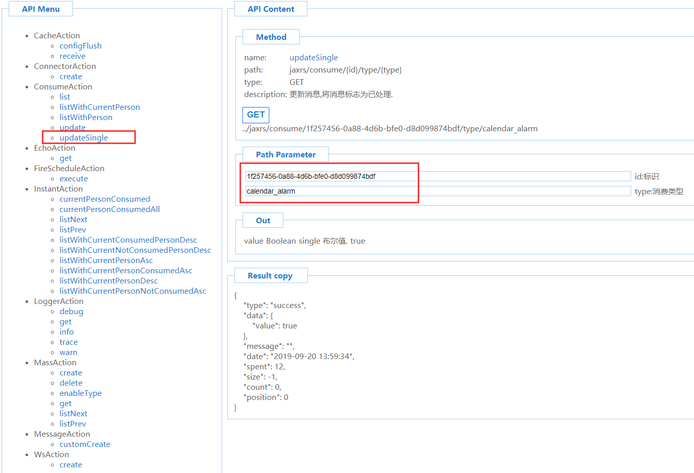

# 平台消息提醒配置

## 一、消息提醒配置文件 <a id="h1_1"></a>

文件路径：o2server/config

文件名：messages.json

注意：如果o2server/config目录下没有该文件，请从o2server/configSample目录中COPY一份到o2server/config目录中，直接在configSample目录中修改将不会生效。

## 二、事件说明 <a id="h1_2"></a>

```
attachment_editor                 #文件被编辑attachment_editorCancel           #文件编辑被撤消attachment_editorModify           #文件编辑被修改attachment_share                  #文件被分享attachment_shareCancel            #文件分享被取消meeting_delete                    #会议被删除meeting_invite                    #收到会议邀请readCompleted_create              #文件已阅readCompleted_delete              #文件已阅被删除read_create                       #收到文件待阅read_delete                       #文件待阅被删除taskCompleted_create              #收到已办信息taskCompleted_delete              #已办信息被删除task_create                       #收到待办信息task_delete                       #待办信息被删除task_press                        #待办被点击打开teamwork_taskCreate               #收到工作任务teamwork_taskUpdate               #工作任务被更新teamwork_taskDelelte              #工作任务被删除teamwork_taskOvertime             #工作任务已超时teamwork_taskChat                 #收到工作任务交流信息
```

## 三、关于consumers产生的消息的处理机（消费者）相关配置： <a id="h1_3"></a>

ws ： 内部处理器，PC端websocket消息推送的处理器

pms : 内部处理器，pushMail通过极光推送向移动设备推送应用通知（**Notifacation**）的处理器

dingding : 内部处理器，发送钉钉待办消息的处理器

zhengwudingding ： 内部处理器，发送政务钉钉待办消息的处理器

qiyeweixin : 内部处理器，发送企业微信消息提醒的处理器

## 四、配置外部消费者 <a id="h1_4"></a>

适应需求：比如分离出一组消息，由程序通过第三方短信网关发送"待办到达"提醒短信：

### 1、添加新的consumer，比如sms\(名称可以根据业务来自由决定，支持英文\)： <a id="h2_5"></a>

```text
"task_create": {    "consumers": [        "ws",        "pms",        "dingding",        "zhengwuDingding",        "qiyeweixin",        "sms"    ]},
```

**\(注意，修改完成后，整个JSON的格式必须保证正确。\)**

### 2、通过服务获取所有的需要提醒的消息列表： <a id="h2_6"></a>

 [http://o2server\_host:20020/x\_message\_assemble\_communicate/jest/index.html](http://o2server_host:20020/x_message_assemble_communicate/jest/index.html)



服务请求地址：jaxrs/consume/list/{consume}/count/{count}

参数说明：

        consume - 需要查询消息的消费者

        count - 返回列表最大数量

服务地址示例: [http://o2server\_host:20020/x\_message\_assemble\_communicate/jaxrs/consume/list/sms/count/10](http://o2server_host:20020/x_message_assemble_communicate//jaxrs/consume/list/sms/count/10)

返回数据格式：

```text
{  "type": "success",  "data": [    {      "id": "665958e7-f590-43d5-9f0c-906514329e31",      "title": "您有新的待办:流程调用:12323, (拟稿,测试并行流程)",      "body": "{'id':'c8168b76-aa41-4223-bc0d-6b0a4143ca29','job':'712154cb-41aa-44ff-a7c2-b7c29a0f3db0','title':'流程调用:12323','startTime':'2019-09-13 08:21:03','startTimeMonth':'2019-09','work':'a0cb81b1-609a-40df-9a34-6813957c32ea','application':'45475aa6-1651-4014-ae6b-625f9dd5948b','applicationName':'001test','applicationAlias':'001test','process':'c5b46aed-4d1e-4da6-a1ef-bc591eb296b5','processName':'测试并行流程','processAlias':'','serial':'','person':'罗晶@luojing@P','identity':'罗晶@a553fb21-9354-4344-8eba-d8e284b7b460@I','unit':'开发部@22@U','trustIdentity':'纪桂丹@ed052254-23ae-4809-a5cc-8d12b95697de@I','activity':'fbb22a88-14fe-4154-b435-a4e410f78648','activityName':'拟稿','activityAlias':'','activityDescription':'','activityType':'manual','activityToken':'b084b040-3067-49bb-8e48-ea0f95eca59f','creatorPerson':'纪桂丹@JiGuiDan@P','creatorIdentity':'纪桂丹@e868844b-bcea-4b31-8ddd-ea3becda290a@I','creatorUnit':'开发部@22@U','expired':false,'urged':false,'routeList':['5ca98a7f-8a8b-4efb-8a0f-f6051501eb34','37345194-2456-4beb-8775-3b6c3108cad0'],'routeNameList':['go','选择'],'routeOpinionList':['',''],'routeDecisionOpinionList':['',''],'routeName':'','opinion':'','modified':false,'viewed':false,'allowRapid':false,'first':true,'createTime':'2019-09-13 08:21:03','updateTime':'2019-09-13 08:21:03','sequence':'20190913082103c8168b76-aa41-4223-bc0d-6b0a4143ca29'}",      "type": "task_create",      "consumer": "sms",      "person": "罗晶@luojing@P",      "consumed": false,      "instant": "c619de29-166b-4571-96f0-da4f11c6ed63",      "createTime": "2019-09-13 08:21:03",      "updateTime": "2019-09-13 08:21:03"    },    {      "id": "63eb790c-9b02-4faa-80c8-e9b9b93a4083",      "title": "您有新的待办:流程调用:测试一分N个流程0001, (拟稿,测试并行流程)",      "body": "{'id':'16ff7d53-dd0e-405f-9351-845d8ed697ab','job':'3fdeb09f-d3dc-48e6-962d-dd34d7aa8d7d','title':'流程调用:测试一分N个流程0001','startTime':'2019-09-13 08:21:03','startTimeMonth':'2019-09','work':'d7a4e5de-260b-496e-b73b-33fcf4c35629','application':'45475aa6-1651-4014-ae6b-625f9dd5948b','applicationName':'001test','applicationAlias':'001test','process':'c5b46aed-4d1e-4da6-a1ef-bc591eb296b5','processName':'测试并行流程','processAlias':'','serial':'','person':'罗晶@luojing@P','identity':'罗晶@a553fb21-9354-4344-8eba-d8e284b7b460@I','unit':'开发部@22@U','trustIdentity':'纪桂丹@ed052254-23ae-4809-a5cc-8d12b95697de@I','activity':'fbb22a88-14fe-4154-b435-a4e410f78648','activityName':'拟稿','activityAlias':'','activityDescription':'','activityType':'manual','activityToken':'d5240f24-515c-46a4-a386-d7188b3bcb8e','creatorPerson':'纪桂丹@JiGuiDan@P','creatorIdentity':'纪桂丹@e868844b-bcea-4b31-8ddd-ea3becda290a@I','creatorUnit':'开发部@22@U','expired':false,'urged':false,'routeList':['5ca98a7f-8a8b-4efb-8a0f-f6051501eb34','37345194-2456-4beb-8775-3b6c3108cad0'],'routeNameList':['go','选择'],'routeOpinionList':['',''],'routeDecisionOpinionList':['',''],'routeName':'','opinion':'','modified':false,'viewed':false,'allowRapid':false,'first':true,'createTime':'2019-09-13 08:21:03','updateTime':'2019-09-13 08:21:03','sequence':'2019091308210316ff7d53-dd0e-405f-9351-845d8ed697ab'}",      "type": "task_create",      "consumer": "sms",      "person": "罗晶@luojing@P",      "consumed": false,      "instant": "0f0e0928-98be-44d4-ab4b-2fb244520297",      "createTime": "2019-09-13 08:21:03",      "updateTime": "2019-09-13 08:21:03"    },    {      "id": "210c7c7d-b90b-4547-aef7-02e352233b3c",      "title": "您有新的待办:纪桂丹的变革及重大事项积分个人申报, (部门积分管理员初审,个人申报流程)",      "body": "{'id':'bc9bca9e-f9a1-42a2-8753-0767c08c7975','job':'dda07279-8692-46ac-b175-8106f53f4172','title':'纪桂丹的变革及重大事项积分个人申报','startTime':'2019-09-13 08:21:25','startTimeMonth':'2019-09','work':'b2113d2a-3e70-4c96-bbfe-3b14f913c4a3','application':'d205e63a-126a-4344-8115-3d7b9c25e8c8','applicationName':'积分管理-流程','applicationAlias':'pointManagerProcess','process':'7201edad-d86e-4eaf-b176-ca54ce956b36','processName':'个人申报流程','processAlias':'','serial':'','person':'罗晶@luojing@P','identity':'罗晶@a553fb21-9354-4344-8eba-d8e284b7b460@I','unit':'开发部@22@U','trustIdentity':'纪桂丹@ed052254-23ae-4809-a5cc-8d12b95697de@I','activity':'4b7b363c-57e3-410e-8b2b-583719411651','activityName':'部门积分管理员初审','activityAlias':'audit','activityDescription':'','activityType':'manual','activityToken':'6c03308e-d4cd-42cf-910c-145a12ee4e2e','creatorPerson':'纪桂丹@JiGuiDan@P','creatorIdentity':'纪桂丹@ed052254-23ae-4809-a5cc-8d12b95697de@I','creatorUnit':'开发部@22@U','expired':false,'urged':false,'routeList':['b24bfcc0-2a0b-4c6e-a5ec-bdcddc5594e6','e6475ed3-31cd-4edd-b30e-522670d64d67'],'routeNameList':['送积分行为管理单位管理员复审并公示','退回拟稿人'],'routeOpinionList':['',''],'routeDecisionOpinionList':['',''],'routeName':'','opinion':'','modified':false,'viewed':false,'allowRapid':false,'first':false,'createTime':'2019-09-13 08:21:25','updateTime':'2019-09-13 08:21:25','sequence':'20190913082125bc9bca9e-f9a1-42a2-8753-0767c08c7975'}",      "type": "task_create",      "consumer": "sms",      "person": "罗晶@luojing@P",      "consumed": false,      "instant": "ed69ece9-b194-4344-addc-a2bc4b77b574",      "createTime": "2019-09-13 08:21:25",      "updateTime": "2019-09-13 08:21:25"    },    {      "id": "9bf0cb36-5f37-4e13-9c85-bf6724738e08",      "title": "日程提醒",      "body": "{'id':'42e267b5-d5c6-4b96-b0f6-7b89a6f65586','calendarId':'fa61c4e5-2424-4a89-9ada-341aaf05162c','repeatMasterId':'73d39f2d-7718-463f-9d6a-e1a90957cac4','eventType':'CAL_EVENT','title':'三国杀--兰德杯-预赛','color':'#428ffc','comment':'\r\n三国杀--兰德杯-预赛\r\n\r\n\\n','startTime':'2019-09-15 08:26:00','startTimeStr':'2019-09-15 08:26:00','endTime':'2019-09-15 23:59:00','endTimeStr':'2019-09-15 23:59:00','locationName':'三国杀--兰德杯-预赛','recurrenceRule':'FREQ=WEEKLY;UNTIL=20191005T160000Z;BYDAY=SU','alarm':true,'alarmTime':'2019-09-15 08:21:00','alarmAlready':false,'valarmTime_config':'0,0,-5,0','valarm_Summary':'日程提醒','isAllDayEvent':false,'daysOfDuration':0,'isPublic':true,'source':'PERSONAL','createPerson':'纪桂丹@JiGuiDan@P','updatePerson':'纪桂丹@JiGuiDan@P','targetType':'PERSON','participants':['纪桂丹@JiGuiDan@P','xadmin'],'manageablePersonList':['纪桂丹@JiGuiDan@P','xadmin'],'viewablePersonList':['纪桂丹@JiGuiDan@P','xadmin'],'viewableUnitList':[],'viewableGroupList':[],'createTime':'2019-09-05 08:26:50','updateTime':'2019-09-05 08:26:50','sequence':'2019090508265042e267b5-d5c6-4b96-b0f6-7b89a6f65586'}",      "type": "calendar_alarm",      "consumer": "sms",      "person": "纪桂丹@JiGuiDan@P",      "consumed": false,      "instant": "dc8eaf90-28b6-40e0-8fcb-ca972a30c8b3",      "createTime": "2019-09-15 08:24:54",      "updateTime": "2019-09-15 08:24:54"    },    {      "id": "1f257456-0a88-4d6b-bfe0-d8d099874bdf",      "title": "日程提醒",      "body": "{'id':'42e267b5-d5c6-4b96-b0f6-7b89a6f65586','calendarId':'fa61c4e5-2424-4a89-9ada-341aaf05162c','repeatMasterId':'73d39f2d-7718-463f-9d6a-e1a90957cac4','eventType':'CAL_EVENT','title':'三国杀--兰德杯-预赛','color':'#428ffc','comment':'\r\n三国杀--兰德杯-预赛\r\n\r\n\\n','startTime':'2019-09-15 08:26:00','startTimeStr':'2019-09-15 08:26:00','endTime':'2019-09-15 23:59:00','endTimeStr':'2019-09-15 23:59:00','locationName':'三国杀--兰德杯-预赛','recurrenceRule':'FREQ=WEEKLY;UNTIL=20191005T160000Z;BYDAY=SU','alarm':true,'alarmTime':'2019-09-15 08:21:00','alarmAlready':false,'valarmTime_config':'0,0,-5,0','valarm_Summary':'日程提醒','isAllDayEvent':false,'daysOfDuration':0,'isPublic':true,'source':'PERSONAL','createPerson':'纪桂丹@JiGuiDan@P','updatePerson':'纪桂丹@JiGuiDan@P','targetType':'PERSON','participants':['纪桂丹@JiGuiDan@P','xadmin'],'manageablePersonList':['纪桂丹@JiGuiDan@P','xadmin'],'viewablePersonList':['纪桂丹@JiGuiDan@P','xadmin'],'viewableUnitList':[],'viewableGroupList':[],'createTime':'2019-09-05 08:26:50','updateTime':'2019-09-05 08:26:50','sequence':'2019090508265042e267b5-d5c6-4b96-b0f6-7b89a6f65586'}",      "type": "calendar_alarm",      "consumer": "sms",      "person": "xadmin",      "consumed": false,      "instant": "b2caf573-7933-483c-a3de-7446e37a8cb2",      "createTime": "2019-09-15 08:24:54",      "updateTime": "2019-09-15 08:24:54"    }  ],  "message": "",  "date": "2019-09-20 13:38:43",  "spent": 12,  "size": 5,  "count": 0,  "position": 0}
```

### 3、消费后，需要由自定义程序将消息主动标识为已消费，否则将一直存在于数据库中，每次查询都会将消息重新查询出来： <a id="h2_7"></a>

[http://o2server\_host:20020/x\_message\_assemble\_communicate/jest/index.html](http://o2server_host:20020/x_message_assemble_communicate/jest/index.html)



更新（消费）消息服务地址：jaxrs/consume/{id}/type/{type}

参数说明：

        id - 需要标识的消息ID

        type - 需要标识的消息类别（在查询时返回数据中的type值）

服务地址示例: http://o2server\_host:20020/x\_message\_assemble\_communicate/jaxrs/consume/1f257456-0a88-4d6b-bfe0-d8d099874bdf/type/calendar\_alarm

返回数据格式：

```text
{  "type": "success",  "data": {    "value": true  },  "message": "",  "date": "2019-09-20 13:59:34",  "spent": 12,  "size": -1,  "count": 0,  "position": 0}
```

## 五、消息信息表自动清理相关设置 <a id="h1_8"></a>

#### 参数说明：

        enable - 是否启用  
        cron - 定时cron表达式  
        keep - 消息保留天数

```
"clean": {    "enable": true,    "cron": "30 30 6 * * ?",    "keep": 7.0,    "###enable": "是否启用###",    "###cron": "定时cron表达式###",    "###keep": "消息保留天数###"}
```


