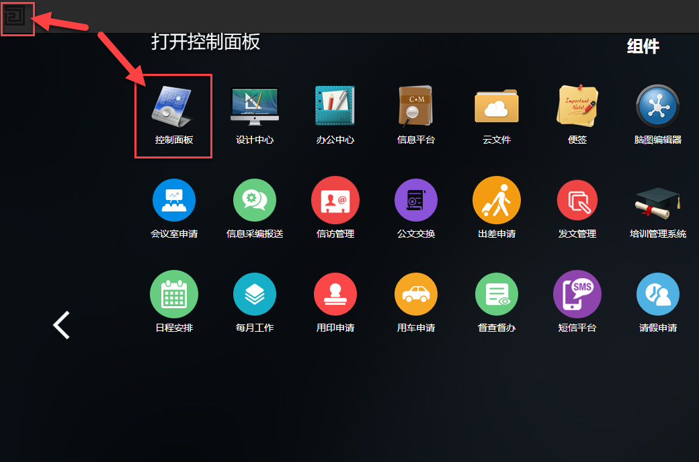
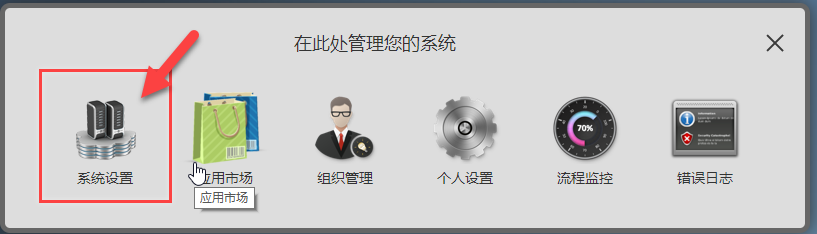
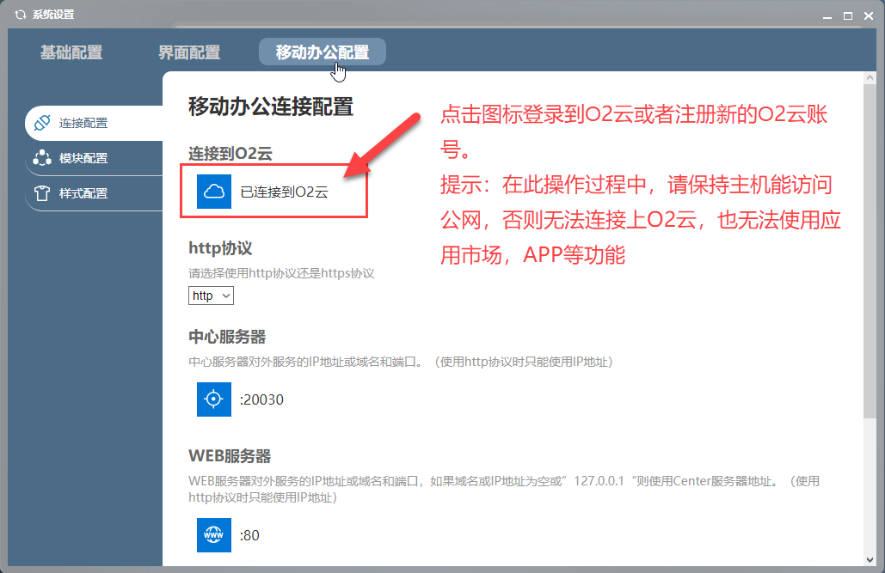
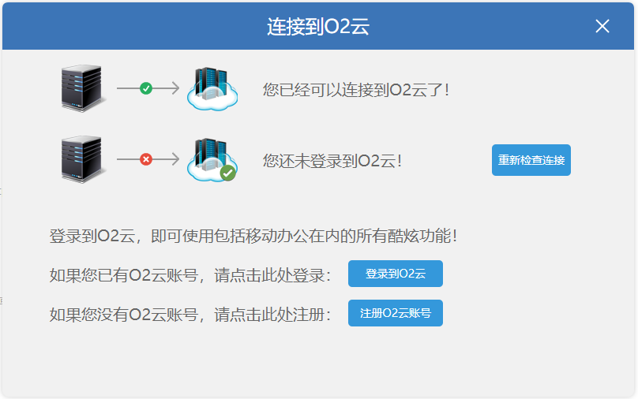
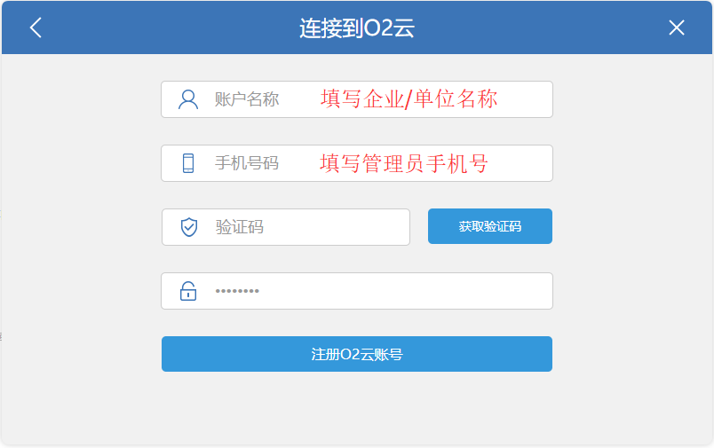
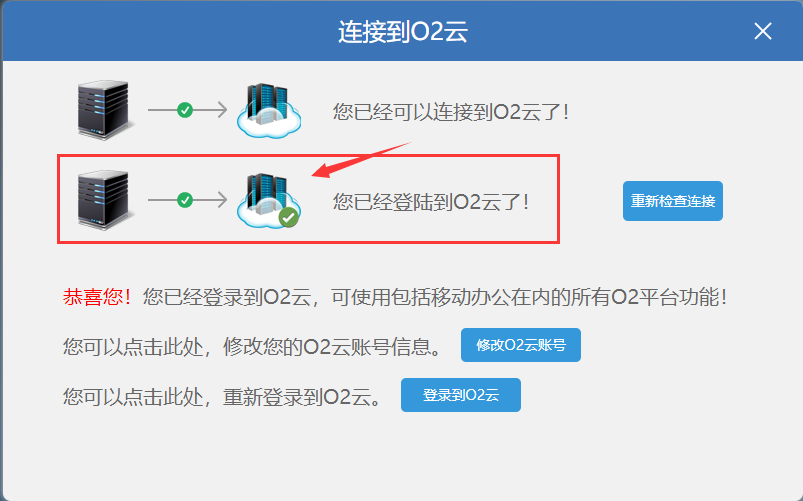

# 连接O2云使用APP


#### 要使用移动办公APP，必须确保用户可以通过公网访问O2OA服务器，并且服务器向外可以访问collect.o2oa.net:20080端口向O2云进行通信。


##  一、**使用O2OA连接O2云**

使用系统管理或者xadmin登录系统，点击首页左上角的系统菜单，选择“控制面板 ”-“系统设置”：

点击\[系统设置\]：

点击书签\[移动办公配置\]：

在此操作过程中，请保持主机能访问公网，否则无法连接上O2云，也无法使用应用市场，APP等功能。

在系统弹出的O2云登录状态页面中，如果已经拥有O2云账号，可以点击登录按钮进行登录，也可以点击“注册O2云账号”，进行新账号的注册：

填写好企业/单位名称、管理员手机号、验证码以及登录密码之后，即可完成O2云账号的注册，使用此账号进行系统登录即可。登录成功后，如下图所示：

登录O2云后，您可以使用应用市场以及手机APP进行移动办公。


#### O2云不会从服务器采集任何业务数据。但是为了让用户能正常使用移动办公，实现对请求的正常转发和私有服务器访问绑定，O2云会采集用户的手机号码（只是手机号，不采集姓名等其他用户信息）用于服务器绑定。


##  **二、使用移动APP连接O2OA服务器**


**前提条件：**

#### 如果需要使用移动APP访问自己部署的O2OA服务器需要满足以下条件：

#### 1）服务器需要有**公网**地址或者可以通过域名访问到服务器

#### 2）可以从**公网**访问到服务器的WEB服务器、中心服务器、应用服务器端口，默认为（80, 20030, 20020）或者使用nginx等代理进行端口转发。


### **1、O2OA相关配置修改**

进入控制面板 - 系统设置 - 移动办公配置 选择卡界面，如下图所示：

