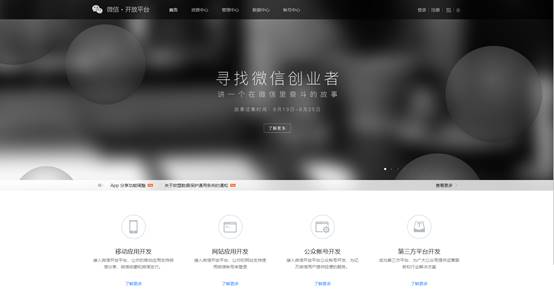
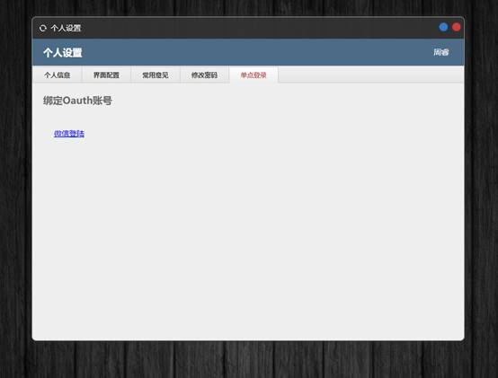
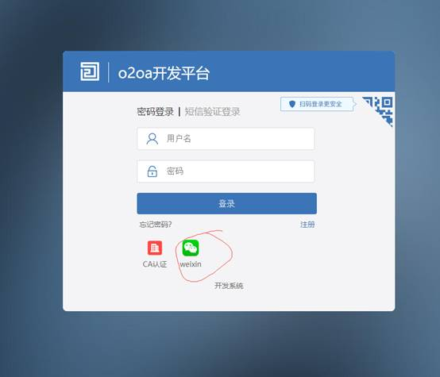

# 配置绑定微信扫码登录

**这里的微信不同于上文中的企业微信,需要注册微信开发者帐号.**

在 [https://open.weixin.qq.com](https://open.weixin.qq.com/) 注册微信开发者帐号.



创建网站应用:


审核通过后在token.js中配置

```text
 "oauthClients": [
	{
		  "enable": true,
		  "name": "weixin",
		  "displayName": "微信登陆",
		  "icon": "图片的base64编码字串",
		  "clientId": "网站应用appID",
		  "clientSecret": "网站应用AppSecret",
		  "authAddress": "https://open.weixin.qq.com/connect/qrconnect",
		  "authParameter": "appid\u003d{$client_id}\u0026response_type\u003dcode\u0026scope\u003dsnsapi_login\u0026state\u003dstate",
		  "authMethod": "GET",
		  "tokenAddress": "https://api.weixin.qq.com/sns/oauth2/access_token",
		  "tokenParameter": "appid\u003d{$client_id}\u0026secret\u003d{$client_secret}\u0026code\u003d{$code}\u0026grant_type\u003dauthorization_code",
		  "tokenMethod": "GET",
		  "tokenType": "json",
		  "infoAddress": "https://api.weixin.qq.com/sns/oauth2/refresh_token",
		  "infoParameter": "appid\u003d{$client_id}\u0026grant_type\u003drefresh_token\u0026refresh_token\u003d{$refresh_token}",
		  "infoMethod": "GET",
		  "infoType": "json",
		  "infoCredentialField": "openid",
		  "infoScriptText": "",
		  "bindingEnable": true,
		  "bindingField": "open1Id"
	}
]
```

在使用前还需要进行绑定,使用用户名.密码登录后在个人设置中设置:



完成绑定即可使用微信扫码登录.



