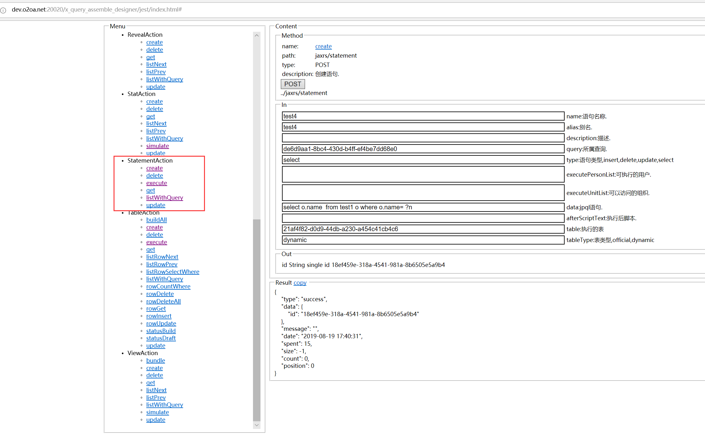
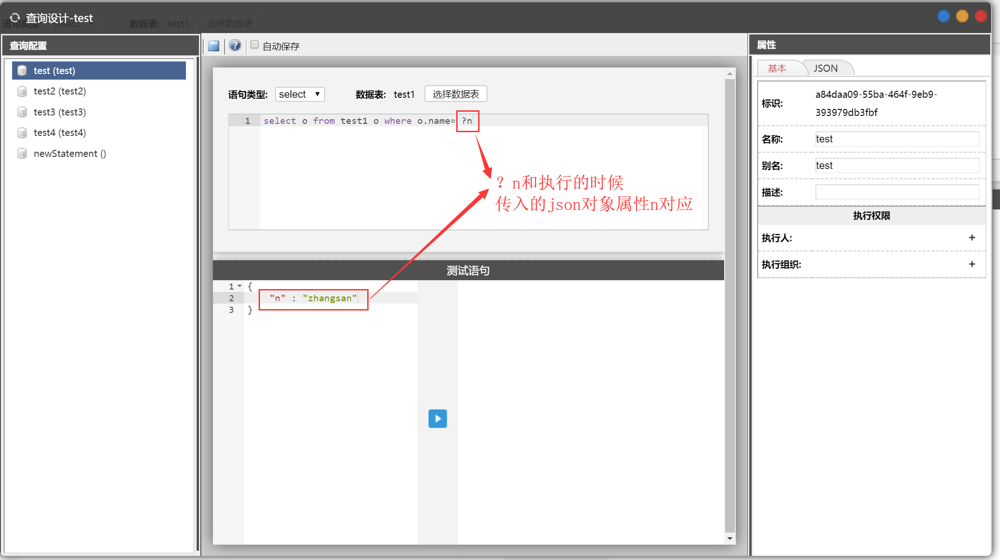

# 查询语句

查询语句是建立在数据表基数上的查询语句配置。配置查询语句后，在应用中可调用执行。

## 入口 <a id="ru-kou"></a>

点系统的左上角导航-&gt;设计中心-&gt;数据中心-&gt;具体应用-&gt;查询配置打开

## 查询语句的后台服务 <a id="shi-tu-de-hou-tai-fu-wu"></a>

​[http://applicationServer:20020/x\_query\_assemble\_surface/jest/index.html](http://:20020/****/x_query_assemble_surface/jest/index.html)​



## 创建查询配置

1、创建查询配置；

2、选择语句类型和数据表；

3、编写查询语句，保存

## 查询语句

### 语法

查询语句用的是JPA JPQL语句，如 `select o from tableName o where o.name='zhangsan'`。

了解JPQL语句可以点击链接查看：[https://www.objectdb.com/java/jpa/query/jpql/structure](https://www.objectdb.com/java/jpa/query/jpql/structure)​

### 动态传参

查询语句中的参数可以使用json传入

如：

查询语句的设计为 `select o from tableName o where o.name=?n`

在调用查询语句的时候传入 json

```text
{
    "n" : "zhangsan"
}
```

则 最终在后台拼接成的语句为

`select o from tableName o where o.name=‘’`



## 使用 <a id="shu-ju-biao-jiao-ben"></a>

需要编写脚本去使用查询语句

### 方法一

```text
o2.Actions.get( "x_query_assemble_surface" ).executeStatement(
    statementFlag, //语句id、语句名称或语句别名
    page, //页码，数字
    size,  //每页条数
    data, //请求的json
    function(json){
        //json为执行結果
    },
    function(xhr){ 
        //如果返回错误，在这里处理
    },
    async //同步还是异步
)
```

例如：现在已有一个查询语句配置`select o from student o where o.class=?class`，存储的别名是 selectStudent，取第一页的10条，那么方法如下：

```text
o2.Actions.get( "x_query_assemble_surface" ).executeStatement(
    "selectStudent",1,10,{
        class : "01计算机一班"
    },function(json){
        //json 为返回的结果
    }
)
```


### 方法二

```text
var action = new this.Action( "x_query_assemble_surface", {
    executeStatement:{ //服务命名1，自定义
        "uri": "/jaxrs/statement/{flag}/execute/page/{page}/size/{size}", //服务地址1，形如 /jaxrs/...
        "method": "POST" //请求方法，包括 GET POST PUT DELETE
    }
);
action.invoke({
    "name": "executeStatement", //自定义的服务名
    "parameter": {
        "flag": statementFlag, //语句id、语句名称或语句别名
        "page" : page, //页码，数字
        "size" : size //每页条数
    },  //uri参数
    "data": {  }, //请求的正文
    "success": function(json){ //服务调用成功时的回调方法，json 是服务返回的数据
        //这里进行具体的处理
    }.bind(this),
    "failure" : function(xhr){ //服务调用失败时的回调方法，xhr 为 XMLHttpRequest 对象
        //这里进行具体的处理
    },
    "async" : true, //同步还是异步，默认为true
});
```

例如：现在已有一个查询语句配置`select o from student o where o.class=?class`，存储的别名是 selectStudent，取第一页的10条，那么方法如下：

```text
var action = new this.Action( "x_query_assemble_surface", {
    executeStatement:{ //服务命名1，自定义
        "uri": "/jaxrs/statement/{flag}/execute/page/{page}/size/{size}", //服务地址1，形如 /jaxrs/...
        "method": "POST" //请求方法，包括 GET POST PUT DELETE
    }
);
action.executeStatement({
    "name": "executeStatement", //自定义的服务名
    "parameter": { //uri参数
        "flag": selectStudent, //语句id、语句名称或语句别名
        "page" : 1, //页码，数字
        "size" : 10 //每页条数
    },  
    "data": { //请求的正文
        class : "01计算机一班"
     }, 
     "success" : function(json){
         //json 为返回的结果
     }
})
```

