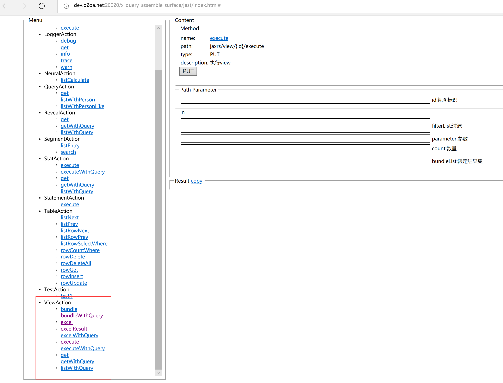
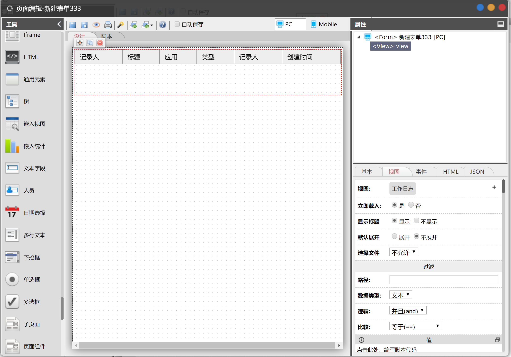
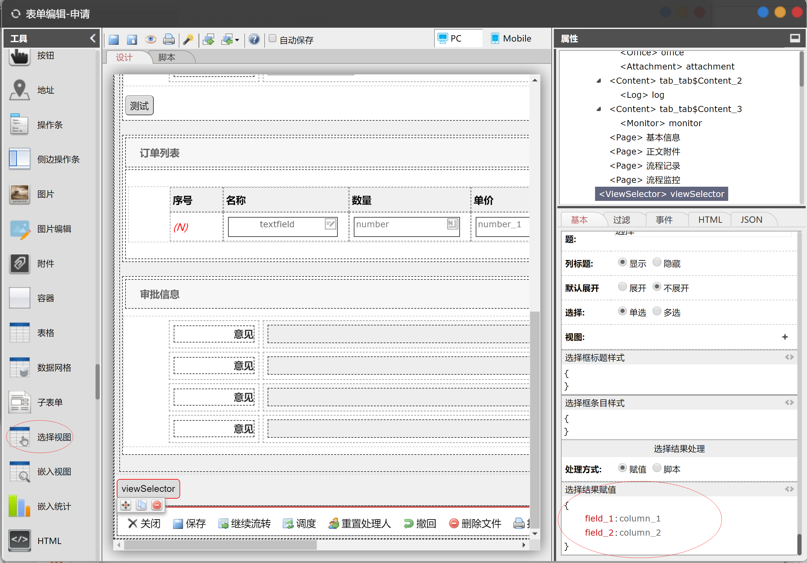

# 视图

在O2OA中，视图是展现、查询流程和内容管理数据的重要途径，也是各应用进行数据关联的工具。

## 入口

点系统的左上角导航-&gt;设计中心-&gt;数据中心-&gt;具体应用-&gt;视图打开。

## 视图的后台服务

[http://applicationServer:20020/x\_query\_assemble\_surface/jest/index.html](http://****:20020/x_query_assemble_surface/jest/index.html)



## 视图属性

### 基本

| 属性名 | 说明 |
| :--- | :--- |
| 标识 | 视图ID |
| 名称 | 视图名称 |
| 别名 | 视图别名 |
| 隐藏视图 | 隐藏后不会在点左上角导航-&gt;应用中显示 |
| 最大行数 | 视图展现的时候返回数据的最多数目 |
| 每页行数 | 视图展现的时候每页的数据数目 |
| 可执行人 | 允许执行视图的人。和可执行组织同时为空的时候，所有人可执行 |
| 可执行组织 | 允许执行视图的组织 |

### 范围

<table>
  <thead>
    <tr>
      <th style="text-align:left">&#x5C5E;&#x6027;&#x540D;</th>
      <th style="text-align:left">&#x8BF4;&#x660E;</th>
    </tr>
  </thead>
  <tbody>
    <tr>
      <td style="text-align:left"></td>
      <td style="text-align:left">&#x53EF;&#x4EE5;&#x9009;&#x62E9;&#x6D41;&#x7A0B;&#x5E73;&#x53F0;&#x6570;&#x636E;&#x6216;&#x8005;&#x662F;&#x5185;&#x5BB9;&#x7BA1;&#x7406;&#x5E73;&#x53F0;&#x7684;&#x6570;&#x636E;</td>
    </tr>
    <tr>
      <td style="text-align:left">&#x6743;&#x9650;</td>
      <td style="text-align:left">
        <p>&#x5E26;&#x6743;&#x9650;&#xFF1A;&#x5F53;&#x524D;&#x4EBA;&#x5458;&#x53EA;&#x80FD;&#x770B;&#x5230;&#x6D41;&#x8F6C;&#x8FC7;&#x7684;&#x5DE5;&#x4F5C;</p>
        <p>&#x5FFD;&#x7565;&#xFF1A;&#x5F53;&#x524D;&#x4EBA;&#x5458;&#x53EF;&#x4EE5;&#x770B;&#x5230;&#x7B26;&#x5408;&#x8FC7;&#x6EE4;&#x6761;&#x4EF6;&#x6240;&#x6709;&#x5DE5;&#x4F5C;&#xFF0C;&#x4F46;&#x662F;&#x6CA1;&#x6709;&#x6D41;&#x8F6C;&#x8FC7;&#x7684;&#x4E0D;&#x80FD;&#x6253;&#x5F00;</p>
      </td>
    </tr>
    <tr>
      <td style="text-align:left">&#x6D41;&#x8F6C;&#x72B6;&#x6001;</td>
      <td style="text-align:left">&#x53EA;&#x6709;&#x9009;&#x62E9;&#x6D41;&#x7A0B;&#x5E73;&#x53F0;&#x6570;&#x636E;&#x7684;&#x65F6;&#x5019;&#x8D77;&#x4F5C;&#x7528;</td>
    </tr>
    <tr>
      <td style="text-align:left">&#x9009;&#x62E9;&#x5E94;&#x7528;</td>
      <td style="text-align:left">&#x53EA;&#x5BF9;&#x5E94;&#x6D41;&#x7A0B;&#x5E73;&#x53F0;&#x5E94;&#x7528;&#x7684;&#x6570;&#x636E;</td>
    </tr>
    <tr>
      <td style="text-align:left">&#x9009;&#x62E9;&#x6D41;&#x7A0B;</td>
      <td style="text-align:left">&#x53EA;&#x5BF9;&#x5E94;&#x6D41;&#x7A0B;&#x7684;&#x6570;&#x636E;&#xFF0C;&#x5982;&#x679C;&#x5E94;&#x7528;&#x548C;&#x6D41;&#x7A0B;&#x540C;&#x65F6;&#x9009;&#x62E9;&#x7684;&#x60C5;&#xFF0C;&#x53D6;&#x5E76;&#x96C6;</td>
    </tr>
    <tr>
      <td style="text-align:left">&#x6570;&#x636E;&#x7C7B;&#x578B;</td>
      <td style="text-align:left">
        <p>&#x4FE1;&#x606F;&#x7C7B;&#xFF1A;&#x53EA;&#x663E;&#x793A;&#x5185;&#x5BB9;&#x7BA1;&#x7406;&#x680F;&#x76EE;&#x6216;&#x5206;&#x7C7B;&#x91CC;&#x6587;&#x6863;&#x7C7B;&#x578B;&#x8BBE;&#x7F6E;&#x4E3A;&#x201C;&#x4FE1;&#x606F;&#x201D;&#x7684;&#x6570;&#x636E;</p>
        <p>&#x6570;&#x636E;&#x7C7B;&#xFF1A;&#x53EA;&#x663E;&#x793A;&#x5185;&#x5BB9;&#x7BA1;&#x7406;&#x680F;&#x76EE;&#x6216;&#x5206;&#x7C7B;&#x91CC;&#x6587;&#x6863;&#x7C7B;&#x578B;&#x8BBE;&#x7F6E;&#x4E3A;&#x201C;&#x6570;&#x636E;&#x201D;&#x7684;&#x6570;&#x636E;</p>
        <p>&#x5168;&#x90E8;&#xFF1A;&#x5BF9;&#x6587;&#x6863;&#x7C7B;&#x578B;&#x65E0;&#x9650;&#x5236;</p>
      </td>
    </tr>
    <tr>
      <td style="text-align:left">&#x9009;&#x62E9;&#x680F;&#x76EE;</td>
      <td style="text-align:left">&#x53EA;&#x663E;&#x793A;&#x5BF9;&#x5E94;&#x5185;&#x5BB9;&#x7BA1;&#x7406;&#x680F;&#x76EE;&#x7684;&#x6570;&#x636E;</td>
    </tr>
    <tr>
      <td style="text-align:left">&#x9009;&#x62E9;&#x5206;&#x7C7B;</td>
      <td style="text-align:left">&#x53EA;&#x663E;&#x793A;&#x5BF9;&#x5E94;&#x5185;&#x5BB9;&#x7BA1;&#x7406;&#x5206;&#x7C7B;&#x7684;&#x6570;&#x636E;&#xFF0C;&#x5982;&#x679C;&#x680F;&#x76EE;&#x548C;&#x5206;&#x7C7B;&#x540C;&#x65F6;&#x9009;&#x62E9;</td>
    </tr>
    <tr>
      <td style="text-align:left">&#x62DF;&#x7A3F;&#x7EC4;&#x7EC7;</td>
      <td style="text-align:left">&#x53EA;&#x663E;&#x793A;&#x9009;&#x62E9;&#x7684;&#x62DF;&#x7A3F;&#x7EC4;&#x7EC7;&#x7684;&#x6570;&#x636E;</td>
    </tr>
    <tr>
      <td style="text-align:left">&#x62DF;&#x7A3F;&#x4EBA;&#x5458;</td>
      <td style="text-align:left">&#x53EA;&#x663E;&#x793A;&#x9009;&#x62E9;&#x7684;&#x62DF;&#x7A3F;&#x4EBA;&#x5458;&#x7684;&#x6570;&#x636E;</td>
    </tr>
    <tr>
      <td style="text-align:left">&#x62DF;&#x7A3F;&#x8EAB;&#x4EFD;</td>
      <td style="text-align:left">&#x53EA;&#x663E;&#x793A;&#x9009;&#x62E9;&#x7684;&#x62DF;&#x7A3F;&#x8EAB;&#x4EFD;&#x7684;&#x6570;&#x636E;</td>
    </tr>
    <tr>
      <td style="text-align:left">&#x9690;&#x85CF;&#x89C6;&#x56FE;</td>
      <td style="text-align:left">&#x9690;&#x85CF;&#x540E;&#x4E0D;&#x4F1A;&#x5728;&#x70B9;&#x5DE6;&#x4E0A;&#x89D2;&#x5BFC;&#x822A;-&gt;&#x5E94;&#x7528;&#x4E2D;&#x663E;&#x793A;</td>
    </tr>
    <tr>
      <td style="text-align:left">&#x65F6;&#x6BB5;</td>
      <td style="text-align:left">&#x53EA;&#x663E;&#x793A;&#x7B26;&#x5408;&#x65F6;&#x6BB5;&#x5185;&#x7684;&#x6570;&#x636E;&#xFF0C;&#x5141;&#x8BB8;&#x6709;&#x504F;&#x79FB;&#x91CF;</td>
    </tr>
  </tbody>
</table>### 过滤

当选择“作为默认过滤条件”时，视图在执行的时候既根据该过滤条件进行过滤。

当选择“作为自定义过滤数据”时，用户可以根据配置自定义进行过滤。

路径：

#### 平台流程填写对应的以下路径：

```text
{
    "$work" : {
        "title" : "" , //标题
        "startTime" : "", //创建时间
        "startTimeMonth": "", //创建月份
        "completedTime": "", //完成时间
        "completedTimeMonth": "", //完成月份
        "creatorPerson": "", //拟稿人
        "creatorIdentity": "", //拟稿人身份
        "creatorUnit": "", //拟稿组织
        "creatorUnitLevelName": "", //拟稿组织层级
        "application": "", //应用ID
        "applicationName": "", //应用名称
        "applicationAlias": "", //应用别名
        "process": "", //流程ID
        "processName": "", //流程名称
        "processAlias": "", //流程别名
        "serial": "", //编号
        "activityType": "", //活动类型
        "activityName": "", //活动名称
        "activityArrivedTime": "", //活动到达时间
        "workId": "", //工作ID
        "workCompletedId": "", //已完成工作ID
        "job": "", //JOB的ID(job)
        "completed": "", //是否已完成(completed)
    },
    "subject" : "", //标题
    "identity1" : [{ //身份/人员/组织/职务/群组 的存储形式
        {
            "name": "李四",  //身份名称，不唯一
            "unique": "23dd1b53-feed-485d-8c9c-1a4e64ff58a2", //身份唯一标识
            "description": "", //身份描述
            "distinguishedName": "李四@23dd1b53-feed-485d-8c9c-1a4e64ff58a2@I", //身份全称
            "person": "李四@lisi@P", //人员
            "unit": "开发部@kfb@U",  //组织
            "unitName": "开发部",   //组织名称, 不唯一
            "unitLevel": 2,         //组织层级
            "unitLevelName": "浙江兰德纵横/开发部", //组织层级名
            "orderNumber": 24920439 //排序号
        }
        ...
    }] 
    ...
}
```

如：流程ID "$work.workId"

标题填写：subject

身份dn填写：identity.0.distinguishedName \(数组用 “.0” 来表示下标\)

#### 内容管理填写对应的以下路径：

```text
{
    "$document" : {
        "title" : "", //标题
        "publishTime" : "", //发布时间
        "creatorPerson" : "", //拟稿人
        "creatorIdentity" : "", //拟稿人身份
        "creatorUnitName" : "", //拟稿组织
        "creatorTopUnitName" : "", //拟稿顶级组织
        "appId" : "", //栏目ID
        "appName" : "", //栏目名称
        "categoryId" : "", //分类ID
        "categoryName" : "", //分类名称
        "categoryAlias" : "", //分类别名
        "docid" : "", //文档ID
    },
    "subject" : "", //标题
    "identity1" : [{ //身份/人员/组织/职务/群组 的存储形式
        {
            "name": "李四",  //身份名称，不唯一
            "unique": "23dd1b53-feed-485d-8c9c-1a4e64ff58a2", //身份唯一标识
            "description": "", //身份描述
            "distinguishedName": "李四@23dd1b53-feed-485d-8c9c-1a4e64ff58a2@I", //身份全称
            "person": "李四@lisi@P", //人员
            "unit": "开发部@kfb@U",  //组织
            "unitName": "开发部",   //组织名称, 不唯一
            "unitLevel": 2,         //组织层级
            "unitLevelName": "浙江兰德纵横/开发部", //组织层级名
            "orderNumber": 24920439 //排序号
        }
        ...
    }] 
    ...
}
```

如：文档ID填写 "$document.docid"

标题填写：subject

身份dn填写：identity.0.distinguishedName \(数组用 “.0” 来表示下标\)

## 列属性

<table>
  <thead>
    <tr>
      <th style="text-align:left">&#x5C5E;&#x6027;</th>
      <th style="text-align:left">&#x8BF4;&#x660E;</th>
    </tr>
  </thead>
  <tbody>
    <tr>
      <td style="text-align:left">&#x5217;&#x6807;&#x9898;</td>
      <td style="text-align:left">&#x8868;&#x683C;&#x7684;&#x6807;&#x9898;</td>
    </tr>
    <tr>
      <td style="text-align:left">&#x5217;&#x540D;</td>
      <td style="text-align:left">&#x5217;&#x540D;&#xFF0C;&#x5F53;&#x9700;&#x8981;&#x64CD;&#x4F5C;&#x6570;&#x636E;&#x7684;&#x65F6;&#x5019;&#x8981;&#x7528;&#x5230;&#xFF08;&#x6BD4;&#x5982;&#x5D4C;&#x5165;&#x5230;&#x8868;&#x5355;&#x4E2D;&#x9009;&#x62E9;&#x6570;&#x636E;&#x7684;&#x65F6;&#x5019;&#xFF09;</td>
    </tr>
    <tr>
      <td style="text-align:left">&#x9ED8;&#x8BA4;&#x503C;</td>
      <td style="text-align:left">&#x5217;&#x503C;&#x4E3A;&#x7A7A;&#x65F6;&#x7684;&#x9ED8;&#x8BA4;&#x503C;</td>
    </tr>
    <tr>
      <td style="text-align:left">&#x6253;&#x5F00;&#x6587;&#x6863;</td>
      <td style="text-align:left">&#x70B9;&#x51FB;&#x8BE5;&#x5217;&#x7684;&#x65F6;&#x5019;&#xFF0C;&#x662F;&#x5426;&#x6253;&#x5F00;&#x6587;&#x6863;</td>
    </tr>
    <tr>
      <td style="text-align:left">&#x6570;&#x636E;&#x8DEF;&#x5F84;</td>
      <td style="text-align:left">&#x67E5;&#x770B;&#x672C;&#x7AE0;-&#x89C6;&#x56FE;&#x5C5E;&#x6027;-&#x8FC7;&#x6EE4;-&#x8DEF;&#x5F84;&#x7684;&#x4ECB;&#x7ECD;</td>
    </tr>
    <tr>
      <td style="text-align:left">&#x6392;&#x5E8F;</td>
      <td style="text-align:left">&#x8BE5;&#x5217;&#x662F;&#x5426;&#x6392;&#x5E8F;&#xFF0C;&#x53EA;&#x6709;&#x7B2C;&#x4E00;&#x4E2A;&#x6392;&#x5E8F;&#x5217;&#x6709;&#x6548;</td>
    </tr>
    <tr>
      <td style="text-align:left">&#x5206;&#x7C7B;</td>
      <td style="text-align:left">&#x8BE5;&#x5217;&#x662F;&#x5426;&#x5206;&#x7C7B;&#xFF0C;&#x53EA;&#x80FD;&#x6709;&#x4E00;&#x4E2A;&#x5206;&#x7C7B;&#x5217;</td>
    </tr>
    <tr>
      <td style="text-align:left">&#x9690;&#x85CF;</td>
      <td style="text-align:left">&#x663E;&#x793A;&#x7684;&#x65F6;&#x5019;&#xFF0C;&#x8BE5;&#x5217;&#x662F;&#x5426;&#x9690;&#x85CF;</td>
    </tr>
    <tr>
      <td style="text-align:left">&#x7EC4;&#x7EC7;&#x5BF9;&#x8C61;</td>
      <td style="text-align:left">&#x5982;&#x679C;&#x9009;&#x662F;&#xFF0C;&#x90A3;&#x4E48;&#x53EA;&#x663E;&#x793A;&#x6570;&#x7EC4;&#x7B2C;&#x4E00;&#x4E2A;&#x503C;&#x7684;
        name &#x5C5E;&#x6027;</td>
    </tr>
    <tr>
      <td style="text-align:left">HTML&#x503C;</td>
      <td style="text-align:left">&#x5982;&#x679C;&#x9009;&#x62E9;&#x662F;&#xFF0C;&#x5219;&#x4F5C;&#x4E3A;&#x5355;&#x5143;&#x683C;&#x7684;innerHTML&#x663E;&#x793A;</td>
    </tr>
    <tr>
      <td style="text-align:left">&#x663E;&#x793A;&#x811A;&#x672C;</td>
      <td style="text-align:left">
        <p>&#x53EF;&#x4EE5;&#x901A;&#x8FC7;&#x811A;&#x672C;&#x5BF9;&#x5217;&#x503C;&#x8FDB;&#x884C;&#x8BA1;&#x7B97;&#x3002;</p>
        <p>this.value&#xFF1A;&#x4E3A;&#x5217;&#x539F;&#x6765;&#x7684;&#x503C;</p>
        <p>this.entry.data: &#x8BE5;&#x884C;&#x6240;&#x6709;&#x5217;&#x7684;&#x503C;</p>
        <p>&#x663E;&#x793A;&#x811A;&#x672C;&#x6700;&#x7EC8;&#x9700;&#x8981; return
          &#x653E;&#x56DE;&#x503C;</p>
      </td>
    </tr>
  </tbody>
</table>## 视图的使用

### 在表单、页面中嵌入视图

可以在表单中使用“嵌入视图”组件



### 选择视图的数据到表单 

在表单中使用“选择视图”组件，可以进行流程、内容管理分类直接的数据关联。



当 选择结果处理 选择 “赋值”的时候：

上图中的 field\_1 为本表单的组件标识，column\_1 为视图的列名。

当用户选择视图后，会将选中行 column\_1 列的值赋值给 field\_1 。

当 选择结果处理 选择 “脚本”的时候，可以通过 _this.target.selectedData_ 来获取用户选择行的数据。数据格式如下：

```text
{[
  bundle : "xxxx", //CMS文档Id/流程jobId
  data : {  //列数据
    column1Name : column1Value, //第一列的列名，第一列的列值
    column2Name : column2Value, //第二列的列名，第二列的列值
    ...
  },
  ...
]}
```

## 在脚本中的使用

可以查看API的 view章节进行学习，[点击打开链接](http://www.o2oa.net/x_desktop/portal.html?id=dcd8e168-2da0-4496-83ee-137dc976c7f6&page=99d67d72-b744-4c36-852e-50254b5775ff)

