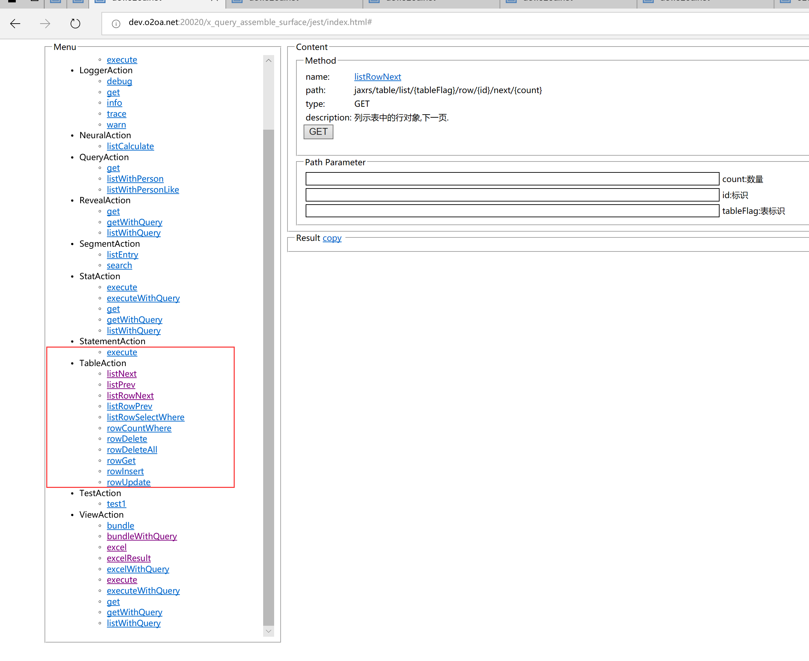

# 自建表

当应用的数据特别大的时候，或者需要比视图更灵活的查询的时候，需要用到自建表。

## 入口

点系统的左上角导航-&gt;设计中心-&gt;数据中心-&gt;具体应用-&gt;数据表打开

## 自建表的后台服务 <a id="shi-tu-de-hou-tai-fu-wu"></a>

​[http://applicationServer:20020/x\_query\_assemble\_surface/jest/index.html](http://:20020/****/x_query_assemble_surface/jest/index.html)​



## 自建表脚本

目前在表单和页面中还没有自建表组件，需要通过脚本来进行增删改查的执行。

1、创建一个脚本名称为 queryTableService，代码如下：

```text
var _self = this;
window.QueryTableService = new Class({
    Implements: [Options, Events],
    options : {
        tableFlag : ""
    },
    initialize : function( options ){
        this.setOptions( options || {});
        this.action = new _self.Action("x_query_assemble_surface", {
            "listRowNext" : {
                "uri" : "/jaxrs/table/list/{tableFlag}/row/{id}/next/{count}",
                "method": "GET"
            },
            "listRowPrev" : {
                "uri" : "/jaxrs/table/list/{tableFlag}/row/{id}/prev/{count}",
                "method": "GET"
            },
            //通过where 获取表中的数据,格式为jpql语法,o.name='zhangsan'
            "listRowSelectWhere" : {
                "uri" : "/jaxrs/table/list/{tableFlag}/row/select/where/{where}",
                "method": "GET"
            },
            "rowGet" : {
                "uri": "/jaxrs/table/{tableFlag}/row/{id}", //获取表中某一行数据
                "method": "GET"
            },
            "rowUpdate":{
                "uri": "/jaxrs/table/{tableFlag}/row/{id}", //更新指定表中指定行数据.
                "method": "PUT"
            },
            "rowInsert":{
                "uri": "/jaxrs/table/{tableFlag}/row", //插入一行
                "method": "POST"
            },
            "rowCountWhere" : {
                "uri": "/jaxrs/table/{tableFlag}/row/count/where/{where}", //通过where 统计数量
                "method": "GET"
            },
            "rowDelete" : {
                "uri": "/jaxrs/table/{tableFlag}/row/{id}", //更新指定表中指定行数据.
                "method": "DELETE"
            },
            "rowDeleteAll" : {
                "uri": "/jaxrs/table/{tableFlag}/row/delete/all", //通过where 统计数量
                "method": "DELETE"
            }
        });
    },
    listNext : function(rowId, count, callback_success, callback_fail, async){
        var opt = {
            "name": "listRowNext",
            "parameter": {
                "tableFlag": this.options.tableFlag,
                "id" : rowId,
                "count" : count || 20
            },
            "success": function(json){
                if(callback_success)callback_success(json);
            }.bind(this),
            "async" : async
        };
        if( callback_fail ){
            opt.failure = function(xhr, text, error){
                callback_fail( xhr, text, error );
            }
        }
        this.action.invoke( opt );
    },
    listPrev : function(rowId, count, callback_success, callback_fail, async){
        var opt = {
            "name": "listRowPrev",
            "parameter": {
                "tableFlag": this.options.tableFlag,
                "id" : rowId,
                "count" : count || 20
            },
            "success": function(json){
                if(callback_success)callback_success(json);
            }.bind(this),
            "async" : async
        }
        if( callback_fail ){
            opt.failure = function(xhr, text, error){
                callback_fail( xhr, text, error );
            }
        }
        this.action.invoke(opt);
    },
    listByWhere : function(where, callback_success, callback_fail, async){
        var opt = {
            "name": "listRowSelectWhere",
            "parameter": {
                "tableFlag": this.options.tableFlag,
                "where" : where
            },
            "success": function(json){
                if(callback_success)callback_success(json);
            }.bind(this),
            "async" : async
        };
        if( callback_fail ){
            opt.failure = function(xhr, text, error){
                callback_fail( xhr, text, error );
            }
        }
        this.action.invoke(opt);
    },
    get : function( rowId, callback_success, callback_fail, async ){
        var opt = {
            "name": "rowGet",
            "parameter": {
                "tableFlag": this.options.tableFlag,
                "id" : rowId
            },
            "success": function(json){
                if(callback_success)callback_success(json);
            }.bind(this),
            "async" : async
        };
        if( callback_fail ){
            opt.failure = function(xhr, text, error){
                callback_fail( xhr, text, error );
            }
        }
        this.action.invoke(opt);
    },
    create : function( data, callback_success, callback_fail, async ){
        data.o2_createPerson = layout.desktop.session.user.distinguishedName;
        data.o2_createUnit = Utils.getCurrentDepartment();
        var opt = {
            "name": "rowInsert",
            "parameter": {
                "tableFlag": this.options.tableFlag
            },
            "data" : data,
            "success": function(json){
                if(callback_success)callback_success(json);
            }.bind(this),
            "async" : async
        };
        if( callback_fail ){
            opt.failure = function(xhr, text, error){
                callback_fail( xhr, text, error );
            }
        }
        this.action.invoke(opt);
    },
    update : function( rowId, data, callback_success, callback_fail, async ){
        data.o2_updatePerson = layout.desktop.session.user.distinguishedName;
        var opt = {
            "name": "rowUpdate",
            "parameter": {
                "tableFlag": this.options.tableFlag,
                "id" : rowId
            },
            "data" : data,
            "success": function(json){
                if(callback_success)callback_success(json);
            }.bind(this),
            "async" : async
        };
        if( callback_fail ){
            opt.failure = function(xhr, text, error){
                callback_fail( xhr, text, error );
            }
        }
        this.action.invoke(opt);
    },
    save : function( data, callback_success, callback_fail, async ){
        var opt = {
            "name": data.id ? "rowUpdate" : "rowInsert",
            "parameter": {
                "tableFlag": this.options.tableFlag
            },
            "data" : data,
            "success": function(json){
                if(callback_success)callback_success(json);
            }.bind(this),
            "async" : async
        };
        if( callback_fail ){
            opt.failure = function(xhr, text, error){
                callback_fail( xhr, text, error );
            }
        }
        if(data.id)opt.parameter.id = data.id;
        this.action.invoke(opt);
    },
    count : function( where, callback_success, callback_fail, async ){
        var opt = {
            "name": "rowGet",
            "parameter": {
                "tableFlag": this.options.tableFlag,
                "where" : where
            },
            "success": function(json){
                if(callback_success)callback_success(json);
            }.bind(this),
            "async" : async
        };
        if( callback_fail ){
            opt.failure = function(xhr, text, error){
                callback_fail( xhr, text, error );
            }
        }
        this.action.invoke(opt);
    },
    delete : function( rowId, callback_success, callback_fail, async ){
        var opt = {
            "name": "rowDelete",
            "parameter": {
                "tableFlag": this.options.tableFlag,
                "id" : rowId
            },
            "success": function(json){
                if(callback_success)callback_success(json);
            }.bind(this),
            "async" : async
        };
        if( callback_fail ){
            opt.failure = function(xhr, text, error){
                callback_fail( xhr, text, error );
            }
        }
        this.action.invoke(opt);
    },
    deleteAll : function( callback_success, callback_fail, async ){
        var opt = {
            "name": "rowDelete",
            "parameter": {
                "tableFlag": this.options.tableFlag
            },
            "success": function(json){
                if(callback_success)callback_success(json);
            }.bind(this),
            "async" : async
        };
        if( callback_fail ){
            opt.failure = function(xhr, text, error){
                callback_fail( xhr, text, error );
            }
        }
        this.action.invoke(opt);
    }
});
```

2、在表单/页面的 queryLoad 里添加： `this.include("queryTableService");`

3、调用

```text
var service = new QueryTableService({ tableFlag : "testTable" });

//保存
service.save({
    "subject" : "标题",
    "name" : "zhangsan"
}, function(){
    this.form.notice("保存成功", "success");
}.bind(this)

//根据条件查询
service.listByWhere("o.name='zhangsan'", function( json ){
    //json 为符合条件的数据列表
}, null, false)

//根据id获取数据
service.get( id, function( json ){
    //json 为id对应的数据
}, null, false)
```

