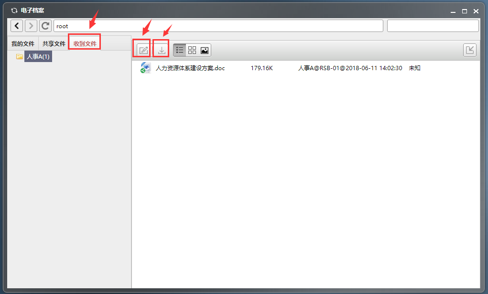

# 个人文件

点击系统菜单-组件-云文件，即可打开云文件系统。

## 首页

打开云文件系统后首页如下：

左边栏为文件收录目录；

顶部栏为路径区；

右边为展示区和工具栏。

## 创建文件夹

点击创建文件夹的图标，会弹出创建文件夹的对话框，填写并确定。

如若想对该文件夹重命名，点击root后，选中右边方框里的文件夹名称，点击重命名图标，会弹出重新命名的对话框，修改后确定即可。

## 上传文件

选中左边需要上传文件的文件夹，点击上传按钮，选择要上传的文件，点击打开即可上传成功。

## 重命名文件

如果对已上传的文件需要重命名，选中该文件，点击重命名按钮，在弹出的重命名对话框里完成相应操作即可。

## 替换文件

如果已上传的文件有内容更改，您可以选择该文件，点击替换按钮，选择相应的文章去替换。（注：文件内容被替换，标题不会被替换）

## 文件展现方式

上传后的文件可以按照列表、图标、预览三种形式来查看。

## 文件分享与发送

分享：如果想分享某文件给对方，您可以选中该文件并点击分享按钮，在弹出的共享文件框里选择共享用户，并确定。注：分享的文件在对方共享文件夹里可查看，只能只读不可编辑。

发送：如果想发送某文件给对方，您可以选中该文件并点击发送按钮，在弹出的发送编辑框里选择用户，并确定。注：发送的文件在对方收到文件夹里可查看，能被编辑。

## 我的文件

我的文件：展示自己上传的文件及文件夹。（注：添加新文件夹时，先点击root，再点击创建文件夹按钮）

共享文件：展示别人发给自己的共享文件。共享文件夹的文件可查看，可下载，但只能只读不可编辑。

收到文件：展示别人发送给自己的文件。收到文件夹的文件可查看、替换、下载。

