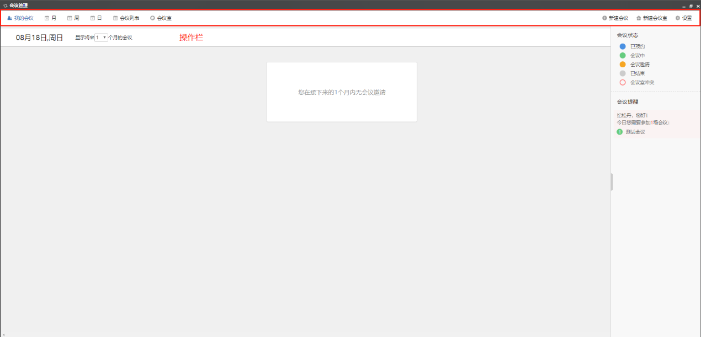

# 会议管理

点击组件-会议管理，即可打开会议管理系统。

## 会议首页

打开会议管理系统后首页如下：

| **操作栏名称** | **功能** |
| :--- | :--- |
| **我的会议** | 列出我的会议标题 |
| **月** | 按月显示要开展的会议 |
| **日** | 按日期显示今天，明天，后天要开展的会议 |
| **会议列表** | 显示我的会议申请，我收到的邀请 |
| **会议室管理** | 对会议室硬件进行管理 |

## 新建会议室

如上图所示，点击操作栏右边的新建会议室图标，即会弹出如下对话框，填写后保存。

| **名称** | **操作方法** |
| :--- | :--- |
| **会议室名称** | 输入名称 |
| **会议室位置** | 输入位置信息 |
| **会议室楼层** | 选择 |
| **容纳人数** | 输入数字 |
| **会议室门牌** | 输入 |
| **分机号** | 输入 |
| **会议室设备** | 勾选 |
| **会议室状态** | 选择 |

## 会议申请

### 新建会议

新建会议申请如上图所示，点击操作栏右边的新建会议图标，即会弹出如下对话框，填写后保存。

| 名称 | 操作方法 |
| :--- | :--- |
| 申请人 | 发起人名字，系统自动生成 |
| 日期 | 选择 |
| 时间 | 选择 |
| 会议室 | 选择 |
| 参会人员 | 选择 |
| 会议标题 | 输入 |
| 会议描述 | 输入会议描述信息 |
| 会议材料 | 可上传、下载、替换、删除会议材料。（注：先保存后方可上传会议材料） |

### 修改会议申请

点击会议列表-我的会议申请-未开始，点击要修改的会议申请，在弹出的对话框里点击编辑会议，您可以修改之前内容，也可以取消会议。

1. 
## 会议展现

### 会议展现的形式

以会议被邀请用户的账号登录，打开会议管理，首页展示如下：

您也可以在顶部操作栏里按月、周、日、会议列表、会议室的形式查看。

### 设置会议展现形式

点击操作栏最右侧的设置标志，在默认视图里可以选择按月、周、日、会议列表、会议室来显示。（注：默认视图是我的会议，更改其他选项后，关闭会议管理，下次打开会议管理时会以您设置的视图形式来呈现。）

