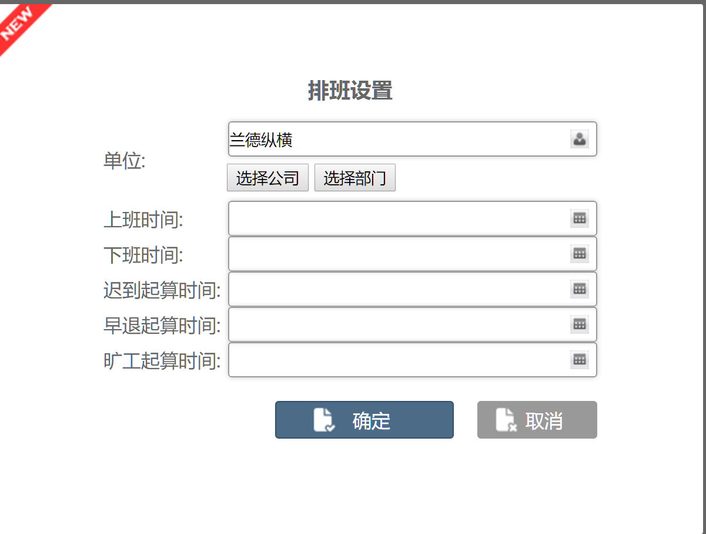
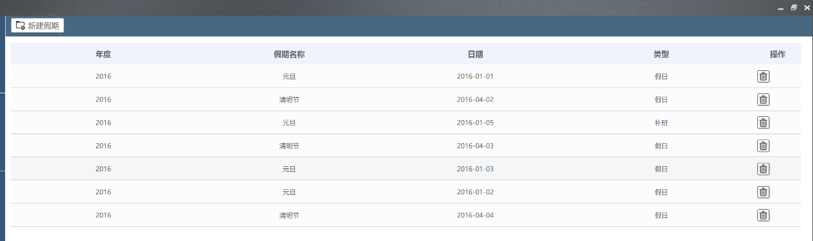
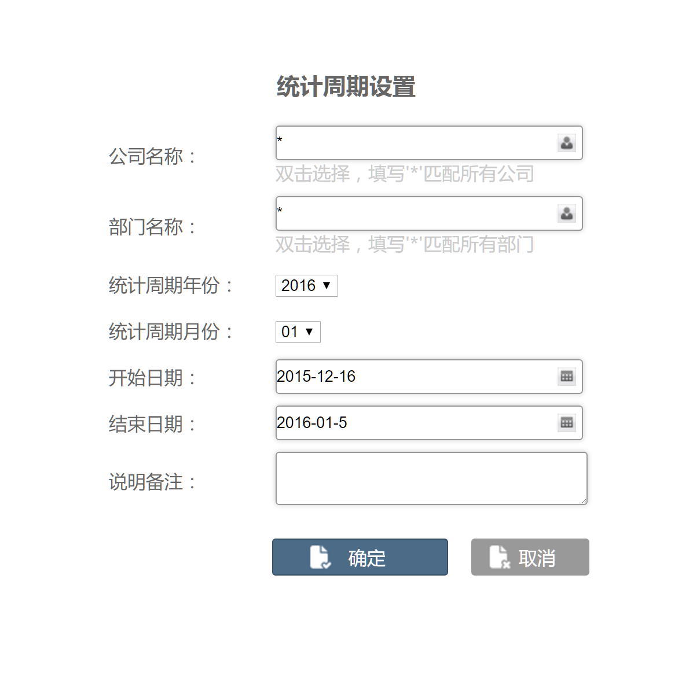

# 考勤管理

点击组件-考勤管理，即可打开考勤管理系统。

## 我的考勤月报

打开考勤管理系统后，会展示我的考勤月报，您可以查看当月的考勤，如下图：

考勤日历：以日历的形式展现当月的考勤结果，并以不同的颜色表示出勤状态。

考勤汇总：用饼图展现考勤状态（出勤、请假、迟到、缺勤、申诉、工时不足）在本月所占的比例。

上下班走势图：提供上班时间和下班时间的走势信息数据，用折线图展现上下班时间的趋势。

右边可以查看排班时间表。

## 我的考勤统计

点击考勤管理-我的考勤统计，可以查看我的出勤明细、我的出勤统计。

我的出勤明细：显示当前考勤周期里每天的打卡时间和考勤状态，并可根据考勤状态查询。如果您对考勤状态有异议的时候，可以向上级提出申诉，领导审批后可修改考勤状态。点击有异常的明细后面的申诉标识，会弹出申诉申请单。在申诉申请单里选择相应的申诉原因，并确定。

我的出勤率统计：显示当前考勤周期里各种考勤状态的次数。

## 我的申诉申请

点击考勤管理-我的申诉申请，查看各种已提交的申诉状态、申诉原因的申诉申请。

## 员工考勤申诉审批

点击考勤管理-员工考勤申诉审批，员工提成申诉后，其审批人可在此单个或批量处理审批单。

系统提供批量处理申诉的数据的功能，选择同意或者不同意

## 部门考勤月报

用于部门管理员、公司管理员查看部门的考勤月报，有权限限制。如果部门管理员管理多个部门，可以在部门间切换。

部门考勤数据展现样式：图表展示、趋势图展示、数据列表展示

## 个人考勤统计

个人出勤明细：用于按年度、月份来查询员工个人的考勤记录

个人出勤率统计：用于按按年度、月份统计工个人的考勤记录

部门考勤统计、公司考勤统计同上

人员：输入人员姓名

年度，月份：选择相应的年份和月份

## 维护管理

### 员工休假记录

员工休假记录**：**是从请假流程的数据对接过来的。请假流程发起后，自动将数据展现到该员工休假记录中。

导出员工休假记录：点击该按钮，导出数据到Excel表

### 数据导入

1. 下载Excel模板：系统提供模板规范格式
2. 导入考勤数据：考勤数据根据模板规范格式进行填写
3. 核对考勤数据：核对考勤数据，系统自动比对数据格式是否填写正确
4. 分析考勤数据：对考勤数据进行分析
5. 统计考勤数据：统计考勤数据整理出统计的数据

### 导入错误信息

**功能：删除文件**

### 非正常出勤数据导出

导出：选择年度和月份，导出数据到Excel

### 权限设置

按钮：新建管理员，配置角色，人员名称，部门信息。

操作：删除配置文档

配置角色信息

选择所属单位

配置人员信息

### 排班设置

操作**：新建排班设置**

单位**：可选择公司或者部门**

**上班时间：选择时间**

**下班时间：选择时间**

**迟到起算时间：选择**

**早退起算时间：选择**

**矿工起算时间：选择**

**配置后，点击“保存”按钮**

### 法定假期

**操作：新建假期，定义假期时间**

年度**：选择年度**

**假期名称：输入名称**

**开始日期：选择**

**结束日期：选择**

**补班日期：选择**

### 统计周期设置

操作**：添加统计周期**

删除**：删除配置文档**

统计周期设置

**公司名称：可输入\*号，表示包含所有**

**部门名称：可输入\*号，表示包含所有**

**统计周期年份：选择**

**统计周期月份：选择**

**开始日期：选择**

**结束日期：选择**

**配置后，点击“确定”保存**

### 考勤人员配置

操作**：新增考勤人员配置**

**删除：删除配置文档**

配置类型**：选择**

**公司名称：选择**

**部门名称：选择**

**员工姓名：选择**

**员工编号：输入**

**入职日期：选择**

**点击“确定”后，保存**

### 工作场所设置

定义工作地点

### 申诉设置

申诉及审批功能启用状态：选择

考勤结果申诉审核人确定方式：选择

考勤结果申诉审核人确定内容：输入“直属领导”

