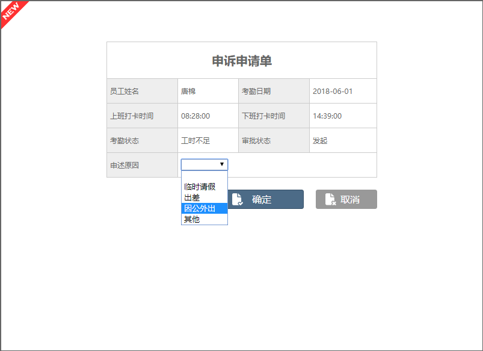
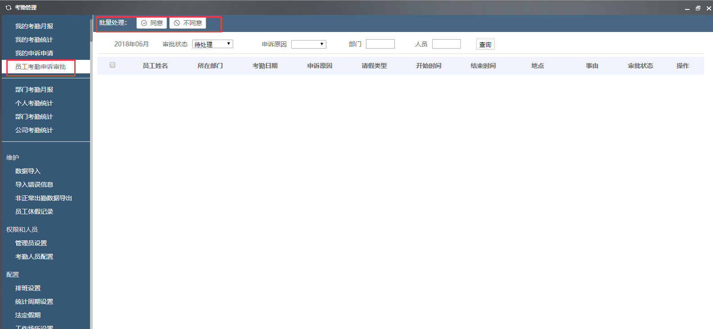

# 考勤管理

点击组件-考勤管理，即可打开考勤管理系统。

## 我的考勤月报

打开考勤管理系统后，会展示我的考勤月报，您可以查看当月的考勤，如下图：

考勤日历：以日历的形式展现当月的考勤结果，并以不同的颜色表示出勤状态。

考勤汇总：用饼图展现考勤状态（出勤、请假、迟到、缺勤、申诉、工时不足）在本月所占的比例。

上下班走势图：提供上班时间和下班时间的走势信息数据，用折线图展现上下班时间的趋势。

右边可以查看排班时间表。

## 我的考勤统计

点击考勤管理-我的考勤统计，可以查看我的出勤明细、我的出勤统计。

我的出勤明细：显示当前考勤周期里每天的打卡时间和考勤状态，并可根据考勤状态查询。如果您对考勤状态有异议的时候，可以向上级提出申诉，领导审批后可修改考勤状态。点击有异常的明细后面的申诉标识，会弹出申诉申请单。在申诉申请单里选择相应的申诉原因，并确定。

我的出勤率统计：显示当前考勤周期里各种考勤状态的次数。

## 我的申诉申请

点击考勤管理-我的申诉申请，查看各种已提交的申诉状态、申诉原因的申诉申请。

## 员工考勤申诉审批

点击考勤管理-员工考勤申诉审批，员工提成申诉后，其审批人可在此单个或批量处理审批单。

系统提供批量处理申诉的数据的功能，选择同意或者不同意

## 部门考勤月报

用于部门管理员、公司管理员查看部门的考勤月报，有权限限制。如果部门管理员管理多个部门，可以在部门间切换。

部门考勤数据展现样式：图表展示、趋势图展示、数据列表展示

## 个人考勤统计

个人出勤明细：用于按年度、月份来查询员工个人的考勤记录

个人出勤率统计：用于按按年度、月份统计工个人的考勤记录

部门考勤统计、公司考勤统计同上

人员：输入人员姓名

年度，月份：选择相应的年份和月份

