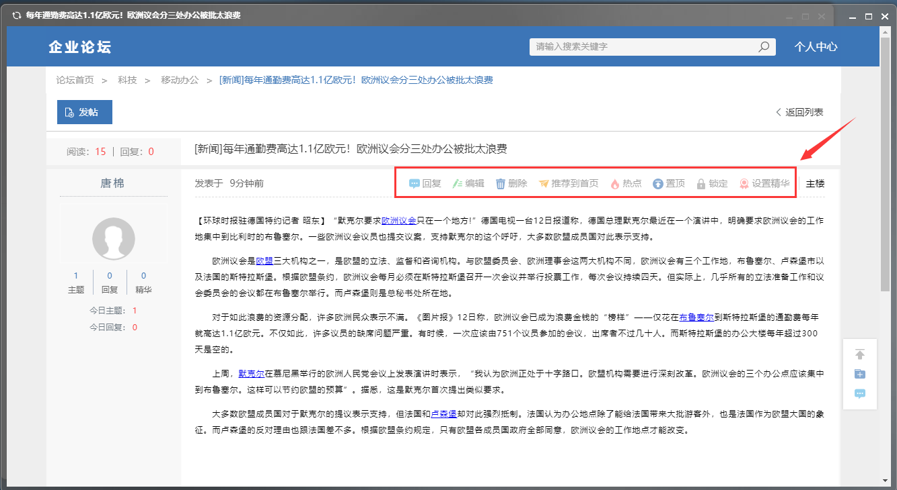

# 论坛管理

点击组件-论坛，即可打开论坛管理系统。

## 首页

打开论坛管理系统后首页如下：

## 设置

点击设置，会弹出含有系统设置、分区设置、模块设置的页面

### 系统设置

点击系统设置后，点击右边列表里任何一行，即可对该行的配置值更改，配置值可以重新设置名称。

### 分区设置

点击分区设置-创建分区，会弹出分区设置的页面。

| **名称** | **功能** |
| :--- | :--- |
| **分区名称** | 填写该分区的名称 |
| **分区状态** | 启用或停止该分区 |
| **创建人** | 该分区的创建人 |
| **分区管理员** | 除了有创建人之外，还可以赋予该区一个或多个管理员 |
| **排序号** | 决定了该区在论坛首页的序号位置 |
| **可见用户** | 所有人可见，或根据权限所见 |
| **分区颜色** | 有多种颜色可供选择，并在效果处展示颜色 |
| **主题类别选项** | 按照该分区的内容选择，输入框里内容可供参考或修改 |
| **首页样式列表** | 选择首页样式里有多种样式可供选择，点击您选择的样式模式即可；多种工具可供您选择 |
| **分区公告** | 填写该分区公告内容 |

分区内容的任何一行，点击后都可以重新修改内容，或删除。

### 板块设置

分区设置里的创建人和所选择的管理人，都有权限在相应的分区里进行下一步的板块设置。

右边顶部展示分区设置里所设置好的分区，下部为板块设置里已创建的板块。

点击板块设置-创建板块，即可创建新的板块并展示在板块区。

#### 基本设置

用于设置该板块的基本信息，如名称、状态等。

#### 权限设置

用于设置该模块的版主、可见范围、发帖人回复人等权限

## 查看论坛、论坛发帖、论坛投票

### 查看论坛

在系统设置、分区设置和板块设置完成后，点击左上角论坛名字企业论坛，弹出论坛页面。或，关闭页面，回到系统菜单点击论坛重新进入。

点击任何一个分区里的模块，即可进入该模块的论坛区。

在论坛区里，您可以浏览该区的主题帖。

### 论坛发帖

点击发帖，即可在该区内发布新的帖子。

点击某主题帖，可对此贴进行编辑、删除等操作。

### 论坛投票

点击发帖，在发帖页面选择主题-投票

| **名称** | **功能** |  |
| :--- | :--- | :--- |
| **主题** | 选择该贴的类型，并输入主题内容 |  |
| **摘要** | 简单描述该贴 |  |
| **内容** | 输入该贴的内容 |  |
| **附件** | 上传、删除、替换、下载相关附件 |  |
| **投票** | **投票时限** | 投票最后期限 |
| **投票结果可见** | 投票结果是否可见 |  |
| **投票人隐私** | 投票人隐私公开或匿名 |  |
| **组1** | 填写投票主题，如若该次投票有多个投票内容，可以选择添加投票组 |  |
| **最多允许选择项** | 本次投票内容可单选或多选 |  |
| **选项** | 填写投票内容，若有多个投票选项，点击后面的+，即可添加更多投票选项 |  |

## 个人中心

点击个人中心，可以查看用户自己的我的发帖、我的回复。

