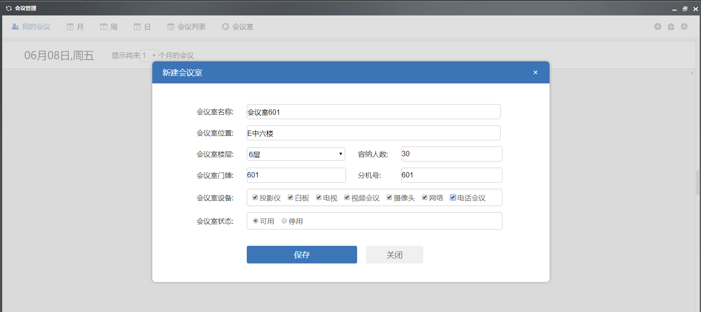

# 日程安排

点击组件-日程安排，即可打开日程安排系统。

## 日程首页

打开日常安排系统后首页如下：

| **操作栏名称** | **功能** |
| :--- | :--- |
| **创建新日历** | 新建日历 |
| **月** | 按月显示日程 |
| **周** | 按周显示日程 |
| **日** | 按日显示日常 |
| **日程** | 显示我的所有日程 |
| **新建日程** | 创建新的日程 |
| **设置** | 设置展示方式 |

## 新建日历

| 名称 | 操作方法 |
| :--- | :--- |
| 日历名称 | 输入 |
| 颜色 | 选择 |
| 类型 | 选择 |
| 是否公开 | 选择 |
| 备注 | 输入 |
| 是否启用 | 选择 |

## 新建日程

| 名称 | 操作方法 |
| :--- | :--- |
| 日历 | 选择 |
| 标题 | 输入 |
| 开始 | 选择 |
| 结束 | 选择 |
| 全天 | 选择 |
| 提醒 | 选择 |
| 更多编辑 | 可以添加地点、日程复用、颜色、内容等 |

## 日历广场

可以查看其它人、组织公开的日程安排。

