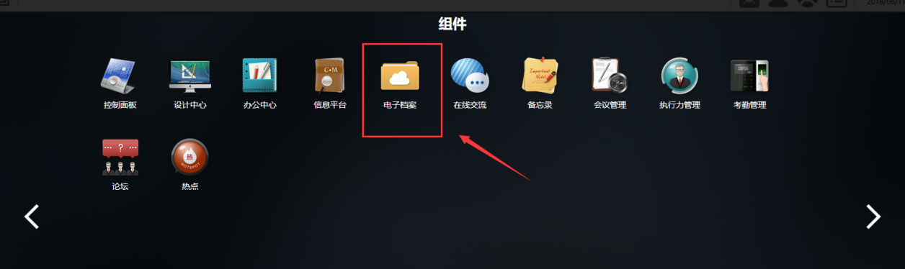
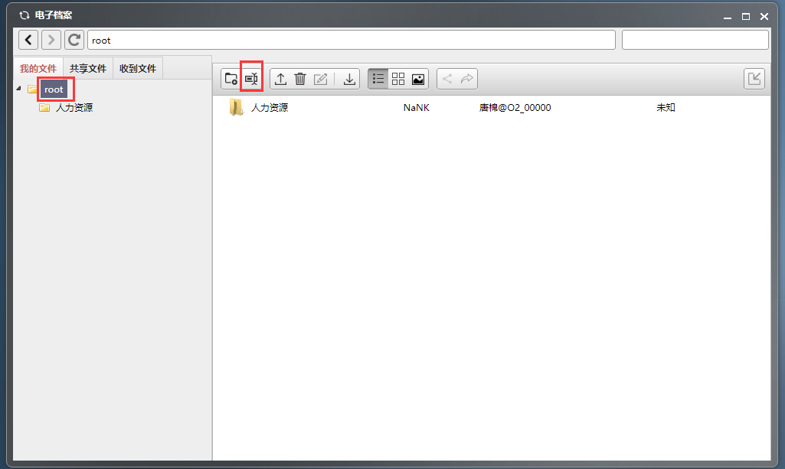
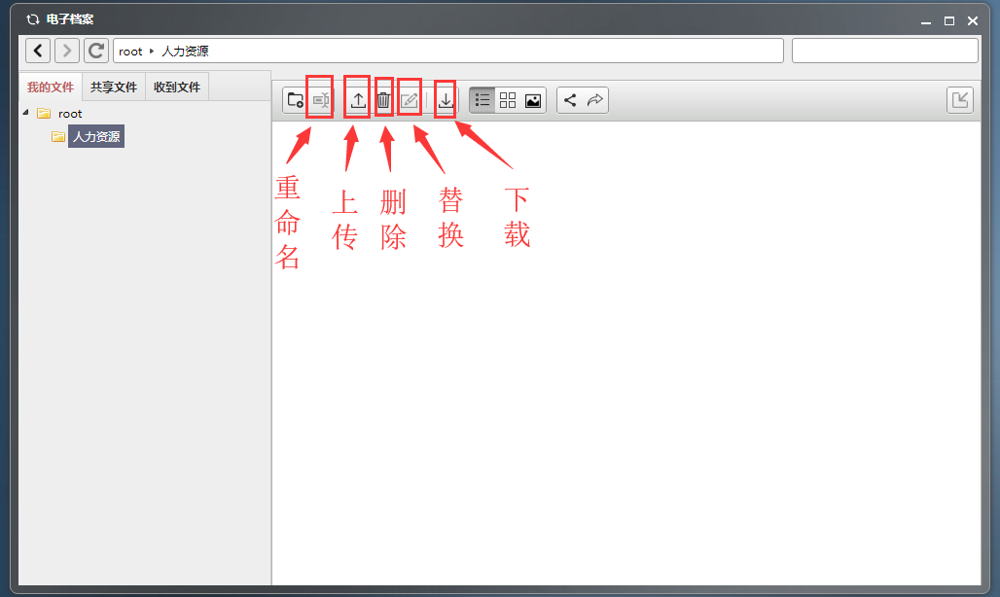

# 执行力管理

OKR全称是Objectives and Key Results，即目标与关键成果法。OKR是一套定义和跟踪目标及其完成情况的管理工具和方法。

**实施的关键流程：**

  从上至下，目标的设立顺序应该是公司到部门到组到个人。

  个人自己想做什么，和管理者想他做什么一般来说是不会完全相同的。那他可以通过先查阅上层的目标，在自己想做的事情范围内找到能对公司目标有利的部分，将他拿出来和自己的管理者进行讨论，做权衡取舍。某种情况下，很有可能这个自己想做的东西，会变成公司今后改变的发展方向。

## 首页

点击组件-执行力管理，即可打开执行力管理系统。

首页如下：

我的工作台：展示我整个工作动态，分为工作部署、工作汇报、统计分析。系统默认打开后首页展示我的工作台页面。

脑图展示：以脑图的形式展示我的工作动态

切换身份：如果员工有多个身份，点击切换身份后展示另外一个身份的执行力管理页面。

## 我的工作台

### 工作部署

组织工作管理者可以进行工作部署。点击我的工作台-工作部署，进入部署工作页面。

#### 部署新工作

1. 点击部署新工作，进入部署中心工作页面。部署中心工作分为：中心工作信息、导入模板、创建工作。

注：中心工作可以看作是一个工作集信息。

1. 中心工作信息

填写完中心工作信息后。可以导入模板，完成批量化的具体工作创建。

1. 创建工作

若不导入模板，也可点击创建工作按钮，来创建中心工作里的一个或多个具体工作信息。

点击创建工作按钮，弹出工作详情对话框，填写完毕并保存。

1. 部署的工作

在创建工作完毕后，页面会回到部署工作中心。原本的页面会显示已部署的工作。点击部署，部署的具体工作会分配给各个责任人和协助人。

#### 中心工作和具体工作

点击我的工作台-工作部署-中心工作/具体工作，可以查看已部署下去的中心工作及中心工作的下级具体工作。

中心工作：中心工作目标列表

具体工作：围绕中心工作目标列出的具体工作

### 工作执行中

部署完工作后，不同权限身份的人完成工作的操作不同：

#### 工作拆解和委派

上级部署工作到负责人之后，以工作负责人身份进入系统，在执行力管理首页会展示待处理信息：待办信息和进行中的工作信息。

点击待处理信息进入部署中心工作页面。

1）点击确认即确认收到到工作，自己完成并从此时计算工作完成时间。

2）若不是自己完成该工作任务，可对此进行拆解或委派。

拆解：将此工作任务拆解给一个或多个下级员工去完成。

委派：将此工作委派给同级别的员工去完成。

（1）工作拆解

点击拆解会弹出工作详情页面，填写完毕并保存后会回到部署中心工作页面。

拆解后的工作即已部署的工作，故拆解的工作可以在部署的工作处查看。点击部署，工作任务即被分配到被拆解后的负责人。

（2）工作委派

点击委派，弹出委派工作页面，可将此任务委派给他人。填写完毕后在部署中心工作页面，会看到被委派的工作左上角标有橙色委图标，被委派的工作任务也可以点击收回撤销之前操作。

#### 工作进展情况汇报

工作负责人点击某项自己负责的工作后，弹出的工作详情页面会分为工作汇报、工作详情、工作交流三部分。如下图所示：

此处的工作汇报用于汇报工作的进度及问题。

点击发起，填写该工作的汇报情况。若已完结，点击是否办结处的是。

### 工作汇报审批

部门领导进入系统后，可以使用两种方式对下级提交的工作汇报进行审批：

1）点击我的工作台-工作汇报，查看待处理汇报、已处理工作等标签，系统将会展示需要处理的工作汇报列表，或者已经处理的工作汇报列表，如下图所示：  

2）点击我的工作台，在执行管理首页，待处理信息处查看待办或工作中的任务，并完成下一步操作，如下图所示：

## 脑图展示

思维导图的建立有利于人们对其所思考的问题进行全方位和系统的描述与分析，非常有助于人们对所研究的问题进行深刻的和富有创造性的思考，从而有利于找到解决问题的关键因素或关键环节。

点击脑图展示，在系统所示界面中点击某一项中心工作，系统会以脑图方式展示指定工作的部署情况。

注：

1）左下角是脑图展示工具；

1. 若某工作被拆解过，此工作前会有一个图标，点击此图标会展示下级子目录；
2. 双击某个具体工作，系统将会展示该工作的详细情况。

## 统计分析

在首页上点击“统计分析”按钮，进入统计页面：

### 按工作统计

显示所有中心工作的统计

### 按日期统计

点击工作“打开”按钮，显示具体的工作完成情况：

### 按部门统计

按部门统计，通过图表形式，显示完成情况.

系统提供搜索查询并导入导出功能，每周汇报和每月汇报

