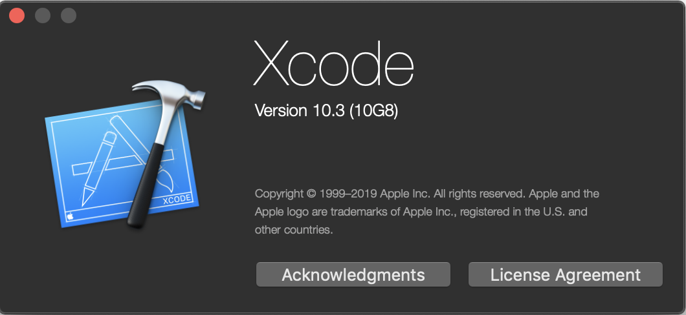

# IOS端打包处理

### 准备

Xcode版本10.3

  

项目使用了COCOAPODS，需要本地安装最新版本的COCOAPODS。 然后到项目根目录执行pod命令：

```text
pod install
```

### 导入项目

在项目根目录找到 `O2Platform.xcworkspace` ，双击打开项目。 在XCode中找到菜单 ： File -&gt; Workspace Settings ... 修改Build System 选项为 `Legacy Build System` 

### 项目基本信息修改

#### 项目名称

项目名称就是ios手机桌面上显示的名称，这个名称修改如下：

  


还有一个是app唯一ID也需要修改。

#### 项目桌面LOGO

还有就是项目的LOGO，这个LOGO是在IOS手机桌面上显示那个图标，找到Assets资源目录，替换AppIcon里面的图片。如下图：

 


#### 可配置的应用内图标

App内看到的一些O2OA相关的logo图标，可以不编译打包进App，我们服务端可以进行动态配置。用管理员进入我们O2OA的服务端，找到系统设置-&gt;移动办公配置-&gt;样式配置，就可以修改图标了：


### 直连版本配置

如果你不希望连接到我们O2云，通过修改配置编译打包，生成的IOS应用，就会直接连接到你们自己的O2OA服务器。目前这个直连版本是不能接收到通知消息的。 修改方式如下：  


在 O2Platform -&gt; config -&gt; config.swift 文件中找到

```groovy
//改为false就是直连版本
let O2IsConnect2Collect = false
```

然后找到O2Platform 目录下找到Info.plist文件，把里面的centerHost 、 centerPort、httpProtocol改成你们自己的O2OA中心服务器地址信息。

 


### 官方网站:

官方网站 : [http://www.o2oa.net](http://www.o2oa.net)

下载地址 : [http://www.o2oa.net](http://www.o2oa.net/download.html)

oschina项目主页 : [https://www.oschina.net/p/o2oa](https://www.oschina.net/p/o2oa)

