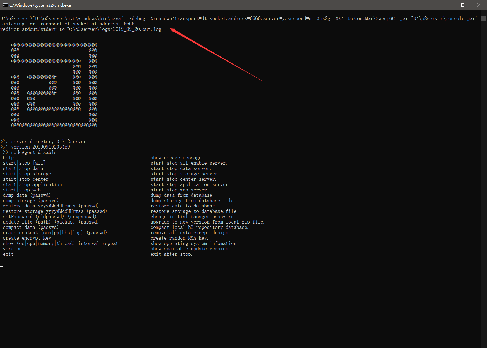

# 后端代码的远程调试

## 一、服务器上添加配置

jvm是支持远程调试的，得在启动脚本里加jvm参数开启远程调试


添加内容：-Xdebug -Xrunjdwp:transport=dt\_socket,address=6666,server=y,suspend=n

```text
"%~dp0jvm\windows\bin\java" -Xdebug -Xrunjdwp:transport=dt_socket,address=6666,server=y,suspend=n -Xms2g -XX:+UseConcMarkSweepGC -jar "%~dp0console.jar"
```

## 二、启动服务器

正常启动服务器，但是可以看到输出的日志中有打印开放端口的的日志。

Listening for transport dt\_socket at address: 6666



## 三、IDEA相关配置

### 1、增加调试/运行配置


### 2、启动调试

点击左上角的绿色小虫，会提示

Connected to the target VM, address: '127.0.0.1:6666', transport: 'socket'


### 3、增加断点


## 四、Eclipse相关配置

### 1、打开调试/运行配置界面


### 2、新增远程调试配置


### 3、选择需要调试的项目

选择项目，输入远程服务器的主机ip地址与端口号


### 4、配置完成后点击“debug”按钮


### 5、在代码增加断点调试


Eclipse远程调试教程很多，可以参考:

[https://www.eclipse.org/jetty/documentation/current/enable-remote-debugging.html](https://www.eclipse.org/jetty/documentation/current/enable-remote-debugging.html)

